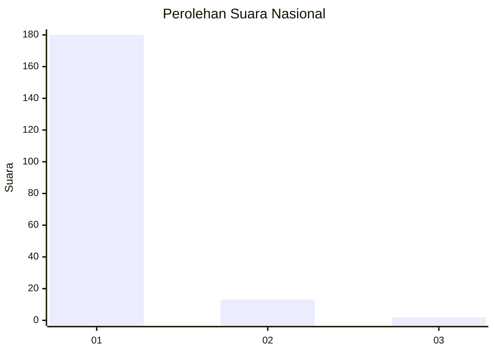
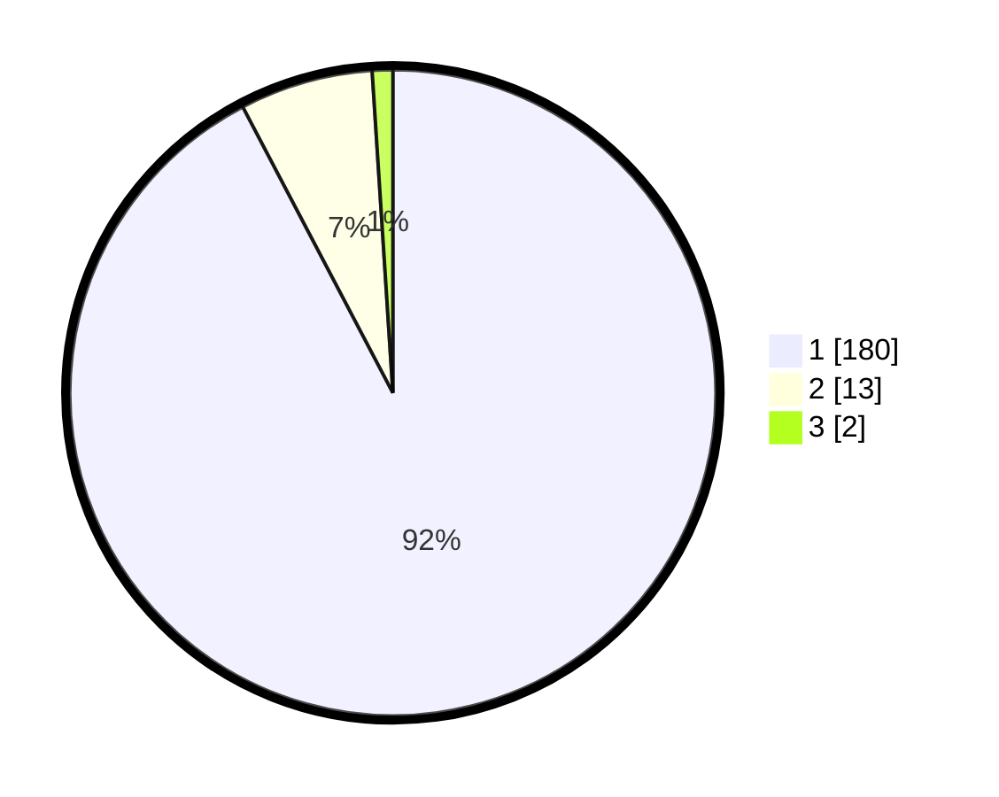

# Hasil

## Grafik

## Tabel

| No. | Nama Paslon    | Suara | Suara (raw) | Persentase |
|:--- |:-------------- | -----:| -----------:| ----------:|
| 1   | ANIES MUHAIMIN | 180   | [180][p-1]  | 92,31      |
| 2   | PRABOWO GIBRAN | 13    | [13][p-2]   | 6,67       |
| 3   | GANJAR MAHFUD  | 2     | [2][p-3]    | 1,03       |

[p-1]: https://github.com/gigit-pemilu/pemilu-2024/blob/main/pilpres/hitung-suara/sub/11-aceh/sub/06-aceh-besar/sub/08-peukan-bada/sub/2015-lampisang/sub/002-tps/sub/paslon-1.txt
[p-2]: https://github.com/gigit-pemilu/pemilu-2024/blob/main/pilpres/hitung-suara/sub/11-aceh/sub/06-aceh-besar/sub/08-peukan-bada/sub/2015-lampisang/sub/002-tps/sub/paslon-2.txt
[p-3]: https://github.com/gigit-pemilu/pemilu-2024/blob/main/pilpres/hitung-suara/sub/11-aceh/sub/06-aceh-besar/sub/08-peukan-bada/sub/2015-lampisang/sub/002-tps/sub/paslon-3.txt

## Foto C Plano

https://sirekap-obj-formc.kpu.go.id/ec7f/pemilu/ppwp/11/06/08/20/15/1106082015002-20240215-042056--90e25c89-3a70-4dad-9d0c-ae178fcc277f.jpg

https://sirekap-obj-formc.kpu.go.id/ec7f/pemilu/ppwp/11/06/08/20/15/1106082015002-20240215-043739--1417326b-1b26-47ac-b94c-c1b6a6a75da8.jpg

https://sirekap-obj-formc.kpu.go.id/ec7f/pemilu/ppwp/11/06/08/20/15/1106082015002-20240215-043755--9485dbd7-c4b3-4512-a077-ad7a680927aa.jpg

## Metadata

| Key        | Value               |
| ---------- | ------------------- |
| Time Stamp | 2024-02-19 06:16:00 |

