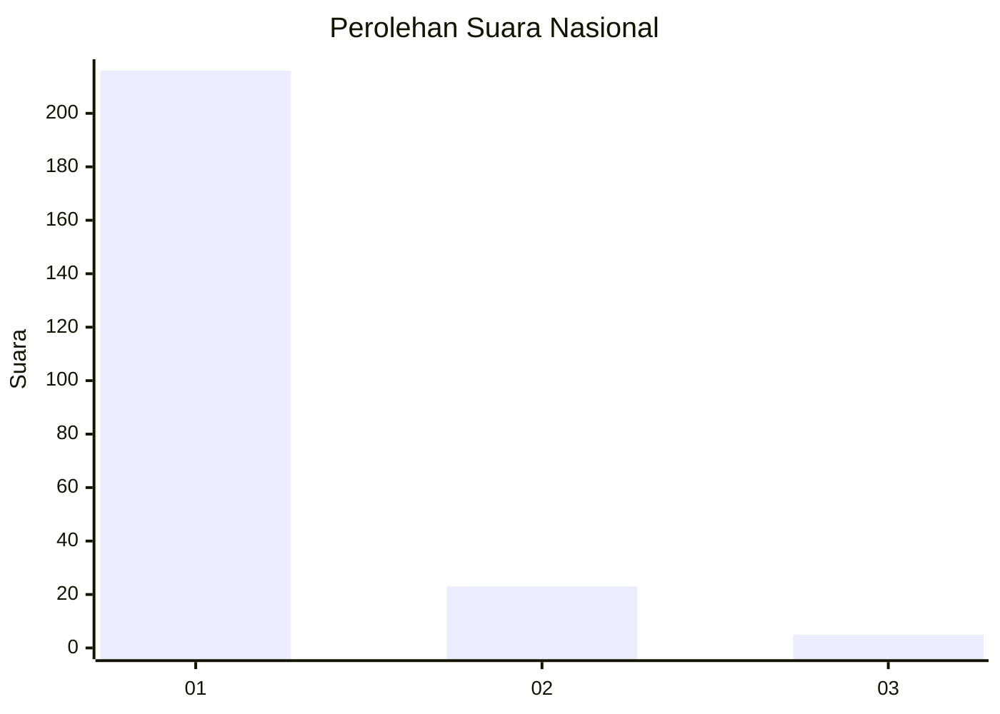
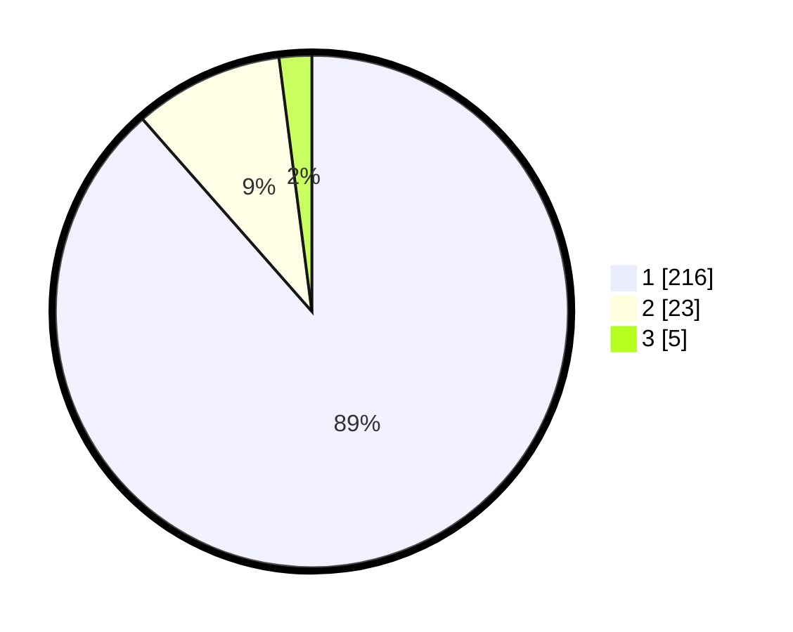

# Hasil

## Grafik

## Tabel

| No. | Nama Paslon    | Suara | Suara (raw) | Persentase |
|:--- |:-------------- | -----:| -----------:| ----------:|
| 1   | ANIES MUHAIMIN | 216   | [216][p-1]  | 88,52      |
| 2   | PRABOWO GIBRAN | 23    | [23][p-2]   | 9,43       |
| 3   | GANJAR MAHFUD  | 5     | [5][p-3]    | 2,05       |

[p-1]: https://github.com/gigit-pemilu/pemilu-2024/blob/main/pilpres/hitung-suara/sub/11-aceh/sub/06-aceh-besar/sub/08-peukan-bada/sub/2017-lam-isek/sub/002-tps/sub/paslon-1.txt
[p-2]: https://github.com/gigit-pemilu/pemilu-2024/blob/main/pilpres/hitung-suara/sub/11-aceh/sub/06-aceh-besar/sub/08-peukan-bada/sub/2017-lam-isek/sub/002-tps/sub/paslon-2.txt
[p-3]: https://github.com/gigit-pemilu/pemilu-2024/blob/main/pilpres/hitung-suara/sub/11-aceh/sub/06-aceh-besar/sub/08-peukan-bada/sub/2017-lam-isek/sub/002-tps/sub/paslon-3.txt

## Foto C Plano

https://sirekap-obj-formc.kpu.go.id/0937/pemilu/ppwp/11/06/08/20/17/1106082017002-20240214-202233--84fbc545-4bc0-4eae-8272-79ac87f97fa9.jpg

https://sirekap-obj-formc.kpu.go.id/0937/pemilu/ppwp/11/06/08/20/17/1106082017002-20240214-202349--b862ec14-836c-4c59-8bd0-3a629c120d16.jpg

https://sirekap-obj-formc.kpu.go.id/0937/pemilu/ppwp/11/06/08/20/17/1106082017002-20240214-202758--d050b8a8-f5fb-40d7-9082-e7e0331e49b2.jpg

## Metadata

| Key        | Value               |
| ---------- | ------------------- |
| Time Stamp | 2024-02-15 12:00:28 |

