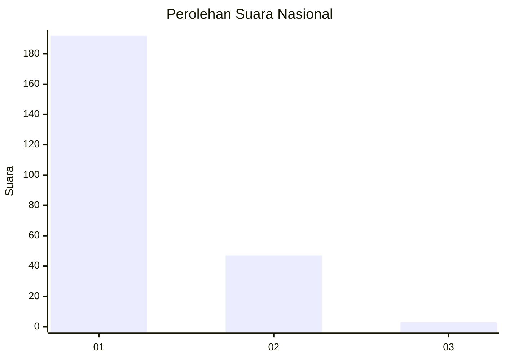
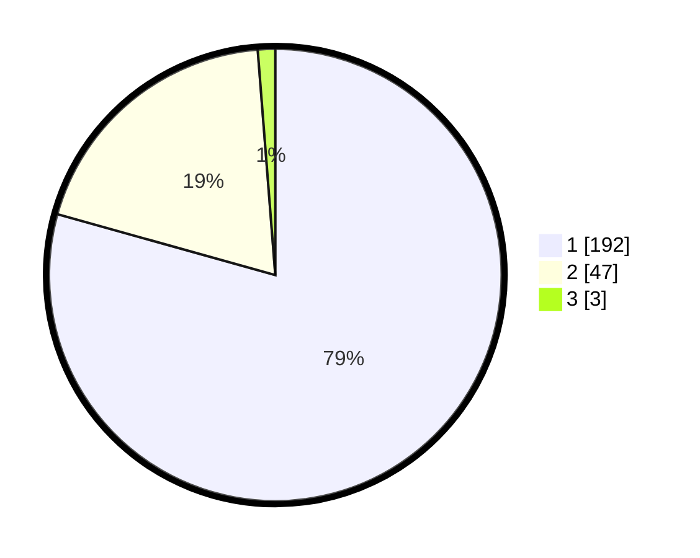

# Hasil

## Grafik

## Tabel

| No. | Nama Paslon    | Suara | Suara (raw) | Persentase |
|:--- |:-------------- | -----:| -----------:| ----------:|
| 1   | ANIES MUHAIMIN | 192   | [192][p-1]  | 79,34      |
| 2   | PRABOWO GIBRAN | 47    | [47][p-2]   | 19,42      |
| 3   | GANJAR MAHFUD  | 3     | [3][p-3]    | 1,24       |

[p-1]: https://github.com/gigit-pemilu/pemilu-2024/blob/main/pilpres/hitung-suara/sub/11-aceh/sub/06-aceh-besar/sub/08-peukan-bada/sub/2018-lamkeumok/sub/001-tps/sub/paslon-1.txt
[p-2]: https://github.com/gigit-pemilu/pemilu-2024/blob/main/pilpres/hitung-suara/sub/11-aceh/sub/06-aceh-besar/sub/08-peukan-bada/sub/2018-lamkeumok/sub/001-tps/sub/paslon-2.txt
[p-3]: https://github.com/gigit-pemilu/pemilu-2024/blob/main/pilpres/hitung-suara/sub/11-aceh/sub/06-aceh-besar/sub/08-peukan-bada/sub/2018-lamkeumok/sub/001-tps/sub/paslon-3.txt

## Foto C Plano

https://sirekap-obj-formc.kpu.go.id/41b0/pemilu/ppwp/11/06/08/20/18/1106082018001-20240215-093936--be985654-31a9-4ac2-8350-56c49550f3a7.jpg

https://sirekap-obj-formc.kpu.go.id/41b0/pemilu/ppwp/11/06/08/20/18/1106082018001-20240215-032257--cbc3e10a-c257-4d54-85dc-379e3bc97f29.jpg

https://sirekap-obj-formc.kpu.go.id/41b0/pemilu/ppwp/11/06/08/20/18/1106082018001-20240214-214624--d54705c9-21b6-415f-a678-2cdb9b3f22f6.jpg

## Metadata

| Key        | Value               |
| ---------- | ------------------- |
| Time Stamp | 2024-02-15 18:00:26 |

