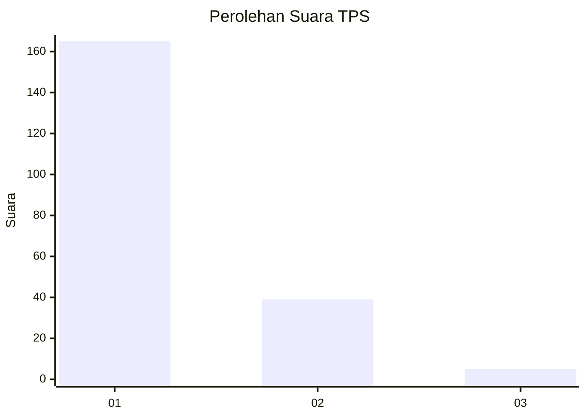
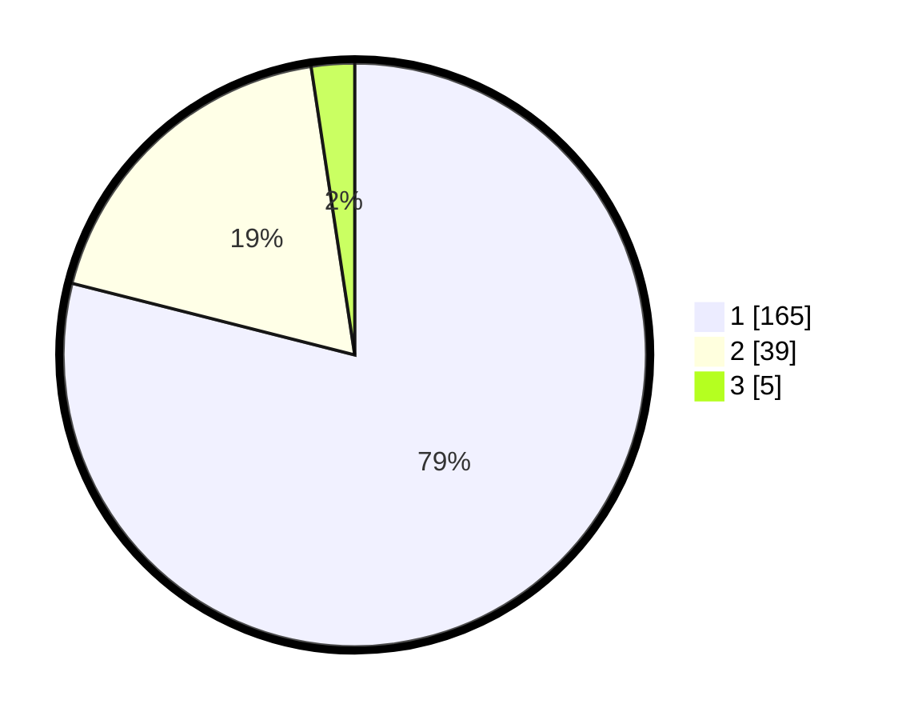

# Hasil

## Grafik

## Tabel

| No. | Nama Paslon    | Suara | Suara (raw) | Persentase |
|:--- |:-------------- | -----:| -----------:| ----------:|
| 1   | ANIES MUHAIMIN | 165   | [165][p-1]  | 78,95      |
| 2   | PRABOWO GIBRAN | 39    | [39][p-2]   | 18,66      |
| 3   | GANJAR MAHFUD  | 5     | [5][p-3]    | 2,39       |

[p-1]: https://github.com/gigit-pemilu/pemilu-2024-11-aceh/blob/main/pilpres/hitung-suara/sub/11-aceh/sub/06-aceh-besar/sub/08-peukan-bada/sub/2020-gurah/sub/001-tps/sub/paslon-1.txt
[p-2]: https://github.com/gigit-pemilu/pemilu-2024-11-aceh/blob/main/pilpres/hitung-suara/sub/11-aceh/sub/06-aceh-besar/sub/08-peukan-bada/sub/2020-gurah/sub/001-tps/sub/paslon-2.txt
[p-3]: https://github.com/gigit-pemilu/pemilu-2024-11-aceh/blob/main/pilpres/hitung-suara/sub/11-aceh/sub/06-aceh-besar/sub/08-peukan-bada/sub/2020-gurah/sub/001-tps/sub/paslon-3.txt

## Foto C Plano

https://sirekap-obj-formc.kpu.go.id/e99c/pemilu/ppwp/11/06/08/20/20/1106082020001-20240214-203334--61efa56c-dfb7-498f-b053-38c5081c48f7.jpg

https://sirekap-obj-formc.kpu.go.id/e99c/pemilu/ppwp/11/06/08/20/20/1106082020001-20240214-203459--5f9201b2-74f9-4ff2-8207-a1a0ba7396c5.jpg

https://sirekap-obj-formc.kpu.go.id/e99c/pemilu/ppwp/11/06/08/20/20/1106082020001-20240214-203452--41e50b47-2efd-4e7f-8640-7b1ccfac8c11.jpg

## Metadata

| Key        | Value               |
| ---------- | ------------------- |
| Time Stamp | 2024-02-15 12:00:28 |

