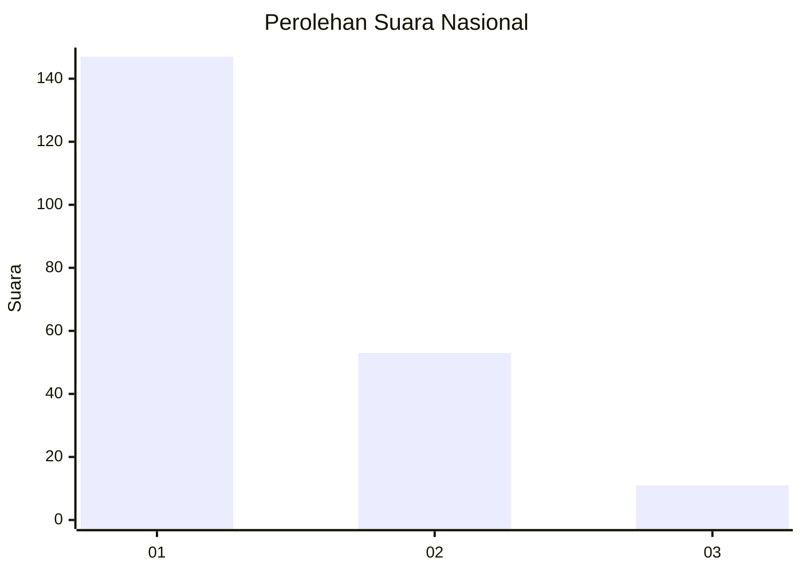
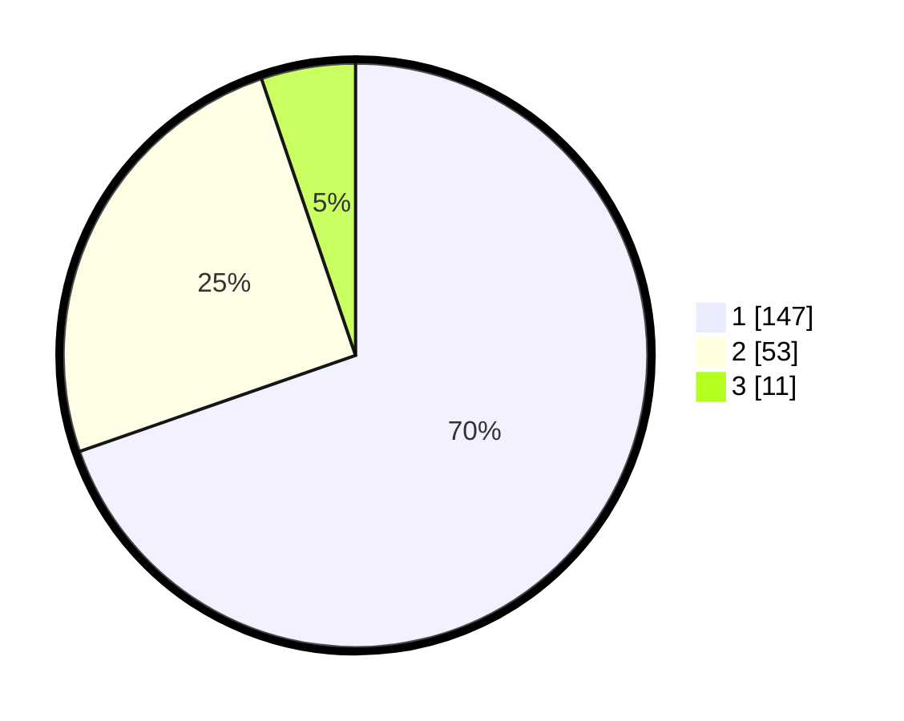

# Hasil

## Grafik

## Tabel

| No. | Nama Paslon    | Suara | Suara (raw) | Persentase |
|:--- |:-------------- | -----:| -----------:| ----------:|
| 1   | ANIES MUHAIMIN | 147   | [147][p-1]  | 69,67      |
| 2   | PRABOWO GIBRAN | 53    | [53][p-2]   | 25,12      |
| 3   | GANJAR MAHFUD  | 11    | [11][p-3]   | 5,21       |

[p-1]: https://github.com/gigit-pemilu/pemilu-2024/blob/main/pilpres/hitung-suara/sub/11-aceh/sub/06-aceh-besar/sub/08-peukan-bada/sub/2020-gurah/sub/002-tps/sub/paslon-1.txt
[p-2]: https://github.com/gigit-pemilu/pemilu-2024/blob/main/pilpres/hitung-suara/sub/11-aceh/sub/06-aceh-besar/sub/08-peukan-bada/sub/2020-gurah/sub/002-tps/sub/paslon-2.txt
[p-3]: https://github.com/gigit-pemilu/pemilu-2024/blob/main/pilpres/hitung-suara/sub/11-aceh/sub/06-aceh-besar/sub/08-peukan-bada/sub/2020-gurah/sub/002-tps/sub/paslon-3.txt

## Foto C Plano

https://sirekap-obj-formc.kpu.go.id/d165/pemilu/ppwp/11/06/08/20/20/1106082020002-20240214-215536--ed756e25-18c8-479a-bff9-7a9614a07e22.jpg

https://sirekap-obj-formc.kpu.go.id/d165/pemilu/ppwp/11/06/08/20/20/1106082020002-20240214-220149--7d5c8491-1d68-4a80-b82c-9b435cce3a2b.jpg

https://sirekap-obj-formc.kpu.go.id/d165/pemilu/ppwp/11/06/08/20/20/1106082020002-20240214-220254--7d430be3-b4fb-4155-8f74-fb4d5a667ea5.jpg

## Metadata

| Key        | Value               |
| ---------- | ------------------- |
| Time Stamp | 2024-02-15 22:30:27 |

