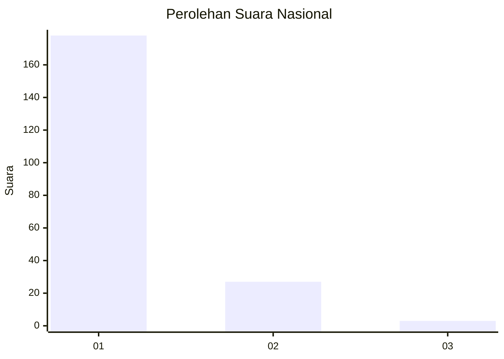
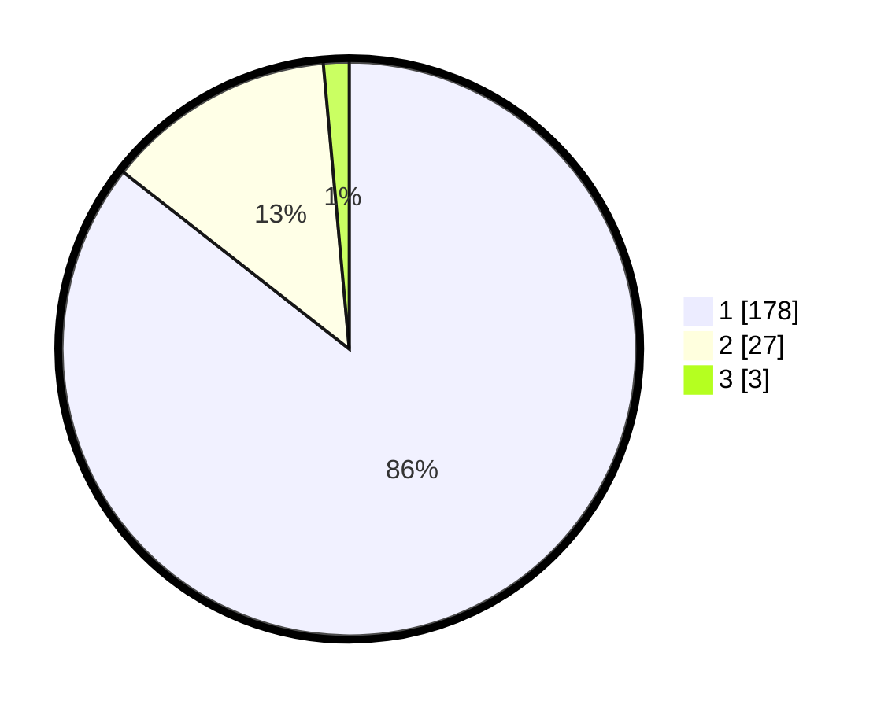

# Hasil

## Grafik

## Tabel

| No. | Nama Paslon    | Suara | Suara (raw) | Persentase |
|:--- |:-------------- | -----:| -----------:| ----------:|
| 1   | ANIES MUHAIMIN | 178   | [178][p-1]  | 85,58      |
| 2   | PRABOWO GIBRAN | 27    | [27][p-2]   | 12,98      |
| 3   | GANJAR MAHFUD  | 3     | [3][p-3]    | 1,44       |

[p-1]: https://github.com/gigit-pemilu/pemilu-2024/blob/main/pilpres/hitung-suara/sub/11-aceh/sub/06-aceh-besar/sub/08-peukan-bada/sub/2021-rima-jeuneu/sub/003-tps/sub/paslon-1.txt
[p-2]: https://github.com/gigit-pemilu/pemilu-2024/blob/main/pilpres/hitung-suara/sub/11-aceh/sub/06-aceh-besar/sub/08-peukan-bada/sub/2021-rima-jeuneu/sub/003-tps/sub/paslon-2.txt
[p-3]: https://github.com/gigit-pemilu/pemilu-2024/blob/main/pilpres/hitung-suara/sub/11-aceh/sub/06-aceh-besar/sub/08-peukan-bada/sub/2021-rima-jeuneu/sub/003-tps/sub/paslon-3.txt

## Foto C Plano

https://sirekap-obj-formc.kpu.go.id/c0db/pemilu/ppwp/11/06/08/20/21/1106082021003-20240215-020254--b0b07404-a933-490b-a471-60a8966f7c95.jpg

https://sirekap-obj-formc.kpu.go.id/c0db/pemilu/ppwp/11/06/08/20/21/1106082021003-20240215-020436--e154ce87-bc05-4dea-af2b-d6c11bc8d12f.jpg

https://sirekap-obj-formc.kpu.go.id/c0db/pemilu/ppwp/11/06/08/20/21/1106082021003-20240215-020528--c739eb19-7410-4b91-a5ee-f169eef74035.jpg

## Metadata

| Key        | Value               |
| ---------- | ------------------- |
| Time Stamp | 2024-02-15 21:01:18 |

