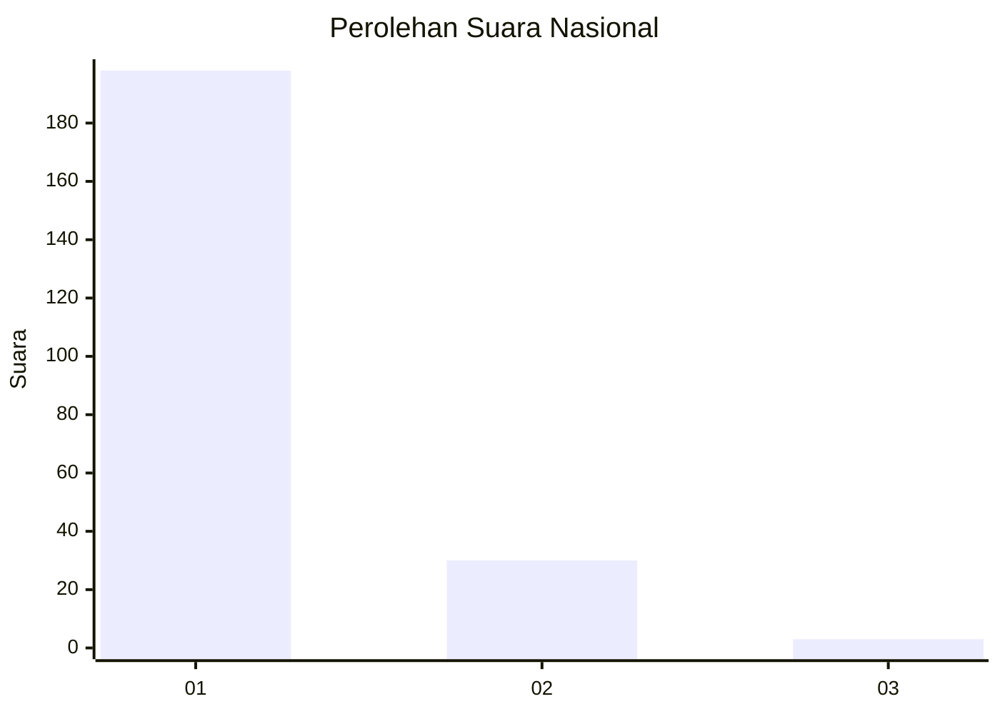
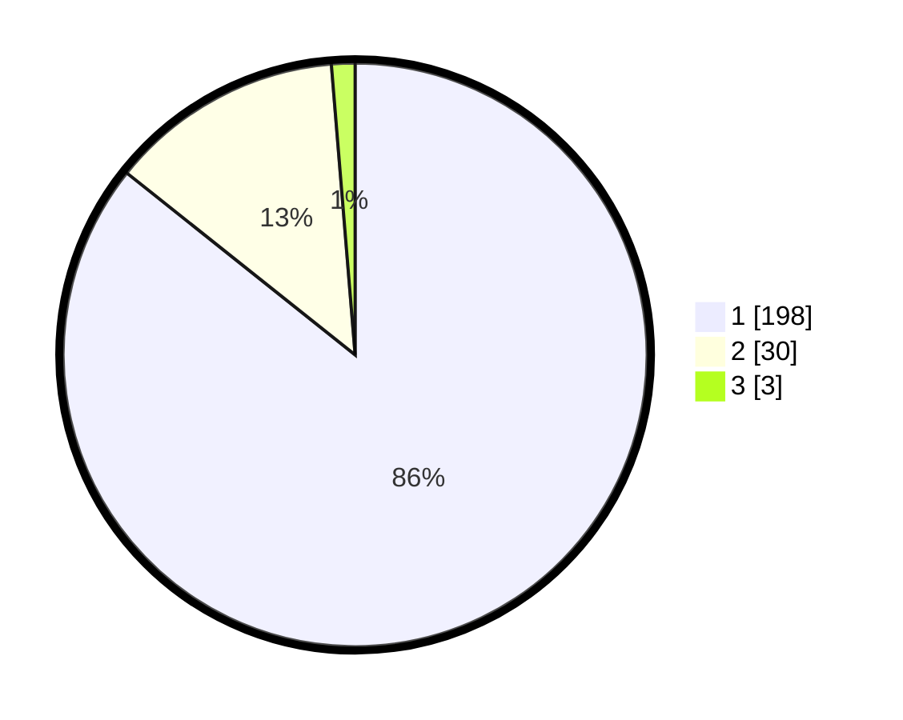

# Hasil

## Grafik

## Tabel

| No. | Nama Paslon    | Suara | Suara (raw) | Persentase |
|:--- |:-------------- | -----:| -----------:| ----------:|
| 1   | ANIES MUHAIMIN | 198   | [198][p-1]  | 85,71      |
| 2   | PRABOWO GIBRAN | 30    | [30][p-2]   | 12,99      |
| 3   | GANJAR MAHFUD  | 3     | [3][p-3]    | 1,30       |

[p-1]: https://github.com/gigit-pemilu/pemilu-2024/blob/main/pilpres/hitung-suara/sub/11-aceh/sub/06-aceh-besar/sub/08-peukan-bada/sub/2022-lam-geu-eu/sub/001-tps/sub/paslon-1.txt
[p-2]: https://github.com/gigit-pemilu/pemilu-2024/blob/main/pilpres/hitung-suara/sub/11-aceh/sub/06-aceh-besar/sub/08-peukan-bada/sub/2022-lam-geu-eu/sub/001-tps/sub/paslon-2.txt
[p-3]: https://github.com/gigit-pemilu/pemilu-2024/blob/main/pilpres/hitung-suara/sub/11-aceh/sub/06-aceh-besar/sub/08-peukan-bada/sub/2022-lam-geu-eu/sub/001-tps/sub/paslon-3.txt

## Foto C Plano

https://sirekap-obj-formc.kpu.go.id/97ca/pemilu/ppwp/11/06/08/20/22/1106082022001-20240214-225814--5e1eaf3f-a79e-459f-a7fa-545a31e20f03.jpg

https://sirekap-obj-formc.kpu.go.id/97ca/pemilu/ppwp/11/06/08/20/22/1106082022001-20240214-222014--d4d7737a-8761-47ac-9e0a-fb2d7173181b.jpg

https://sirekap-obj-formc.kpu.go.id/97ca/pemilu/ppwp/11/06/08/20/22/1106082022001-20240214-223031--003e424f-ee99-482e-b1d0-f23cd06ea2e7.jpg

## Metadata

| Key        | Value               |
| ---------- | ------------------- |
| Time Stamp | 2024-02-15 17:00:25 |

