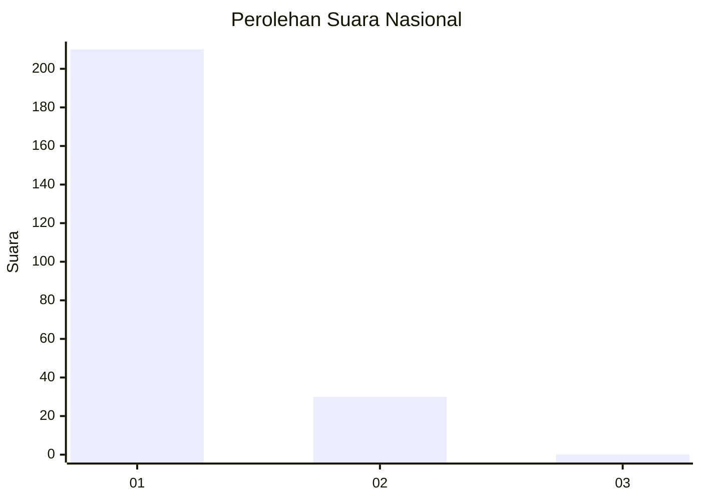
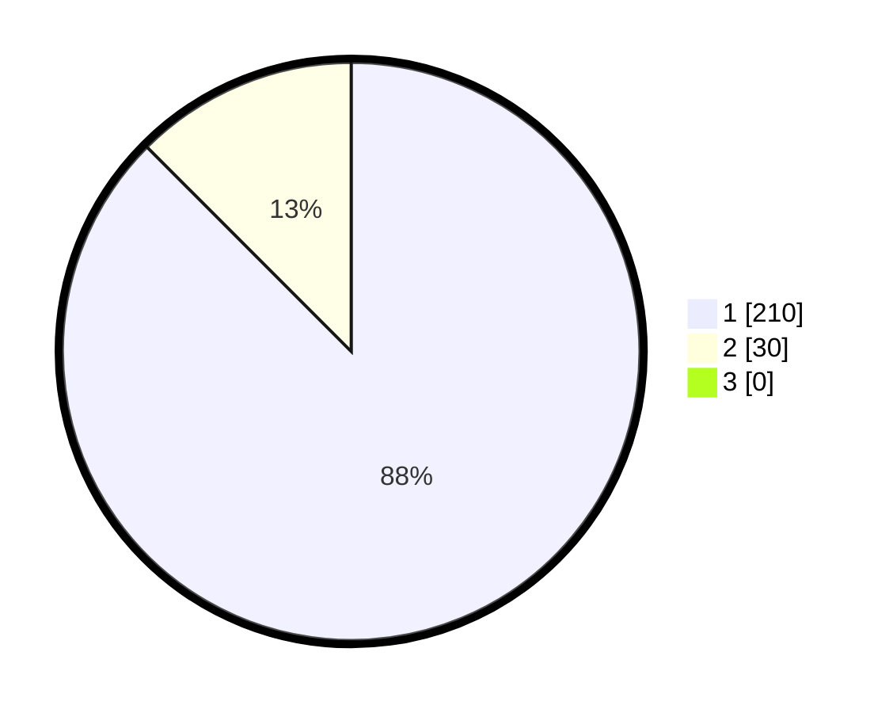

# Hasil

## Grafik

## Tabel

| No. | Nama Paslon    | Suara | Suara (raw) | Persentase |
|:--- |:-------------- | -----:| -----------:| ----------:|
| 1   | ANIES MUHAIMIN | 210   | [210][p-1]  | 87,50      |
| 2   | PRABOWO GIBRAN | 30    | [30][p-2]   | 12,50      |
| 3   | GANJAR MAHFUD  | 0     | [0][p-3]    | 0,00       |

[p-1]: https://github.com/gigit-pemilu/pemilu-2024/blob/main/pilpres/hitung-suara/sub/11-aceh/sub/06-aceh-besar/sub/08-peukan-bada/sub/2022-lam-geu-eu/sub/002-tps/sub/paslon-1.txt
[p-2]: https://github.com/gigit-pemilu/pemilu-2024/blob/main/pilpres/hitung-suara/sub/11-aceh/sub/06-aceh-besar/sub/08-peukan-bada/sub/2022-lam-geu-eu/sub/002-tps/sub/paslon-2.txt
[p-3]: https://github.com/gigit-pemilu/pemilu-2024/blob/main/pilpres/hitung-suara/sub/11-aceh/sub/06-aceh-besar/sub/08-peukan-bada/sub/2022-lam-geu-eu/sub/002-tps/sub/paslon-3.txt

## Foto C Plano

https://sirekap-obj-formc.kpu.go.id/7c19/pemilu/ppwp/11/06/08/20/22/1106082022002-20240215-010251--55c81b07-546c-4360-be30-3d1e7e5e40fc.jpg

https://sirekap-obj-formc.kpu.go.id/7c19/pemilu/ppwp/11/06/08/20/22/1106082022002-20240214-213312--4ad3904c-d2fb-4d34-b958-a504525d70b1.jpg

https://sirekap-obj-formc.kpu.go.id/7c19/pemilu/ppwp/11/06/08/20/22/1106082022002-20240214-213536--38aa1914-957a-4453-be68-bca29a794b3a.jpg

## Metadata

| Key        | Value               |
| ---------- | ------------------- |
| Time Stamp | 2024-02-15 22:30:27 |

