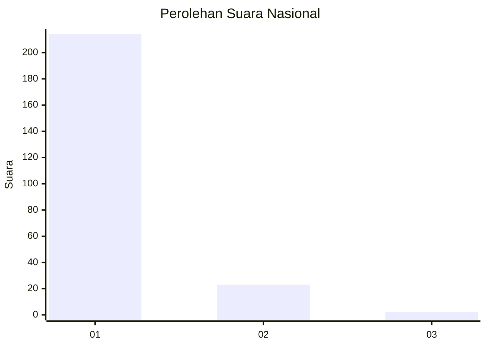
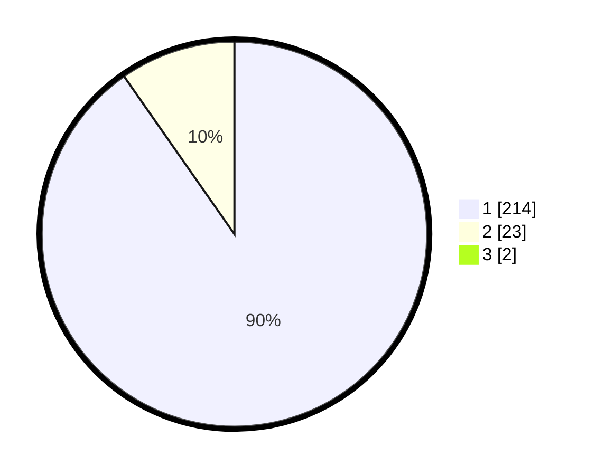

# Hasil

## Grafik

## Tabel

| No. | Nama Paslon    | Suara | Suara (raw) | Persentase |
|:--- |:-------------- | -----:| -----------:| ----------:|
| 1   | ANIES MUHAIMIN | 214   | [214][p-1]  | 89,54      |
| 2   | PRABOWO GIBRAN | 23    | [23][p-2]   | 9,62       |
| 3   | GANJAR MAHFUD  | 2     | [2][p-3]    | 0,84       |

[p-1]: https://github.com/gigit-pemilu/pemilu-2024/blob/main/pilpres/hitung-suara/sub/11-aceh/sub/06-aceh-besar/sub/08-peukan-bada/sub/2025-ajuen/sub/002-tps/sub/paslon-1.txt
[p-2]: https://github.com/gigit-pemilu/pemilu-2024/blob/main/pilpres/hitung-suara/sub/11-aceh/sub/06-aceh-besar/sub/08-peukan-bada/sub/2025-ajuen/sub/002-tps/sub/paslon-2.txt
[p-3]: https://github.com/gigit-pemilu/pemilu-2024/blob/main/pilpres/hitung-suara/sub/11-aceh/sub/06-aceh-besar/sub/08-peukan-bada/sub/2025-ajuen/sub/002-tps/sub/paslon-3.txt

## Foto C Plano

https://sirekap-obj-formc.kpu.go.id/e2f1/pemilu/ppwp/11/06/08/20/25/1106082025002-20240215-003755--6c5ae19f-0a16-49c6-95ce-4b96282454d9.jpg

https://sirekap-obj-formc.kpu.go.id/e2f1/pemilu/ppwp/11/06/08/20/25/1106082025002-20240215-003916--ace53f70-40f0-4126-b1c0-2b71504afc65.jpg

https://sirekap-obj-formc.kpu.go.id/e2f1/pemilu/ppwp/11/06/08/20/25/1106082025002-20240215-004041--c6ce4548-69cf-4f26-9d4b-ee20bb28fdd7.jpg

## Metadata

| Key        | Value               |
| ---------- | ------------------- |
| Time Stamp | 2024-02-15 15:00:29 |

