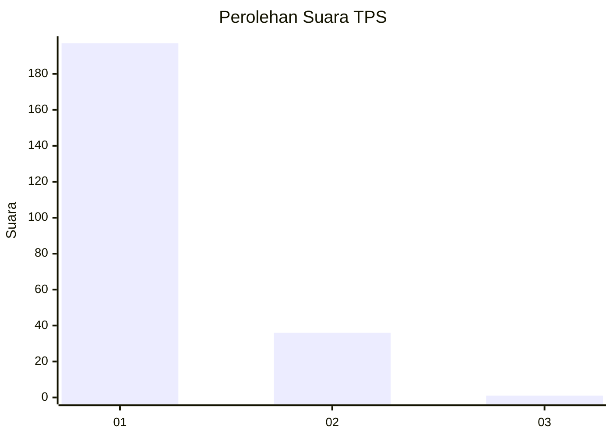
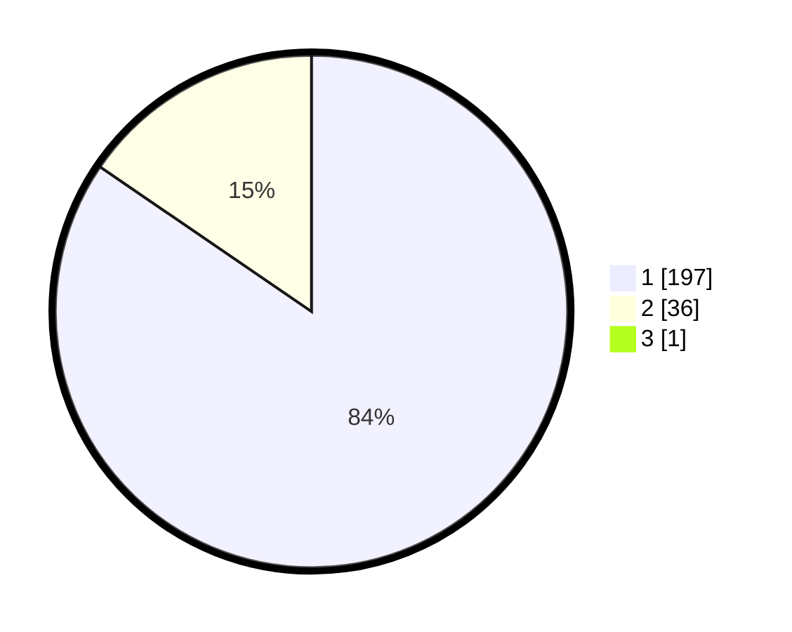

# Hasil

## Grafik

## Tabel

| No. | Nama Paslon    | Suara | Suara (raw) | Persentase |
|:--- |:-------------- | -----:| -----------:| ----------:|
| 1   | ANIES MUHAIMIN | 197   | [197][p-1]  | 84,19      |
| 2   | PRABOWO GIBRAN | 36    | [36][p-2]   | 15,38      |
| 3   | GANJAR MAHFUD  | 1     | [1][p-3]    | 0,43       |

[p-1]: https://github.com/gigit-pemilu/pemilu-2024-11-aceh/blob/main/pilpres/hitung-suara/sub/11-aceh/sub/06-aceh-besar/sub/08-peukan-bada/sub/2025-ajuen/sub/003-tps/sub/paslon-1.txt
[p-2]: https://github.com/gigit-pemilu/pemilu-2024-11-aceh/blob/main/pilpres/hitung-suara/sub/11-aceh/sub/06-aceh-besar/sub/08-peukan-bada/sub/2025-ajuen/sub/003-tps/sub/paslon-2.txt
[p-3]: https://github.com/gigit-pemilu/pemilu-2024-11-aceh/blob/main/pilpres/hitung-suara/sub/11-aceh/sub/06-aceh-besar/sub/08-peukan-bada/sub/2025-ajuen/sub/003-tps/sub/paslon-3.txt

## Foto C Plano

https://sirekap-obj-formc.kpu.go.id/a15e/pemilu/ppwp/11/06/08/20/25/1106082025003-20240214-223918--9a17b49f-e6c1-4568-a838-1955ed2ef9f9.jpg

https://sirekap-obj-formc.kpu.go.id/a15e/pemilu/ppwp/11/06/08/20/25/1106082025003-20240214-224014--2238ab37-4fe3-48ad-b6cd-5b276ed6c6dd.jpg

https://sirekap-obj-formc.kpu.go.id/a15e/pemilu/ppwp/11/06/08/20/25/1106082025003-20240214-224108--da6e84d7-9e6f-4cd5-b5e0-cd1714e3fdde.jpg

## Metadata

| Key        | Value               |
| ---------- | ------------------- |
| Time Stamp | 2024-02-15 22:30:27 |

