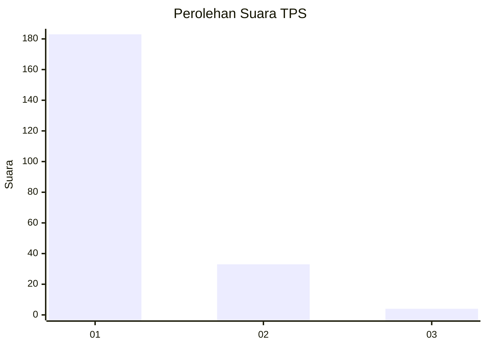
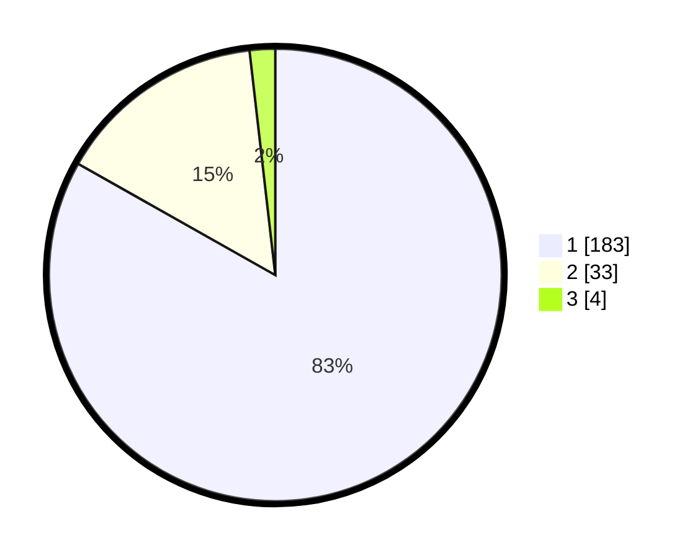

# Hasil

## Grafik

## Tabel

| No. | Nama Paslon    | Suara | Suara (raw) | Persentase |
|:--- |:-------------- | -----:| -----------:| ----------:|
| 1   | ANIES MUHAIMIN | 183   | [183][p-1]  | 83,18      |
| 2   | PRABOWO GIBRAN | 33    | [33][p-2]   | 15,00      |
| 3   | GANJAR MAHFUD  | 4     | [4][p-3]    | 1,82       |

[p-1]: https://github.com/gigit-pemilu/pemilu-2024-11-aceh/blob/main/pilpres/hitung-suara/sub/11-aceh/sub/06-aceh-besar/sub/08-peukan-bada/sub/2025-ajuen/sub/004-tps/sub/paslon-1.txt
[p-2]: https://github.com/gigit-pemilu/pemilu-2024-11-aceh/blob/main/pilpres/hitung-suara/sub/11-aceh/sub/06-aceh-besar/sub/08-peukan-bada/sub/2025-ajuen/sub/004-tps/sub/paslon-2.txt
[p-3]: https://github.com/gigit-pemilu/pemilu-2024-11-aceh/blob/main/pilpres/hitung-suara/sub/11-aceh/sub/06-aceh-besar/sub/08-peukan-bada/sub/2025-ajuen/sub/004-tps/sub/paslon-3.txt

## Foto C Plano

https://sirekap-obj-formc.kpu.go.id/03b8/pemilu/ppwp/11/06/08/20/25/1106082025004-20240215-040223--d10ef798-5622-4fa4-b0dc-890a14abb385.jpg

https://sirekap-obj-formc.kpu.go.id/03b8/pemilu/ppwp/11/06/08/20/25/1106082025004-20240215-040053--fcf23672-d845-4d3a-88a0-18ece001b3b5.jpg

https://sirekap-obj-formc.kpu.go.id/03b8/pemilu/ppwp/11/06/08/20/25/1106082025004-20240215-040359--04b04f1a-031e-43a0-a246-b763382b05ea.jpg

## Metadata

| Key        | Value               |
| ---------- | ------------------- |
| Time Stamp | 2024-02-15 17:00:25 |

