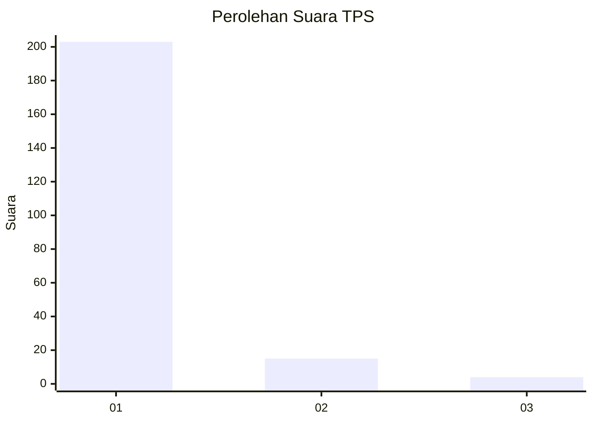
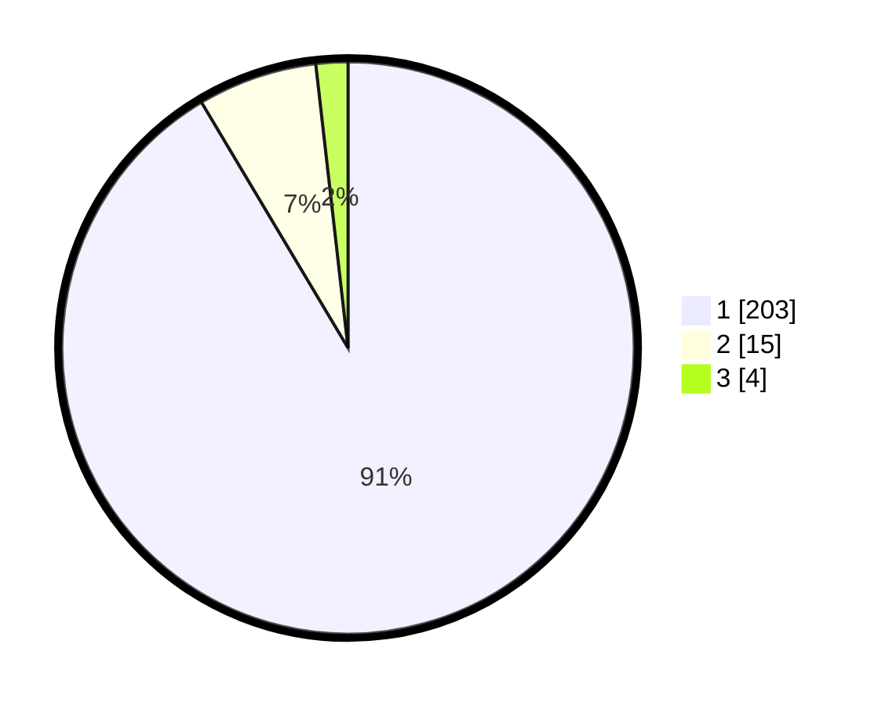

# Hasil

## Grafik

## Tabel

| No. | Nama Paslon    | Suara | Suara (raw) | Persentase |
|:--- |:-------------- | -----:| -----------:| ----------:|
| 1   | ANIES MUHAIMIN | 203   | [203][p-1]  | 91,44      |
| 2   | PRABOWO GIBRAN | 15    | [15][p-2]   | 6,76       |
| 3   | GANJAR MAHFUD  | 4     | [4][p-3]    | 1,80       |

[p-1]: https://github.com/gigit-pemilu/pemilu-2024-11-aceh/blob/main/pilpres/hitung-suara/sub/11-aceh/sub/06-aceh-besar/sub/08-peukan-bada/sub/2025-ajuen/sub/005-tps/sub/paslon-1.txt
[p-2]: https://github.com/gigit-pemilu/pemilu-2024-11-aceh/blob/main/pilpres/hitung-suara/sub/11-aceh/sub/06-aceh-besar/sub/08-peukan-bada/sub/2025-ajuen/sub/005-tps/sub/paslon-2.txt
[p-3]: https://github.com/gigit-pemilu/pemilu-2024-11-aceh/blob/main/pilpres/hitung-suara/sub/11-aceh/sub/06-aceh-besar/sub/08-peukan-bada/sub/2025-ajuen/sub/005-tps/sub/paslon-3.txt

## Foto C Plano

https://sirekap-obj-formc.kpu.go.id/615b/pemilu/ppwp/11/06/08/20/25/1106082025005-20240215-105530--917de8d5-2ca2-4331-bb3b-dba89a52725a.jpg

https://sirekap-obj-formc.kpu.go.id/615b/pemilu/ppwp/11/06/08/20/25/1106082025005-20240215-105507--ad5909ea-3a24-4241-a003-344ea34f4bad.jpg

https://sirekap-obj-formc.kpu.go.id/615b/pemilu/ppwp/11/06/08/20/25/1106082025005-20240215-072233--30e2759d-bb88-4c69-8042-e1517bd5537d.jpg

## Metadata

| Key        | Value               |
| ---------- | ------------------- |
| Time Stamp | 2024-02-15 22:30:27 |

