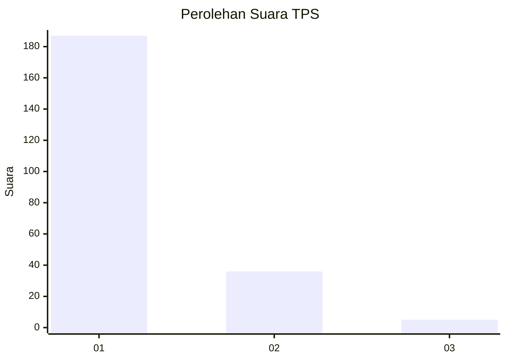
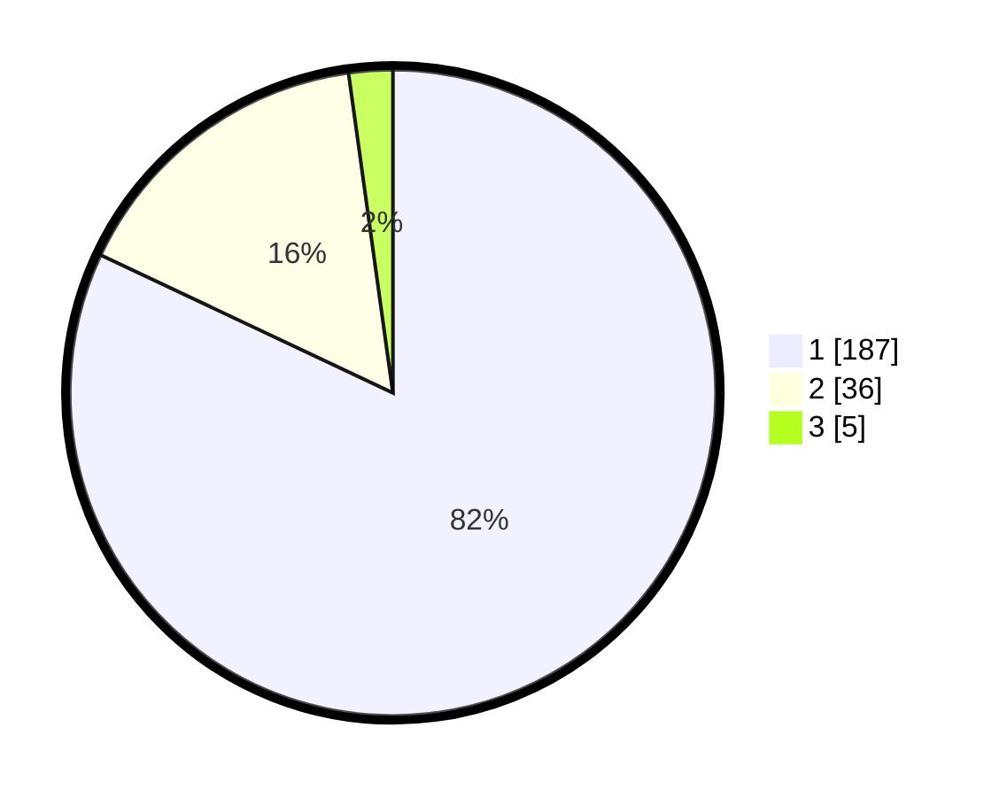

# Hasil

## Grafik

## Tabel

| No. | Nama Paslon    | Suara | Suara (raw) | Persentase |
|:--- |:-------------- | -----:| -----------:| ----------:|
| 1   | ANIES MUHAIMIN | 187   | [187][p-1]  | 82,02      |
| 2   | PRABOWO GIBRAN | 36    | [36][p-2]   | 15,79      |
| 3   | GANJAR MAHFUD  | 5     | [5][p-3]    | 2,19       |

[p-1]: https://github.com/gigit-pemilu/pemilu-2024-11-aceh/blob/main/pilpres/hitung-suara/sub/11-aceh/sub/06-aceh-besar/sub/08-peukan-bada/sub/2025-ajuen/sub/006-tps/sub/paslon-1.txt
[p-2]: https://github.com/gigit-pemilu/pemilu-2024-11-aceh/blob/main/pilpres/hitung-suara/sub/11-aceh/sub/06-aceh-besar/sub/08-peukan-bada/sub/2025-ajuen/sub/006-tps/sub/paslon-2.txt
[p-3]: https://github.com/gigit-pemilu/pemilu-2024-11-aceh/blob/main/pilpres/hitung-suara/sub/11-aceh/sub/06-aceh-besar/sub/08-peukan-bada/sub/2025-ajuen/sub/006-tps/sub/paslon-3.txt

## Foto C Plano

https://sirekap-obj-formc.kpu.go.id/290e/pemilu/ppwp/11/06/08/20/25/1106082025006-20240215-004530--d674b3ab-9b32-4f51-9f30-7c8edbde9cb7.jpg

https://sirekap-obj-formc.kpu.go.id/290e/pemilu/ppwp/11/06/08/20/25/1106082025006-20240214-204921--7e927478-8071-4ea1-9bca-6877386b0142.jpg

https://sirekap-obj-formc.kpu.go.id/290e/pemilu/ppwp/11/06/08/20/25/1106082025006-20240215-031419--ac0cb0f1-058f-489a-a71d-19b0719c7a26.jpg

## Metadata

| Key        | Value               |
| ---------- | ------------------- |
| Time Stamp | 2024-02-15 15:00:29 |

