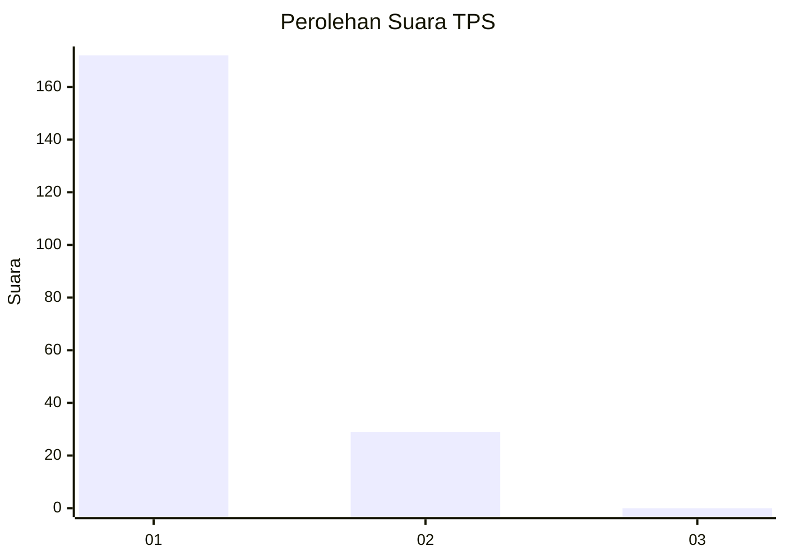
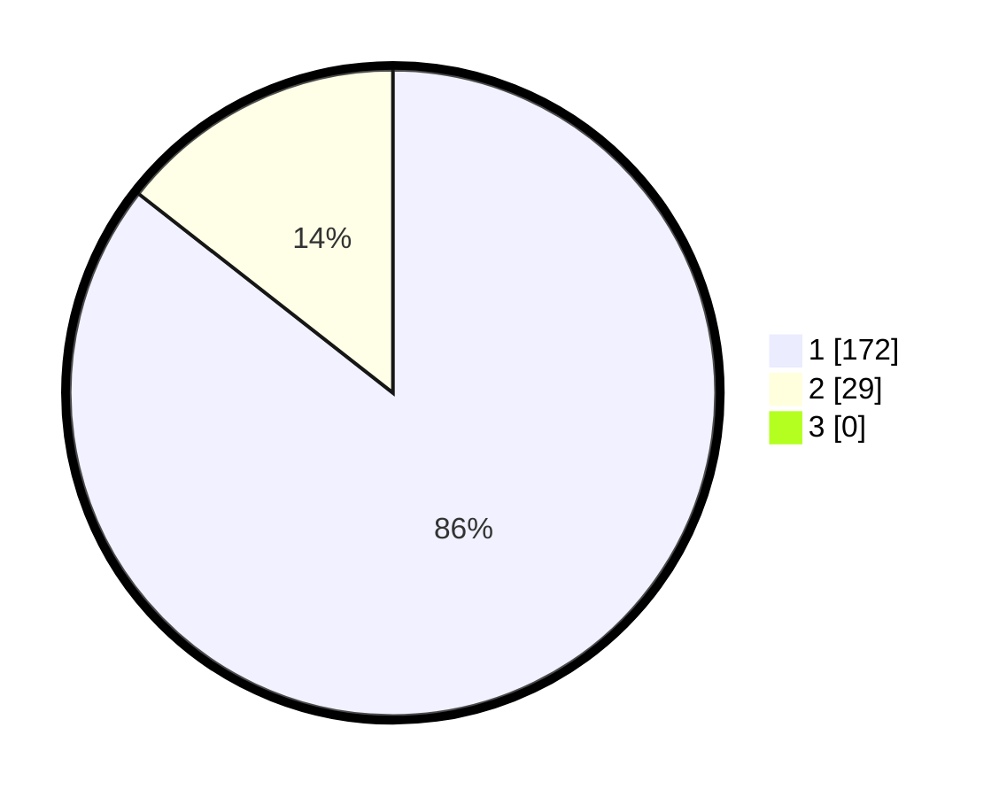

# Hasil

## Grafik

## Tabel

| No. | Nama Paslon    | Suara | Suara (raw) | Persentase |
|:--- |:-------------- | -----:| -----------:| ----------:|
| 1   | ANIES MUHAIMIN | 172   | [172][p-1]  | 85,57      |
| 2   | PRABOWO GIBRAN | 29    | [29][p-2]   | 14,43      |
| 3   | GANJAR MAHFUD  | 0     | [0][p-3]    | 0,00       |

[p-1]: https://github.com/gigit-pemilu/pemilu-2024-11-aceh/blob/main/pilpres/hitung-suara/sub/11-aceh/sub/06-aceh-besar/sub/08-peukan-bada/sub/2026-rima-keuneurom/sub/001-tps/sub/paslon-1.txt
[p-2]: https://github.com/gigit-pemilu/pemilu-2024-11-aceh/blob/main/pilpres/hitung-suara/sub/11-aceh/sub/06-aceh-besar/sub/08-peukan-bada/sub/2026-rima-keuneurom/sub/001-tps/sub/paslon-2.txt
[p-3]: https://github.com/gigit-pemilu/pemilu-2024-11-aceh/blob/main/pilpres/hitung-suara/sub/11-aceh/sub/06-aceh-besar/sub/08-peukan-bada/sub/2026-rima-keuneurom/sub/001-tps/sub/paslon-3.txt

## Foto C Plano

https://sirekap-obj-formc.kpu.go.id/7641/pemilu/ppwp/11/06/08/20/26/1106082026001-20240215-025136--9d10b7fc-5b0b-40ae-9e05-f420f9bf3d20.jpg

https://sirekap-obj-formc.kpu.go.id/7641/pemilu/ppwp/11/06/08/20/26/1106082026001-20240215-025315--1e814a5c-4a2d-4e1d-894f-f71ea6b19d76.jpg

https://sirekap-obj-formc.kpu.go.id/7641/pemilu/ppwp/11/06/08/20/26/1106082026001-20240215-025436--7341809d-4798-44b9-a459-e5e4e524b847.jpg

## Metadata

| Key        | Value               |
| ---------- | ------------------- |
| Time Stamp | 2024-02-15 22:30:27 |

