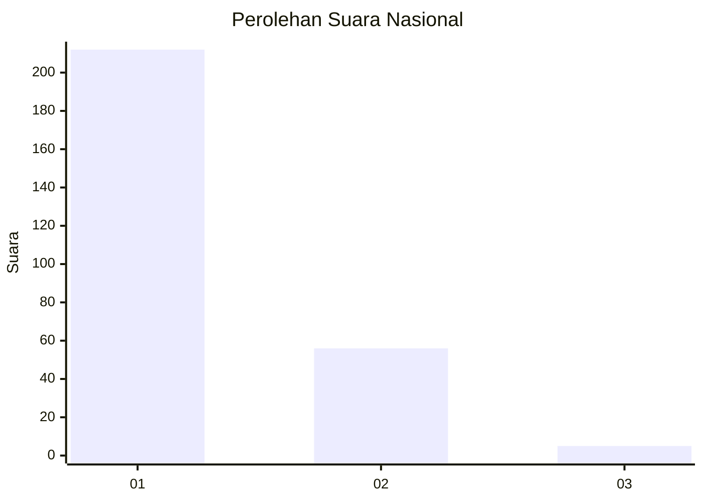
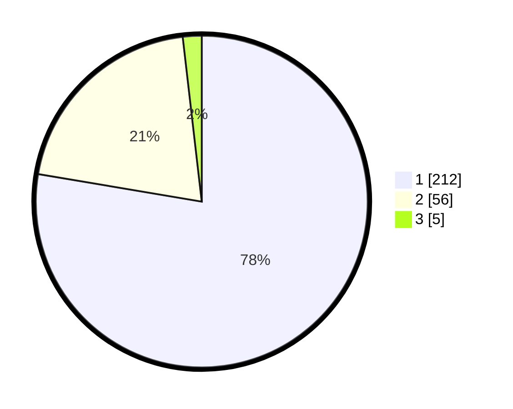

# Hasil

## Grafik

## Tabel

| No. | Nama Paslon    | Suara | Suara (raw) | Persentase |
|:--- |:-------------- | -----:| -----------:| ----------:|
| 1   | ANIES MUHAIMIN | 212   | [212][p-1]  | 77,66      |
| 2   | PRABOWO GIBRAN | 56    | [56][p-2]   | 20,51      |
| 3   | GANJAR MAHFUD  | 5     | [5][p-3]    | 1,83       |

[p-1]: https://github.com/gigit-pemilu/pemilu-2024/blob/main/pilpres/hitung-suara/sub/11-aceh/sub/06-aceh-besar/sub/09-mesjid-raya/sub/2001-meunasah-kulam/sub/001-tps/sub/paslon-1.txt
[p-2]: https://github.com/gigit-pemilu/pemilu-2024/blob/main/pilpres/hitung-suara/sub/11-aceh/sub/06-aceh-besar/sub/09-mesjid-raya/sub/2001-meunasah-kulam/sub/001-tps/sub/paslon-2.txt
[p-3]: https://github.com/gigit-pemilu/pemilu-2024/blob/main/pilpres/hitung-suara/sub/11-aceh/sub/06-aceh-besar/sub/09-mesjid-raya/sub/2001-meunasah-kulam/sub/001-tps/sub/paslon-3.txt

## Foto C Plano

https://sirekap-obj-formc.kpu.go.id/3ed7/pemilu/ppwp/11/06/09/20/01/1106092001001-20240216-190428--f9682fd4-2678-4536-90fb-1846584f6116.jpg

https://sirekap-obj-formc.kpu.go.id/3ed7/pemilu/ppwp/11/06/09/20/01/1106092001001-20240216-190430--1d70e7fb-51da-4051-8672-5c8abda54306.jpg

https://sirekap-obj-formc.kpu.go.id/3ed7/pemilu/ppwp/11/06/09/20/01/1106092001001-20240216-190429--88b6881d-ecf4-4efc-954f-700fa1a9bea2.jpg

## Metadata

| Key        | Value               |
| ---------- | ------------------- |
| Time Stamp | 2024-02-21 16:00:00 |

## DATA PEMILIH TETAP

Jumlah pemilih dalam DPT: **299**.
 * L: **143**.
 * P: **156**.

## DATA PENGGUNA HAK PILIH

Jumlah pengguna hak pilih dalam DPT: **277**.
 * L: **132**.
 * P: **145**.

Jumlah pengguna hak pilih dalam DPTb: **0**.
 * L: **0**.
 * P: **0**.

Jumlah pengguna hak pilih dalam DPK: **12**.
 * L: **6**.
 * P: **6**.

Jumlah pengguna hak pilih: **289**.
 * L: **138**.
 * P: **151**.

## JUMLAH SUARA SAH DAN TIDAK SAH

JUMLAH SELURUH SUARA SAH: **273**.

JUMLAH SUARA TIDAK SAH: **16**.

JUMLAH SELURUH SUARA SAH DAN SUARA TIDAK SAH: **289**.

