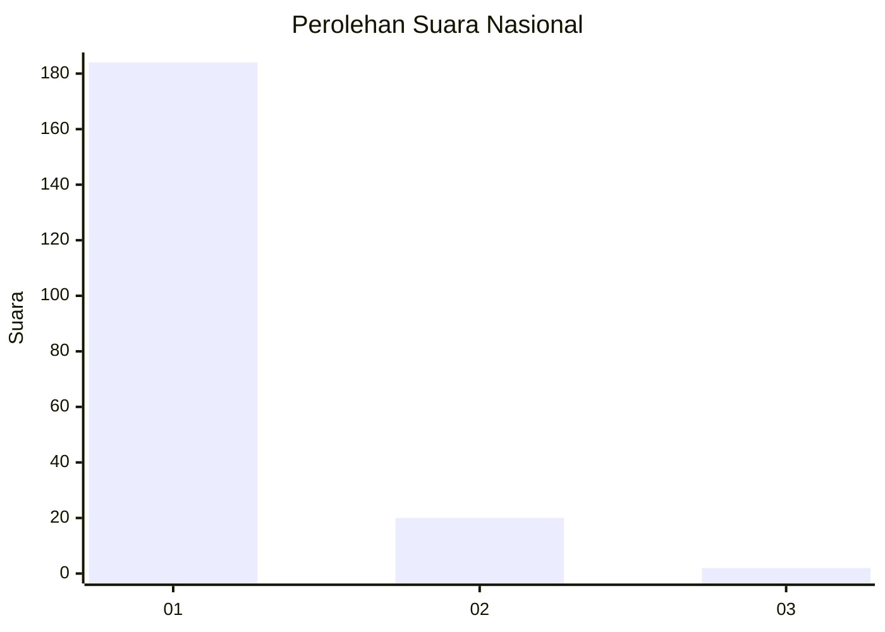
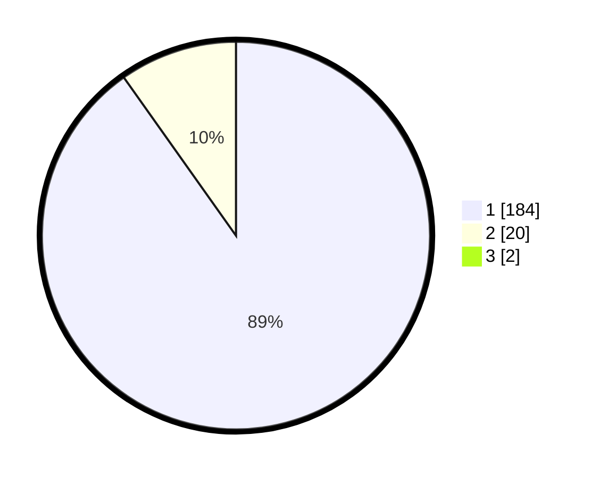

# Hasil

## Grafik

## Tabel

| No. | Nama Paslon    | Suara | Suara (raw) | Persentase |
|:--- |:-------------- | -----:| -----------:| ----------:|
| 1   | ANIES MUHAIMIN | 184   | [184][p-1]  | 89,32      |
| 2   | PRABOWO GIBRAN | 20    | [20][p-2]   | 9,71       |
| 3   | GANJAR MAHFUD  | 2     | [2][p-3]    | 0,97       |

[p-1]: https://github.com/gigit-pemilu/pemilu-2024/blob/main/pilpres/hitung-suara/sub/11-aceh/sub/06-aceh-besar/sub/09-mesjid-raya/sub/2002-beurandeh/sub/001-tps/sub/paslon-1.txt
[p-2]: https://github.com/gigit-pemilu/pemilu-2024/blob/main/pilpres/hitung-suara/sub/11-aceh/sub/06-aceh-besar/sub/09-mesjid-raya/sub/2002-beurandeh/sub/001-tps/sub/paslon-2.txt
[p-3]: https://github.com/gigit-pemilu/pemilu-2024/blob/main/pilpres/hitung-suara/sub/11-aceh/sub/06-aceh-besar/sub/09-mesjid-raya/sub/2002-beurandeh/sub/001-tps/sub/paslon-3.txt

## Foto C Plano

https://sirekap-obj-formc.kpu.go.id/3a4c/pemilu/ppwp/11/06/09/20/02/1106092002001-20240215-020414--a0a81da5-87aa-43dc-95c7-dae6818c595a.jpg

https://sirekap-obj-formc.kpu.go.id/3a4c/pemilu/ppwp/11/06/09/20/02/1106092002001-20240215-015901--5f22bcbe-fdb6-4636-a7bd-ad15be1f2c1c.jpg

https://sirekap-obj-formc.kpu.go.id/3a4c/pemilu/ppwp/11/06/09/20/02/1106092002001-20240215-020055--a427bfe8-db32-47f2-999c-6a456b6b9091.jpg

## Metadata

| Key        | Value               |
| ---------- | ------------------- |
| Time Stamp | 2024-02-15 09:00:24 |

