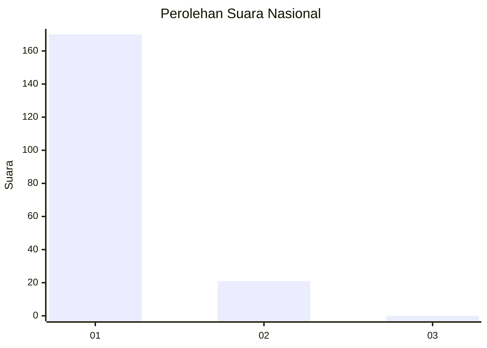
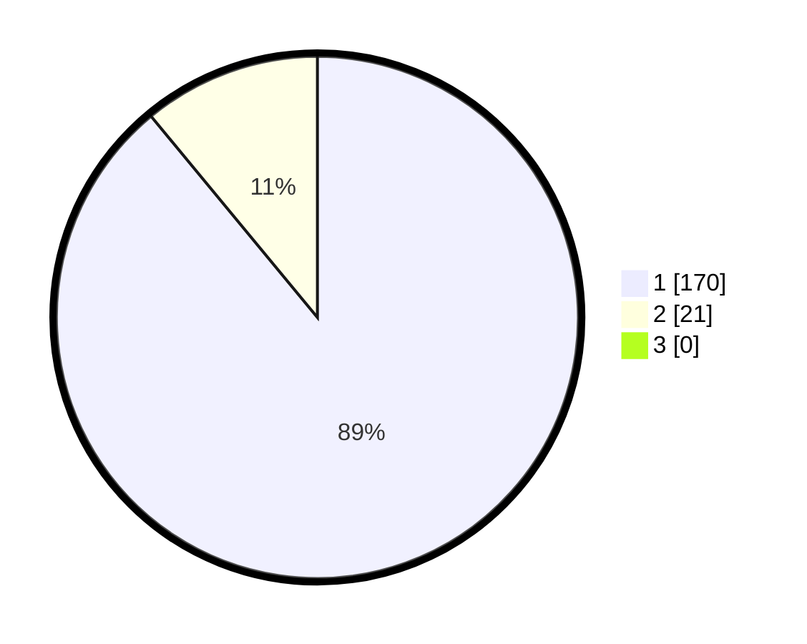

# Hasil

## Grafik

## Tabel

| No. | Nama Paslon    | Suara | Suara (raw) | Persentase |
|:--- |:-------------- | -----:| -----------:| ----------:|
| 1   | ANIES MUHAIMIN | 170   | [170][p-1]  | 89,01      |
| 2   | PRABOWO GIBRAN | 21    | [21][p-2]   | 10,99      |
| 3   | GANJAR MAHFUD  | 0     | [0][p-3]    | 0,00       |

[p-1]: https://github.com/gigit-pemilu/pemilu-2024/blob/main/pilpres/hitung-suara/sub/11-aceh/sub/06-aceh-besar/sub/09-mesjid-raya/sub/2004-meunasah-keudee/sub/002-tps/sub/paslon-1.txt
[p-2]: https://github.com/gigit-pemilu/pemilu-2024/blob/main/pilpres/hitung-suara/sub/11-aceh/sub/06-aceh-besar/sub/09-mesjid-raya/sub/2004-meunasah-keudee/sub/002-tps/sub/paslon-2.txt
[p-3]: https://github.com/gigit-pemilu/pemilu-2024/blob/main/pilpres/hitung-suara/sub/11-aceh/sub/06-aceh-besar/sub/09-mesjid-raya/sub/2004-meunasah-keudee/sub/002-tps/sub/paslon-3.txt

## Foto C Plano

https://sirekap-obj-formc.kpu.go.id/c4cd/pemilu/ppwp/11/06/09/20/04/1106092004002-20240214-201120--c4d1b03c-05e8-45e9-a12e-49da9de23ec6.jpg

https://sirekap-obj-formc.kpu.go.id/c4cd/pemilu/ppwp/11/06/09/20/04/1106092004002-20240214-201247--0ef3eed5-ee43-410e-b3f1-36a7fb7765e6.jpg

https://sirekap-obj-formc.kpu.go.id/c4cd/pemilu/ppwp/11/06/09/20/04/1106092004002-20240214-201431--93520374-aeb0-4b94-bdca-d437eb3dfba5.jpg

## Metadata

| Key        | Value               |
| ---------- | ------------------- |
| Time Stamp | 2024-02-15 22:30:27 |

