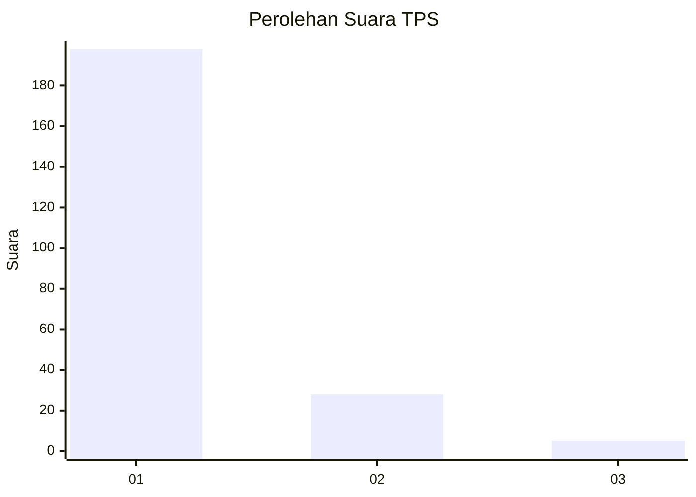
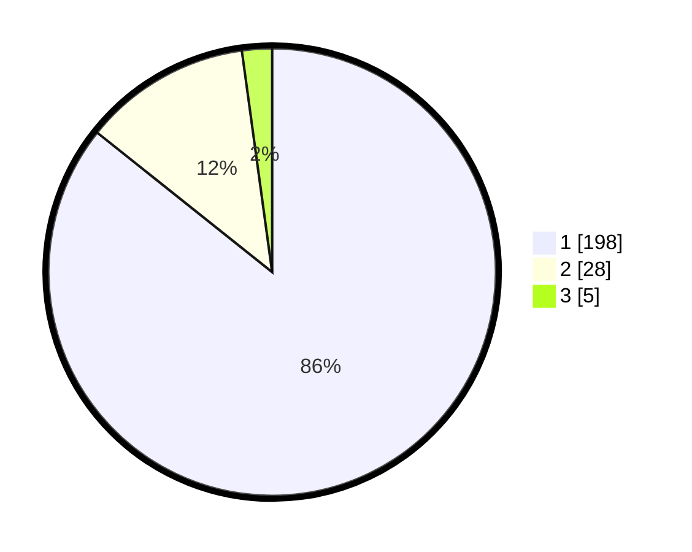

# Hasil

## Grafik

## Tabel

| No. | Nama Paslon    | Suara | Suara (raw) | Persentase |
|:--- |:-------------- | -----:| -----------:| ----------:|
| 1   | ANIES MUHAIMIN | 198   | [198][p-1]  | 85,71      |
| 2   | PRABOWO GIBRAN | 28    | [28][p-2]   | 12,12      |
| 3   | GANJAR MAHFUD  | 5     | [5][p-3]    | 2,16       |

[p-1]: https://github.com/gigit-pemilu/pemilu-2024-11-aceh/blob/main/pilpres/hitung-suara/sub/11-aceh/sub/06-aceh-besar/sub/09-mesjid-raya/sub/2005-lamreh/sub/001-tps/sub/paslon-1.txt
[p-2]: https://github.com/gigit-pemilu/pemilu-2024-11-aceh/blob/main/pilpres/hitung-suara/sub/11-aceh/sub/06-aceh-besar/sub/09-mesjid-raya/sub/2005-lamreh/sub/001-tps/sub/paslon-2.txt
[p-3]: https://github.com/gigit-pemilu/pemilu-2024-11-aceh/blob/main/pilpres/hitung-suara/sub/11-aceh/sub/06-aceh-besar/sub/09-mesjid-raya/sub/2005-lamreh/sub/001-tps/sub/paslon-3.txt

## Foto C Plano

https://sirekap-obj-formc.kpu.go.id/7420/pemilu/ppwp/11/06/09/20/05/1106092005001-20240214-233640--e25d86e2-4aef-46d9-b1ff-60e0252e4118.jpg

https://sirekap-obj-formc.kpu.go.id/7420/pemilu/ppwp/11/06/09/20/05/1106092005001-20240214-203406--4c216c40-9573-4dcb-8a62-43848bc9a3aa.jpg

https://sirekap-obj-formc.kpu.go.id/7420/pemilu/ppwp/11/06/09/20/05/1106092005001-20240214-213649--b0c8af9f-a468-4f0a-9982-024b4b0e8c7a.jpg

## Metadata

| Key        | Value               |
| ---------- | ------------------- |
| Time Stamp | 2024-02-15 12:00:28 |

