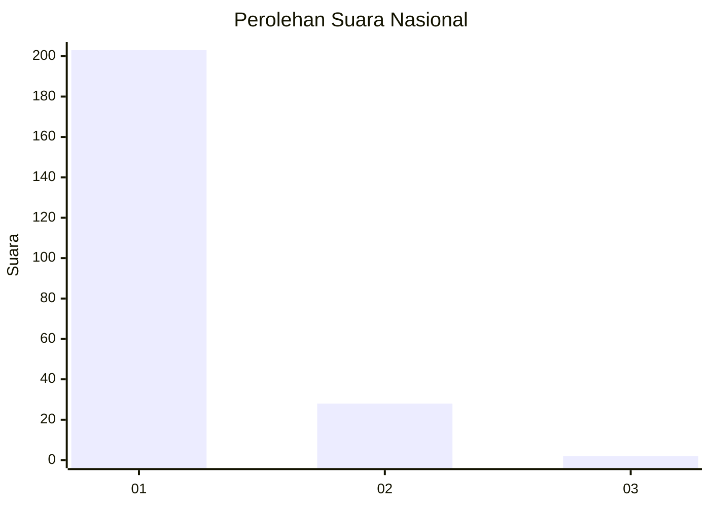
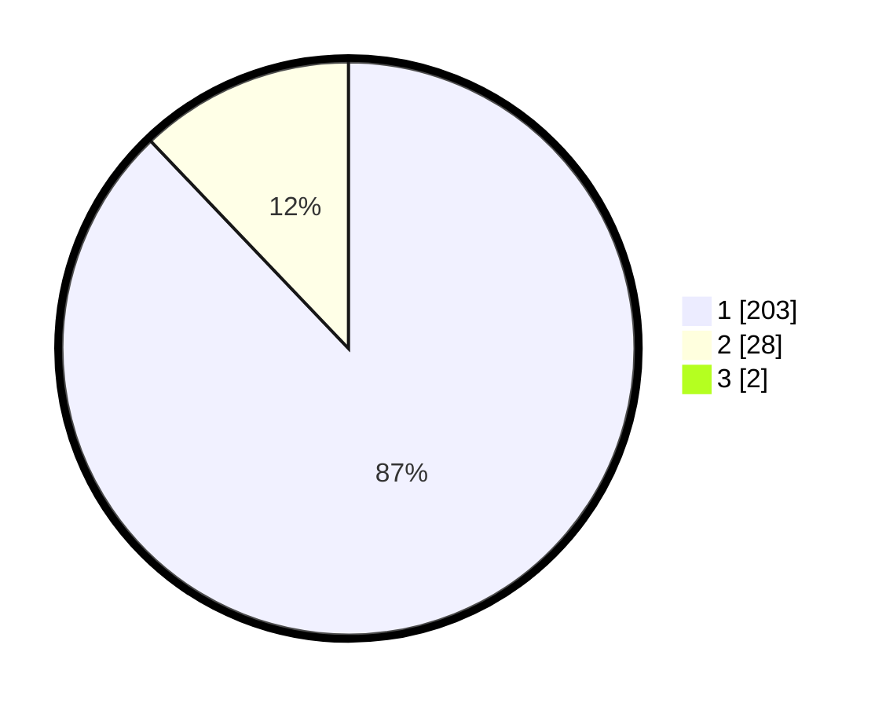

# Hasil

## Grafik

## Tabel

| No. | Nama Paslon    | Suara | Suara (raw) | Persentase |
|:--- |:-------------- | -----:| -----------:| ----------:|
| 1   | ANIES MUHAIMIN | 203   | [203][p-1]  | 87,12      |
| 2   | PRABOWO GIBRAN | 28    | [28][p-2]   | 12,02      |
| 3   | GANJAR MAHFUD  | 2     | [2][p-3]    | 0,86       |

[p-1]: https://github.com/gigit-pemilu/pemilu-2024/blob/main/pilpres/hitung-suara/sub/11-aceh/sub/06-aceh-besar/sub/09-mesjid-raya/sub/2009-ladong/sub/002-tps/sub/paslon-1.txt
[p-2]: https://github.com/gigit-pemilu/pemilu-2024/blob/main/pilpres/hitung-suara/sub/11-aceh/sub/06-aceh-besar/sub/09-mesjid-raya/sub/2009-ladong/sub/002-tps/sub/paslon-2.txt
[p-3]: https://github.com/gigit-pemilu/pemilu-2024/blob/main/pilpres/hitung-suara/sub/11-aceh/sub/06-aceh-besar/sub/09-mesjid-raya/sub/2009-ladong/sub/002-tps/sub/paslon-3.txt

## Foto C Plano

https://sirekap-obj-formc.kpu.go.id/0059/pemilu/ppwp/11/06/09/20/09/1106092009002-20240215-023822--85f7a7e6-f832-4be4-9454-630d3d80c673.jpg

https://sirekap-obj-formc.kpu.go.id/0059/pemilu/ppwp/11/06/09/20/09/1106092009002-20240215-024152--72938014-3ac0-4644-8a35-dbc034d69b87.jpg

https://sirekap-obj-formc.kpu.go.id/0059/pemilu/ppwp/11/06/09/20/09/1106092009002-20240215-093317--db467fc3-c849-4b32-961a-39e305d524ea.jpg

## Metadata

| Key        | Value               |
| ---------- | ------------------- |
| Time Stamp | 2024-02-15 22:40:13 |

