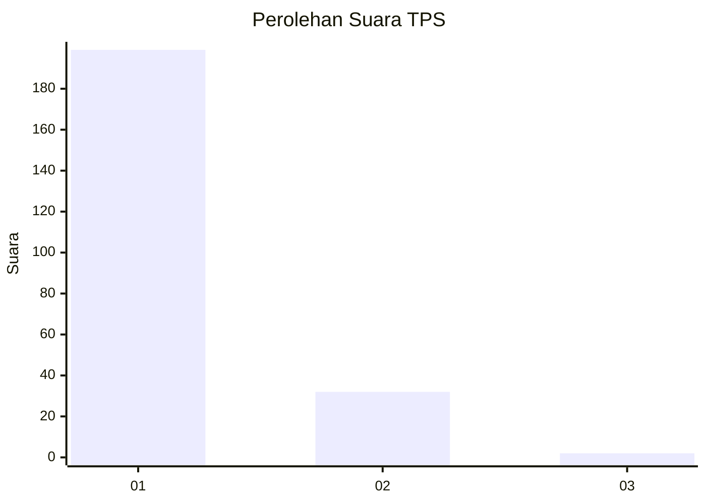
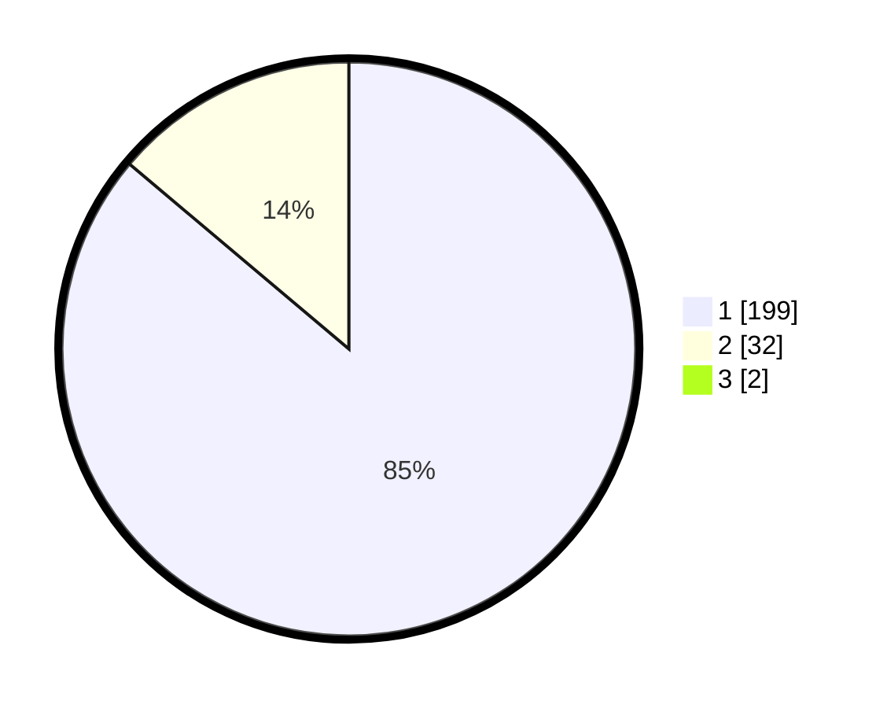

# Hasil

## Grafik

## Tabel

| No. | Nama Paslon    | Suara | Suara (raw) | Persentase |
|:--- |:-------------- | -----:| -----------:| ----------:|
| 1   | ANIES MUHAIMIN | 199   | [199][p-1]  | 85,41      |
| 2   | PRABOWO GIBRAN | 32    | [32][p-2]   | 13,73      |
| 3   | GANJAR MAHFUD  | 2     | [2][p-3]    | 0,86       |

[p-1]: https://github.com/gigit-pemilu/pemilu-2024-11-aceh/blob/main/pilpres/hitung-suara/sub/11-aceh/sub/06-aceh-besar/sub/09-mesjid-raya/sub/2009-ladong/sub/003-tps/sub/paslon-1.txt
[p-2]: https://github.com/gigit-pemilu/pemilu-2024-11-aceh/blob/main/pilpres/hitung-suara/sub/11-aceh/sub/06-aceh-besar/sub/09-mesjid-raya/sub/2009-ladong/sub/003-tps/sub/paslon-2.txt
[p-3]: https://github.com/gigit-pemilu/pemilu-2024-11-aceh/blob/main/pilpres/hitung-suara/sub/11-aceh/sub/06-aceh-besar/sub/09-mesjid-raya/sub/2009-ladong/sub/003-tps/sub/paslon-3.txt

## Foto C Plano

https://sirekap-obj-formc.kpu.go.id/c43e/pemilu/ppwp/11/06/09/20/09/1106092009003-20240215-031520--b52ff76d-4be9-4634-b031-d4477739a808.jpg

https://sirekap-obj-formc.kpu.go.id/c43e/pemilu/ppwp/11/06/09/20/09/1106092009003-20240215-053908--348e6c95-a438-4d6f-b855-212f24ff9407.jpg

https://sirekap-obj-formc.kpu.go.id/c43e/pemilu/ppwp/11/06/09/20/09/1106092009003-20240215-032228--4e6d3bda-f6b2-4dca-a606-cd2706733598.jpg

## Metadata

| Key        | Value               |
| ---------- | ------------------- |
| Time Stamp | 2024-02-15 22:40:13 |

