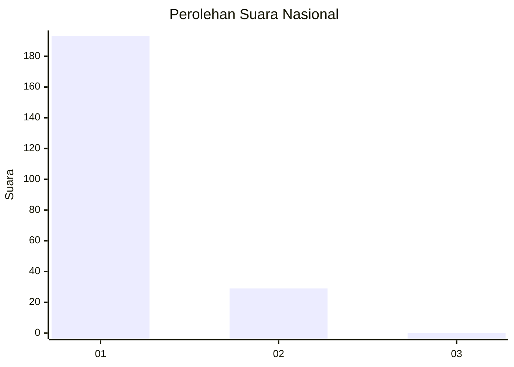
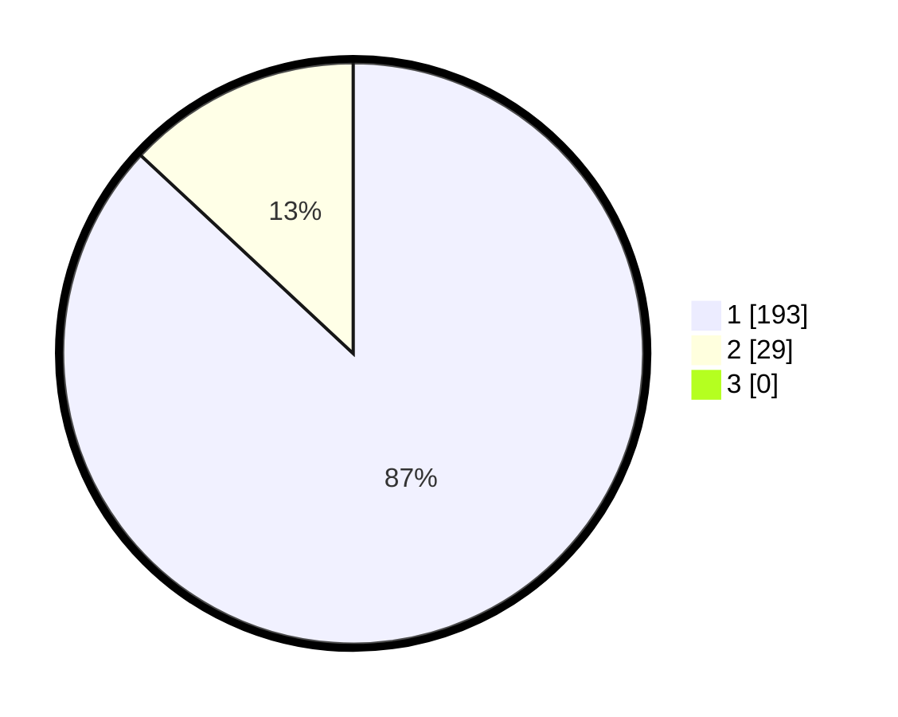

# Hasil

## Grafik

## Tabel

| No. | Nama Paslon    | Suara | Suara (raw) | Persentase |
|:--- |:-------------- | -----:| -----------:| ----------:|
| 1   | ANIES MUHAIMIN | 193   | [193][p-1]  | 86,94      |
| 2   | PRABOWO GIBRAN | 29    | [29][p-2]   | 13,06      |
| 3   | GANJAR MAHFUD  | 0     | [0][p-3]    | 0,00       |

[p-1]: https://github.com/gigit-pemilu/pemilu-2024/blob/main/pilpres/hitung-suara/sub/11-aceh/sub/06-aceh-besar/sub/09-mesjid-raya/sub/2009-ladong/sub/004-tps/sub/paslon-1.txt
[p-2]: https://github.com/gigit-pemilu/pemilu-2024/blob/main/pilpres/hitung-suara/sub/11-aceh/sub/06-aceh-besar/sub/09-mesjid-raya/sub/2009-ladong/sub/004-tps/sub/paslon-2.txt
[p-3]: https://github.com/gigit-pemilu/pemilu-2024/blob/main/pilpres/hitung-suara/sub/11-aceh/sub/06-aceh-besar/sub/09-mesjid-raya/sub/2009-ladong/sub/004-tps/sub/paslon-3.txt

## Foto C Plano

https://sirekap-obj-formc.kpu.go.id/9756/pemilu/ppwp/11/06/09/20/09/1106092009004-20240215-164227--e8b0463c-046f-406b-b2fc-1d86f47e423f.jpg

https://sirekap-obj-formc.kpu.go.id/9756/pemilu/ppwp/11/06/09/20/09/1106092009004-20240215-025832--cb81a2a7-2f3e-4440-a6e0-bfffb1c35d43.jpg

https://sirekap-obj-formc.kpu.go.id/9756/pemilu/ppwp/11/06/09/20/09/1106092009004-20240215-030128--38e69506-3957-4add-a2c0-ecb22fb5f5ed.jpg

## Metadata

| Key        | Value               |
| ---------- | ------------------- |
| Time Stamp | 2024-02-15 17:00:25 |

