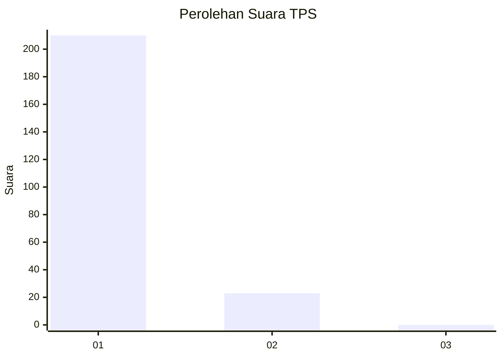
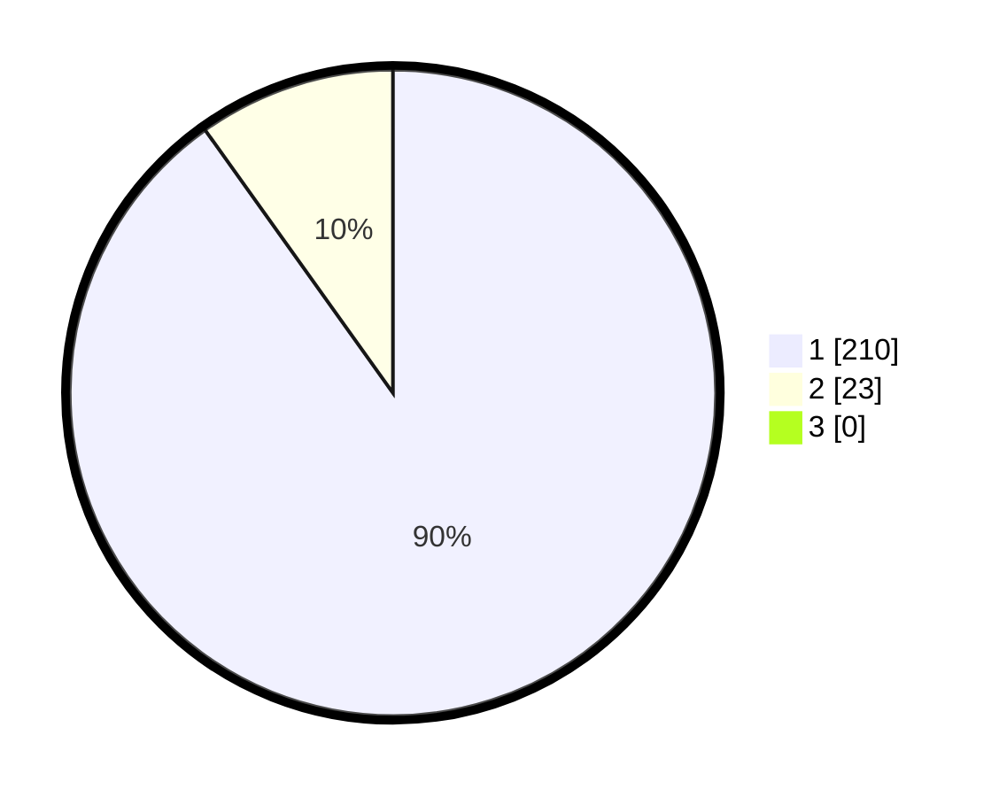

# Hasil

## Grafik

## Tabel

| No. | Nama Paslon    | Suara | Suara (raw) | Persentase |
|:--- |:-------------- | -----:| -----------:| ----------:|
| 1   | ANIES MUHAIMIN | 210   | [210][p-1]  | 90,13      |
| 2   | PRABOWO GIBRAN | 23    | [23][p-2]   | 9,87       |
| 3   | GANJAR MAHFUD  | 0     | [0][p-3]    | 0,00       |

[p-1]: https://github.com/gigit-pemilu/pemilu-2024-11-aceh/blob/main/pilpres/hitung-suara/sub/11-aceh/sub/06-aceh-besar/sub/09-mesjid-raya/sub/2009-ladong/sub/005-tps/sub/paslon-1.txt
[p-2]: https://github.com/gigit-pemilu/pemilu-2024-11-aceh/blob/main/pilpres/hitung-suara/sub/11-aceh/sub/06-aceh-besar/sub/09-mesjid-raya/sub/2009-ladong/sub/005-tps/sub/paslon-2.txt
[p-3]: https://github.com/gigit-pemilu/pemilu-2024-11-aceh/blob/main/pilpres/hitung-suara/sub/11-aceh/sub/06-aceh-besar/sub/09-mesjid-raya/sub/2009-ladong/sub/005-tps/sub/paslon-3.txt

## Foto C Plano

https://sirekap-obj-formc.kpu.go.id/889d/pemilu/ppwp/11/06/09/20/09/1106092009005-20240215-025152--0891475e-36c8-4420-a7e5-e260033dcf54.jpg

https://sirekap-obj-formc.kpu.go.id/889d/pemilu/ppwp/11/06/09/20/09/1106092009005-20240215-025435--cd5302d2-7aa4-4d45-9271-eb5eb6a7d6a8.jpg

https://sirekap-obj-formc.kpu.go.id/889d/pemilu/ppwp/11/06/09/20/09/1106092009005-20240215-025709--724412fd-ff4b-434d-9d2c-bdd88f5251b6.jpg

## Metadata

| Key        | Value               |
| ---------- | ------------------- |
| Time Stamp | 2024-02-15 22:40:13 |

