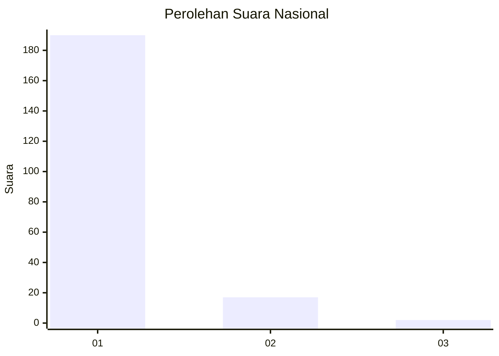
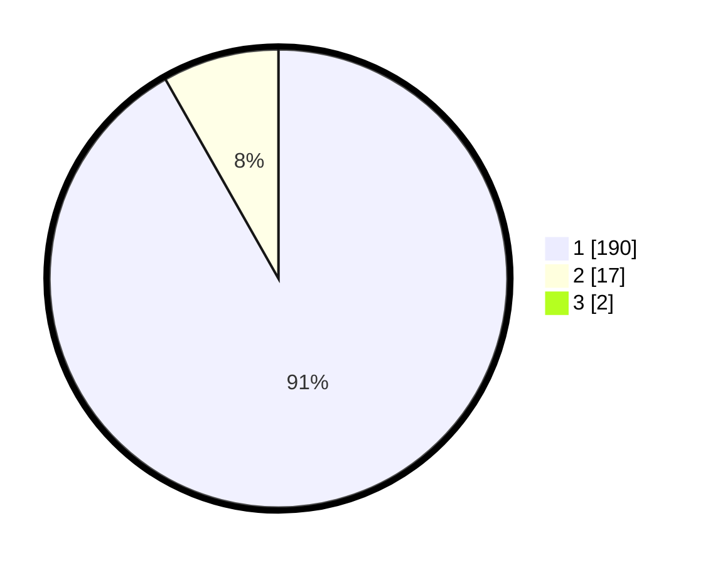

# Hasil

## Grafik

## Tabel

| No. | Nama Paslon    | Suara | Suara (raw) | Persentase |
|:--- |:-------------- | -----:| -----------:| ----------:|
| 1   | ANIES MUHAIMIN | 190   | [190][p-1]  | 90,91      |
| 2   | PRABOWO GIBRAN | 17    | [17][p-2]   | 8,13       |
| 3   | GANJAR MAHFUD  | 2     | [2][p-3]    | 0,96       |

[p-1]: https://github.com/gigit-pemilu/pemilu-2024/blob/main/pilpres/hitung-suara/sub/11-aceh/sub/06-aceh-besar/sub/09-mesjid-raya/sub/2011-durung/sub/001-tps/sub/paslon-1.txt
[p-2]: https://github.com/gigit-pemilu/pemilu-2024/blob/main/pilpres/hitung-suara/sub/11-aceh/sub/06-aceh-besar/sub/09-mesjid-raya/sub/2011-durung/sub/001-tps/sub/paslon-2.txt
[p-3]: https://github.com/gigit-pemilu/pemilu-2024/blob/main/pilpres/hitung-suara/sub/11-aceh/sub/06-aceh-besar/sub/09-mesjid-raya/sub/2011-durung/sub/001-tps/sub/paslon-3.txt

## Foto C Plano

https://sirekap-obj-formc.kpu.go.id/8429/pemilu/ppwp/11/06/09/20/11/1106092011001-20240215-083218--4a6ce566-31cc-48dd-b32e-e066d1bd356b.jpg

https://sirekap-obj-formc.kpu.go.id/8429/pemilu/ppwp/11/06/09/20/11/1106092011001-20240216-152605--ed8c7d11-a06d-4589-9a35-56b02e1a5a32.jpg

https://sirekap-obj-formc.kpu.go.id/8429/pemilu/ppwp/11/06/09/20/11/1106092011001-20240216-152407--0ec8aa4b-7fd8-4660-9104-56ff40b6f5a3.jpg

## Metadata

| Key        | Value               |
| ---------- | ------------------- |
| Time Stamp | 2024-02-19 22:00:00 |

