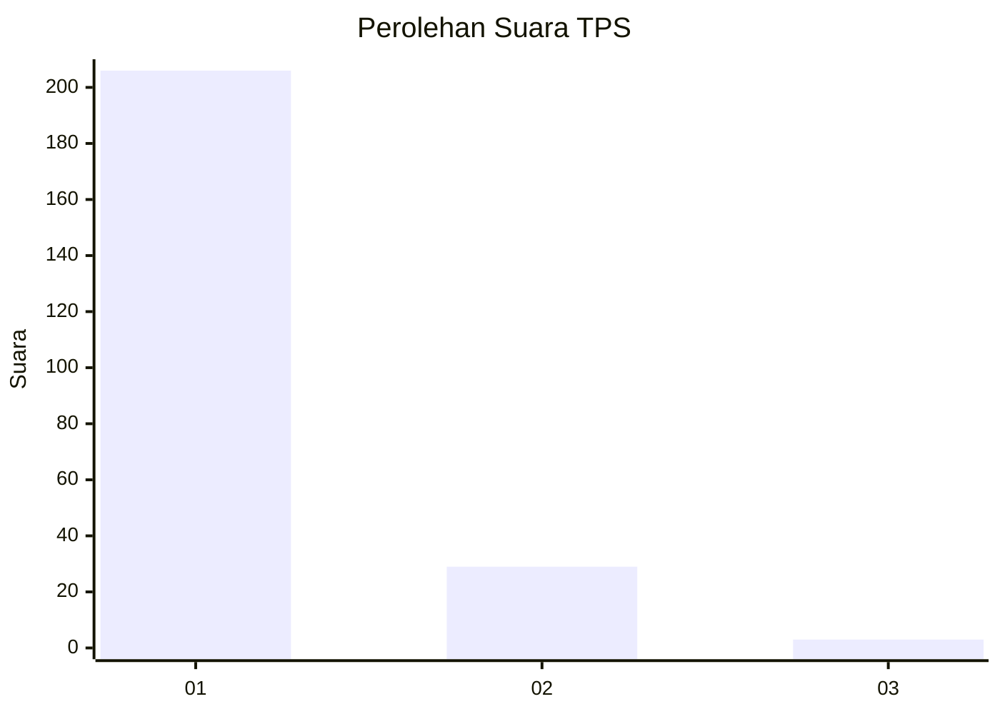
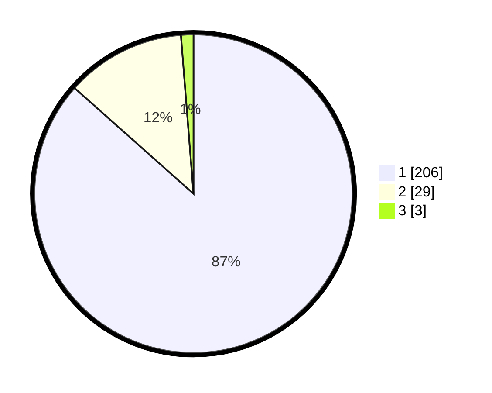

# Hasil

## Grafik

## Tabel

| No. | Nama Paslon    | Suara | Suara (raw) | Persentase |
|:--- |:-------------- | -----:| -----------:| ----------:|
| 1   | ANIES MUHAIMIN | 206   | [206][p-1]  | 86,55      |
| 2   | PRABOWO GIBRAN | 29    | [29][p-2]   | 12,18      |
| 3   | GANJAR MAHFUD  | 3     | [3][p-3]    | 1,26       |

[p-1]: https://github.com/gigit-pemilu/pemilu-2024-11-aceh/blob/main/pilpres/hitung-suara/sub/11-aceh/sub/06-aceh-besar/sub/09-mesjid-raya/sub/2012-neuheun/sub/005-tps/sub/paslon-1.txt
[p-2]: https://github.com/gigit-pemilu/pemilu-2024-11-aceh/blob/main/pilpres/hitung-suara/sub/11-aceh/sub/06-aceh-besar/sub/09-mesjid-raya/sub/2012-neuheun/sub/005-tps/sub/paslon-2.txt
[p-3]: https://github.com/gigit-pemilu/pemilu-2024-11-aceh/blob/main/pilpres/hitung-suara/sub/11-aceh/sub/06-aceh-besar/sub/09-mesjid-raya/sub/2012-neuheun/sub/005-tps/sub/paslon-3.txt

## Foto C Plano

https://sirekap-obj-formc.kpu.go.id/9ba0/pemilu/ppwp/11/06/09/20/12/1106092012005-20240214-191215--8a3fa8ea-9d01-48a7-ac5f-41e20cfc3ed2.jpg

https://sirekap-obj-formc.kpu.go.id/9ba0/pemilu/ppwp/11/06/09/20/12/1106092012005-20240214-200658--dc5001e9-b3f2-446e-baf2-807436357109.jpg

https://sirekap-obj-formc.kpu.go.id/9ba0/pemilu/ppwp/11/06/09/20/12/1106092012005-20240214-200809--0b5db592-c962-4e82-87de-de53eaa28b24.jpg

## Metadata

| Key        | Value               |
| ---------- | ------------------- |
| Time Stamp | 2024-02-15 22:40:13 |

