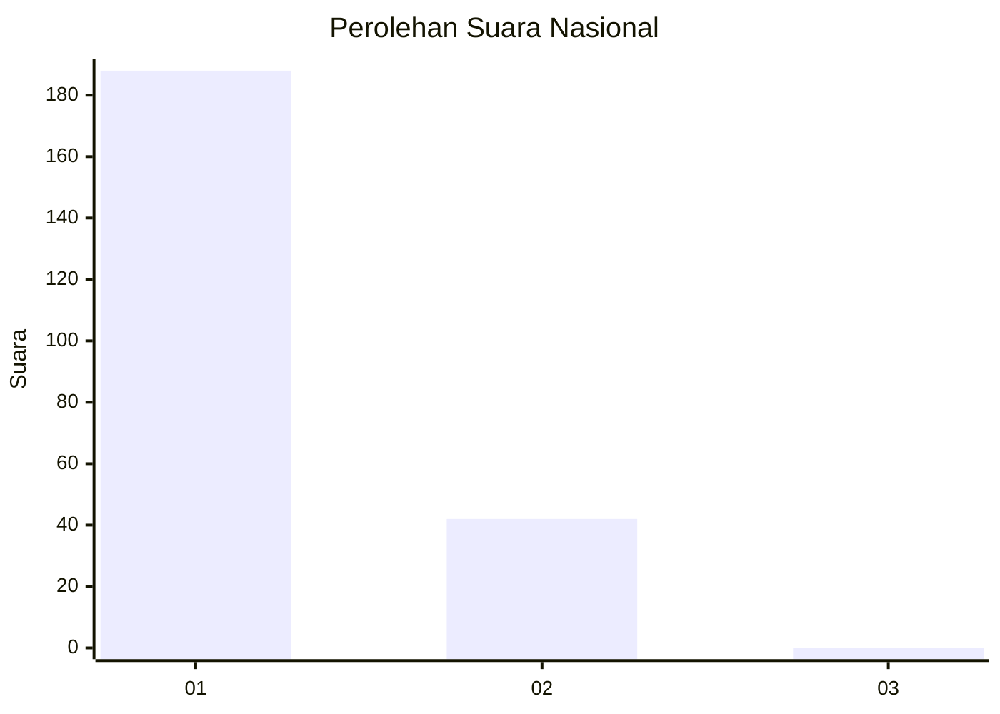
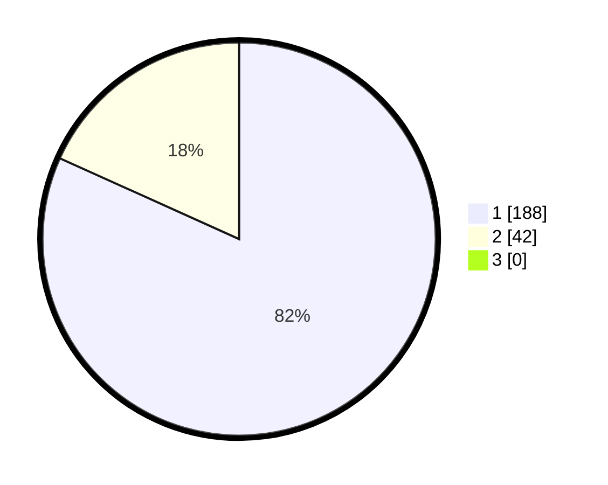

# Hasil

## Grafik

## Tabel

| No. | Nama Paslon    | Suara | Suara (raw) | Persentase |
|:--- |:-------------- | -----:| -----------:| ----------:|
| 1   | ANIES MUHAIMIN | 188   | [188][p-1]  | 81,74      |
| 2   | PRABOWO GIBRAN | 42    | [42][p-2]   | 18,26      |
| 3   | GANJAR MAHFUD  | 0     | [0][p-3]    | 0,00       |

[p-1]: https://github.com/gigit-pemilu/pemilu-2024/blob/main/pilpres/hitung-suara/sub/11-aceh/sub/06-aceh-besar/sub/09-mesjid-raya/sub/2012-neuheun/sub/006-tps/sub/paslon-1.txt
[p-2]: https://github.com/gigit-pemilu/pemilu-2024/blob/main/pilpres/hitung-suara/sub/11-aceh/sub/06-aceh-besar/sub/09-mesjid-raya/sub/2012-neuheun/sub/006-tps/sub/paslon-2.txt
[p-3]: https://github.com/gigit-pemilu/pemilu-2024/blob/main/pilpres/hitung-suara/sub/11-aceh/sub/06-aceh-besar/sub/09-mesjid-raya/sub/2012-neuheun/sub/006-tps/sub/paslon-3.txt

## Foto C Plano

https://sirekap-obj-formc.kpu.go.id/3b2b/pemilu/ppwp/11/06/09/20/12/1106092012006-20240215-010618--c1443f25-c1b8-4538-aa5c-2a7b5f589c1a.jpg

https://sirekap-obj-formc.kpu.go.id/3b2b/pemilu/ppwp/11/06/09/20/12/1106092012006-20240215-010952--e35116d2-e679-47a6-bd41-81fa1deaeb27.jpg

https://sirekap-obj-formc.kpu.go.id/3b2b/pemilu/ppwp/11/06/09/20/12/1106092012006-20240215-011225--76e3a5ce-2d0d-4131-9432-0ed51f6e0476.jpg

## Metadata

| Key        | Value               |
| ---------- | ------------------- |
| Time Stamp | 2024-02-15 23:29:50 |

