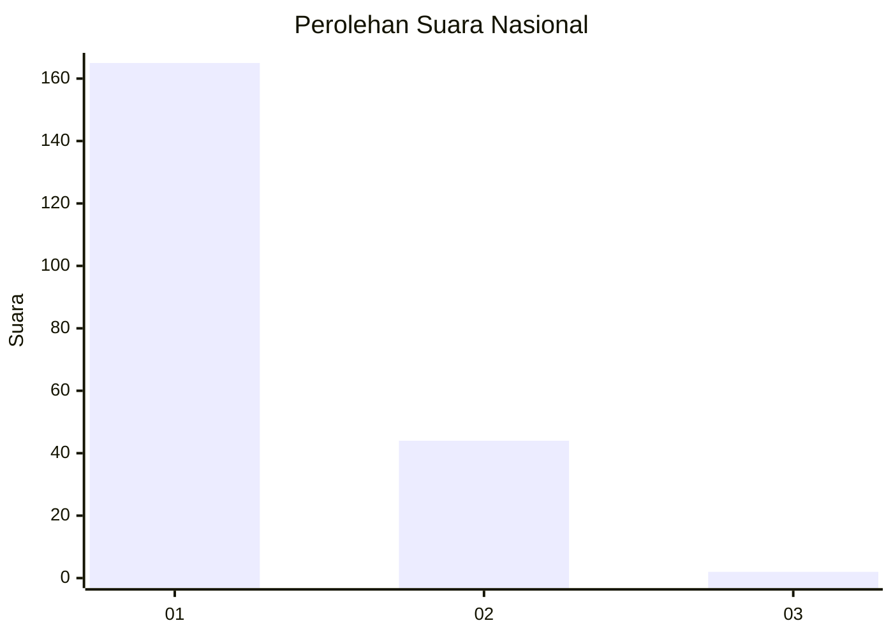
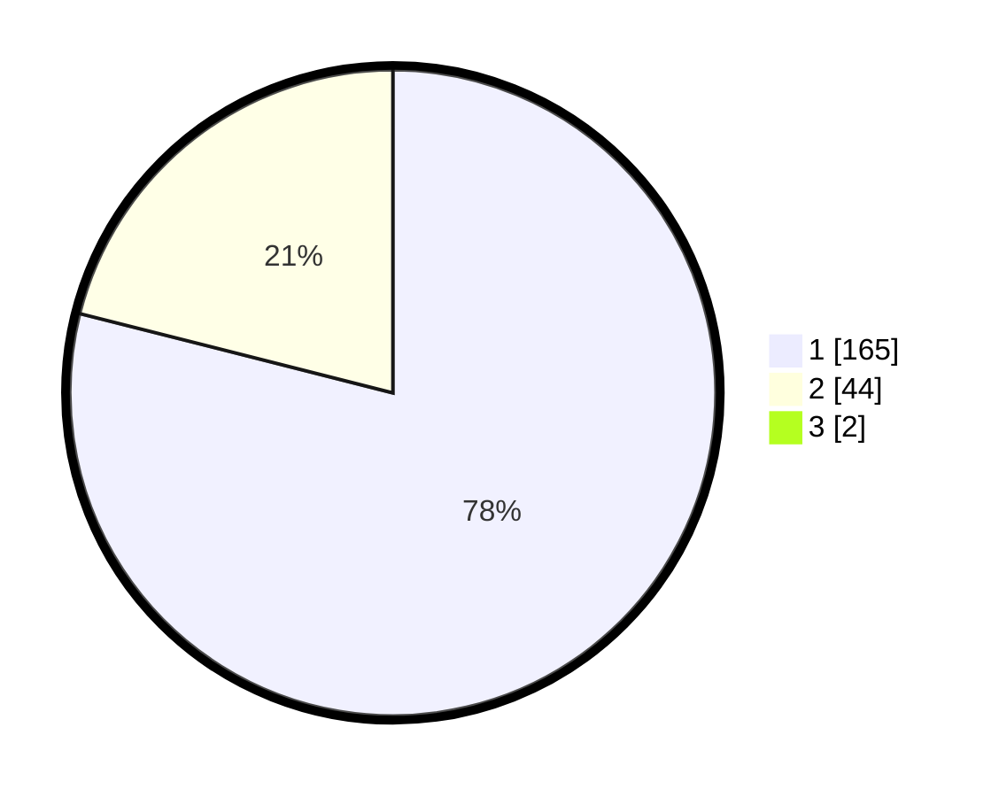

# Hasil

## Grafik

## Tabel

| No. | Nama Paslon    | Suara | Suara (raw) | Persentase |
|:--- |:-------------- | -----:| -----------:| ----------:|
| 1   | ANIES MUHAIMIN | 165   | [165][p-1]  | 78,20      |
| 2   | PRABOWO GIBRAN | 44    | [44][p-2]   | 20,85      |
| 3   | GANJAR MAHFUD  | 2     | [2][p-3]    | 0,95       |

[p-1]: https://github.com/gigit-pemilu/pemilu-2024/blob/main/pilpres/hitung-suara/sub/11-aceh/sub/06-aceh-besar/sub/09-mesjid-raya/sub/2012-neuheun/sub/008-tps/sub/paslon-1.txt
[p-2]: https://github.com/gigit-pemilu/pemilu-2024/blob/main/pilpres/hitung-suara/sub/11-aceh/sub/06-aceh-besar/sub/09-mesjid-raya/sub/2012-neuheun/sub/008-tps/sub/paslon-2.txt
[p-3]: https://github.com/gigit-pemilu/pemilu-2024/blob/main/pilpres/hitung-suara/sub/11-aceh/sub/06-aceh-besar/sub/09-mesjid-raya/sub/2012-neuheun/sub/008-tps/sub/paslon-3.txt

## Foto C Plano

https://sirekap-obj-formc.kpu.go.id/b750/pemilu/ppwp/11/06/09/20/12/1106092012008-20240214-221757--70e8341a-a1ba-4976-90de-2eb5f480b076.jpg

https://sirekap-obj-formc.kpu.go.id/b750/pemilu/ppwp/11/06/09/20/12/1106092012008-20240214-221908--5dfb0ce8-a70f-4ebe-9575-5c4530cb6b2d.jpg

https://sirekap-obj-formc.kpu.go.id/b750/pemilu/ppwp/11/06/09/20/12/1106092012008-20240214-222000--0d3ab26c-3fe3-4877-892b-94202cea262c.jpg

## Metadata

| Key        | Value               |
| ---------- | ------------------- |
| Time Stamp | 2024-02-25 15:00:00 |

