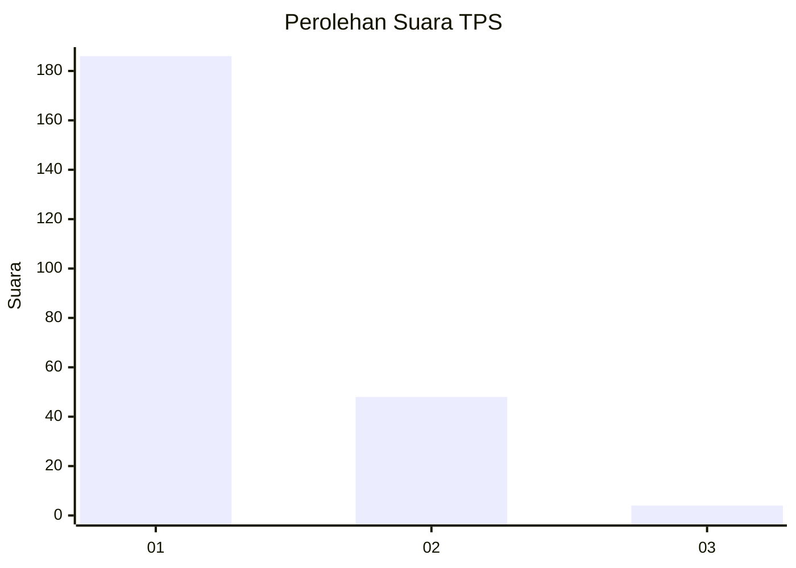
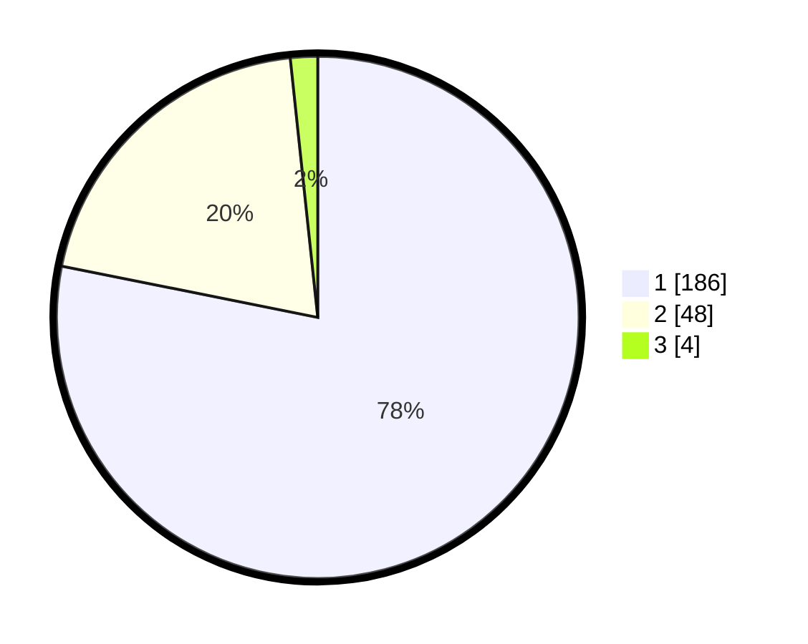

# Hasil

## Grafik

## Tabel

| No. | Nama Paslon    | Suara | Suara (raw) | Persentase |
|:--- |:-------------- | -----:| -----------:| ----------:|
| 1   | ANIES MUHAIMIN | 186   | [186][p-1]  | 78,15      |
| 2   | PRABOWO GIBRAN | 48    | [48][p-2]   | 20,17      |
| 3   | GANJAR MAHFUD  | 4     | [4][p-3]    | 1,68       |

[p-1]: https://github.com/gigit-pemilu/pemilu-2024-11-aceh/blob/main/pilpres/hitung-suara/sub/11-aceh/sub/06-aceh-besar/sub/09-mesjid-raya/sub/2012-neuheun/sub/011-tps/sub/paslon-1.txt
[p-2]: https://github.com/gigit-pemilu/pemilu-2024-11-aceh/blob/main/pilpres/hitung-suara/sub/11-aceh/sub/06-aceh-besar/sub/09-mesjid-raya/sub/2012-neuheun/sub/011-tps/sub/paslon-2.txt
[p-3]: https://github.com/gigit-pemilu/pemilu-2024-11-aceh/blob/main/pilpres/hitung-suara/sub/11-aceh/sub/06-aceh-besar/sub/09-mesjid-raya/sub/2012-neuheun/sub/011-tps/sub/paslon-3.txt

## Foto C Plano

https://sirekap-obj-formc.kpu.go.id/8fc0/pemilu/ppwp/11/06/09/20/12/1106092012011-20240214-192919--6aa037c0-5a6e-4def-b5fd-3df6172de06f.jpg

https://sirekap-obj-formc.kpu.go.id/8fc0/pemilu/ppwp/11/06/09/20/12/1106092012011-20240214-192929--e5df0aa0-de86-4e39-9aa3-9b974609eb0f.jpg

https://sirekap-obj-formc.kpu.go.id/8fc0/pemilu/ppwp/11/06/09/20/12/1106092012011-20240214-192938--626b8315-eb06-473e-a102-ec9bbed3ae0e.jpg

## Metadata

| Key        | Value               |
| ---------- | ------------------- |
| Time Stamp | 2024-02-15 23:29:50 |

