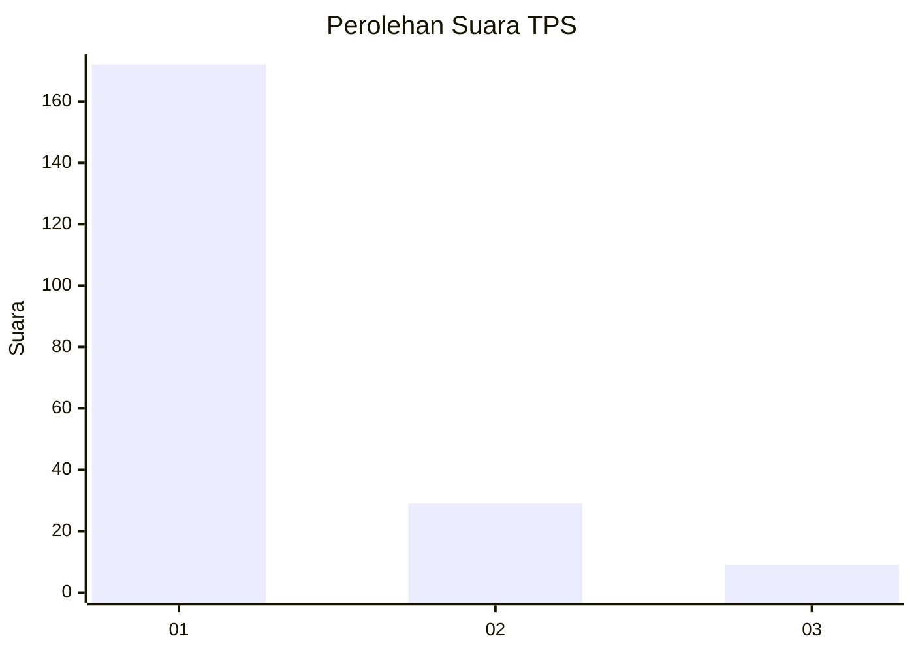
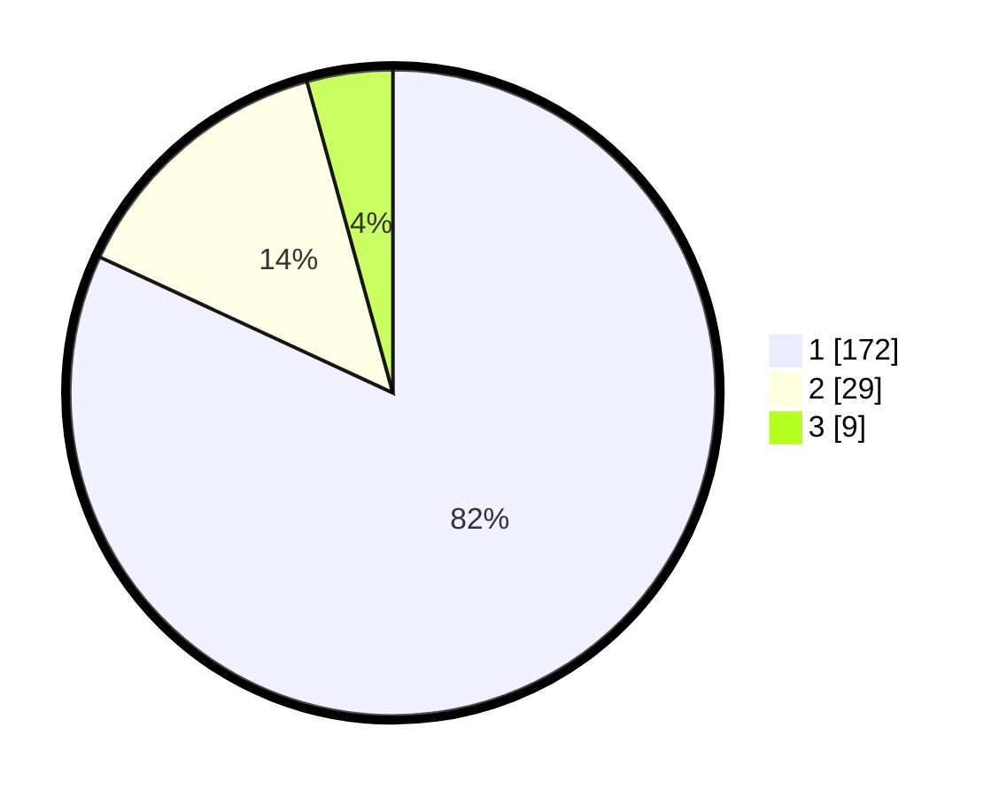

# Hasil

## Grafik

## Tabel

| No. | Nama Paslon    | Suara | Suara (raw) | Persentase |
|:--- |:-------------- | -----:| -----------:| ----------:|
| 1   | ANIES MUHAIMIN | 172   | [172][p-1]  | 81,90      |
| 2   | PRABOWO GIBRAN | 29    | [29][p-2]   | 13,81      |
| 3   | GANJAR MAHFUD  | 9     | [9][p-3]    | 4,29       |

[p-1]: https://github.com/gigit-pemilu/pemilu-2024-11-aceh/blob/main/pilpres/hitung-suara/sub/11-aceh/sub/06-aceh-besar/sub/09-mesjid-raya/sub/2012-neuheun/sub/012-tps/sub/paslon-1.txt
[p-2]: https://github.com/gigit-pemilu/pemilu-2024-11-aceh/blob/main/pilpres/hitung-suara/sub/11-aceh/sub/06-aceh-besar/sub/09-mesjid-raya/sub/2012-neuheun/sub/012-tps/sub/paslon-2.txt
[p-3]: https://github.com/gigit-pemilu/pemilu-2024-11-aceh/blob/main/pilpres/hitung-suara/sub/11-aceh/sub/06-aceh-besar/sub/09-mesjid-raya/sub/2012-neuheun/sub/012-tps/sub/paslon-3.txt

## Foto C Plano

https://sirekap-obj-formc.kpu.go.id/d5de/pemilu/ppwp/11/06/09/20/12/1106092012012-20240215-000609--11a3457e-2681-4bed-8902-95289673a089.jpg

https://sirekap-obj-formc.kpu.go.id/d5de/pemilu/ppwp/11/06/09/20/12/1106092012012-20240215-000717--fe913c67-f1be-4653-b738-a75027d926a0.jpg

https://sirekap-obj-formc.kpu.go.id/d5de/pemilu/ppwp/11/06/09/20/12/1106092012012-20240215-000912--9955ba60-4fe6-4955-b4ec-f4aa81ddb9c9.jpg

## Metadata

| Key        | Value               |
| ---------- | ------------------- |
| Time Stamp | 2024-02-15 04:00:24 |

