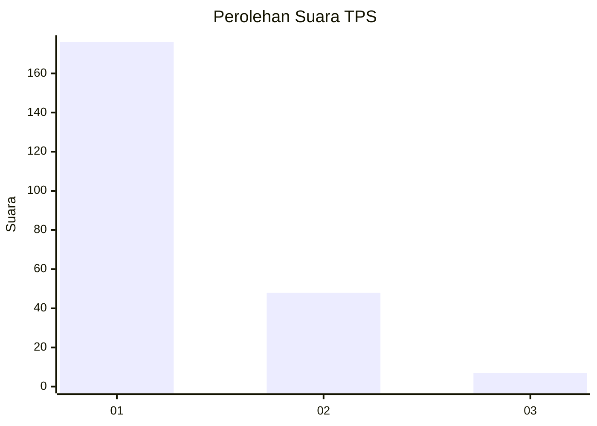
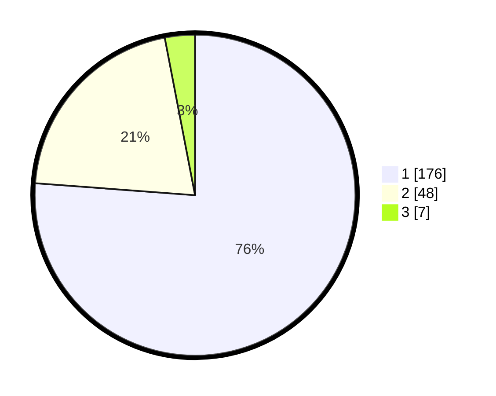

# Hasil

## Grafik

## Tabel

| No. | Nama Paslon    | Suara | Suara (raw) | Persentase |
|:--- |:-------------- | -----:| -----------:| ----------:|
| 1   | ANIES MUHAIMIN | 176   | [176][p-1]  | 76,19      |
| 2   | PRABOWO GIBRAN | 48    | [48][p-2]   | 20,78      |
| 3   | GANJAR MAHFUD  | 7     | [7][p-3]    | 3,03       |

[p-1]: https://github.com/gigit-pemilu/pemilu-2024-11-aceh/blob/main/pilpres/hitung-suara/sub/11-aceh/sub/06-aceh-besar/sub/09-mesjid-raya/sub/2012-neuheun/sub/014-tps/sub/paslon-1.txt
[p-2]: https://github.com/gigit-pemilu/pemilu-2024-11-aceh/blob/main/pilpres/hitung-suara/sub/11-aceh/sub/06-aceh-besar/sub/09-mesjid-raya/sub/2012-neuheun/sub/014-tps/sub/paslon-2.txt
[p-3]: https://github.com/gigit-pemilu/pemilu-2024-11-aceh/blob/main/pilpres/hitung-suara/sub/11-aceh/sub/06-aceh-besar/sub/09-mesjid-raya/sub/2012-neuheun/sub/014-tps/sub/paslon-3.txt

## Foto C Plano

https://sirekap-obj-formc.kpu.go.id/4387/pemilu/ppwp/11/06/09/20/12/1106092012014-20240215-020035--8894d8f1-2947-4d2d-a6c3-1b99311ef3cf.jpg

https://sirekap-obj-formc.kpu.go.id/4387/pemilu/ppwp/11/06/09/20/12/1106092012014-20240215-020111--009eabc9-d0ff-43ad-a494-5aee1b7ed596.jpg

https://sirekap-obj-formc.kpu.go.id/4387/pemilu/ppwp/11/06/09/20/12/1106092012014-20240215-020157--1b5dbd67-ddcc-4724-91a2-5e57021e455a.jpg

## Metadata

| Key        | Value               |
| ---------- | ------------------- |
| Time Stamp | 2024-02-15 23:29:50 |

