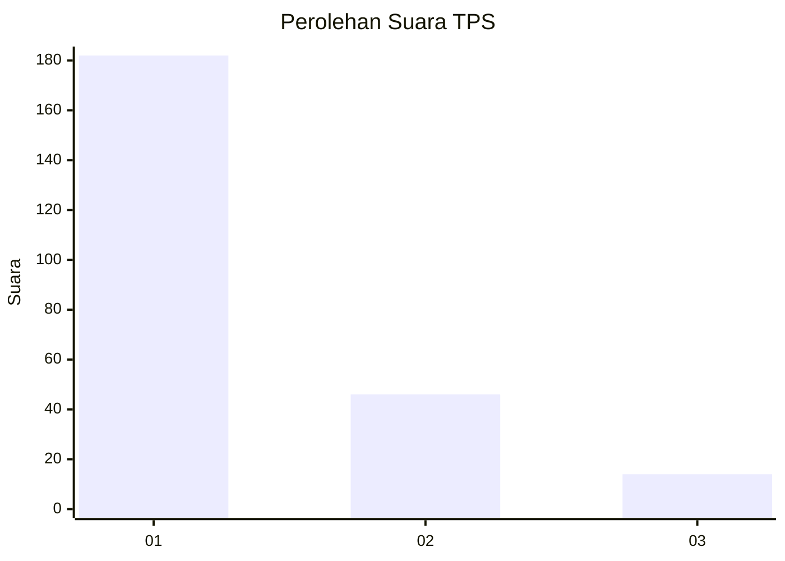
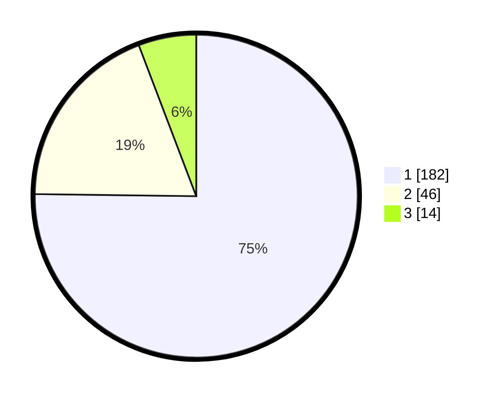

# Hasil

## Grafik

## Tabel

| No. | Nama Paslon    | Suara | Suara (raw) | Persentase |
|:--- |:-------------- | -----:| -----------:| ----------:|
| 1   | ANIES MUHAIMIN | 182   | [182][p-1]  | 75,21      |
| 2   | PRABOWO GIBRAN | 46    | [46][p-2]   | 19,01      |
| 3   | GANJAR MAHFUD  | 14    | [14][p-3]   | 5,79       |

[p-1]: https://github.com/gigit-pemilu/pemilu-2024-11-aceh/blob/main/pilpres/hitung-suara/sub/11-aceh/sub/06-aceh-besar/sub/09-mesjid-raya/sub/2012-neuheun/sub/017-tps/sub/paslon-1.txt
[p-2]: https://github.com/gigit-pemilu/pemilu-2024-11-aceh/blob/main/pilpres/hitung-suara/sub/11-aceh/sub/06-aceh-besar/sub/09-mesjid-raya/sub/2012-neuheun/sub/017-tps/sub/paslon-2.txt
[p-3]: https://github.com/gigit-pemilu/pemilu-2024-11-aceh/blob/main/pilpres/hitung-suara/sub/11-aceh/sub/06-aceh-besar/sub/09-mesjid-raya/sub/2012-neuheun/sub/017-tps/sub/paslon-3.txt

## Foto C Plano

https://sirekap-obj-formc.kpu.go.id/8a29/pemilu/ppwp/11/06/09/20/12/1106092012017-20240214-230319--969ac5e7-1c63-482a-81e9-a7b42fc7cb1f.jpg

https://sirekap-obj-formc.kpu.go.id/8a29/pemilu/ppwp/11/06/09/20/12/1106092012017-20240214-230425--45d805ce-ce02-4e27-a237-4722141f0ba8.jpg

https://sirekap-obj-formc.kpu.go.id/8a29/pemilu/ppwp/11/06/09/20/12/1106092012017-20240214-230538--8178b357-3d26-4d90-8217-d7702a75d2cd.jpg

## Metadata

| Key        | Value               |
| ---------- | ------------------- |
| Time Stamp | 2024-02-15 23:29:50 |

