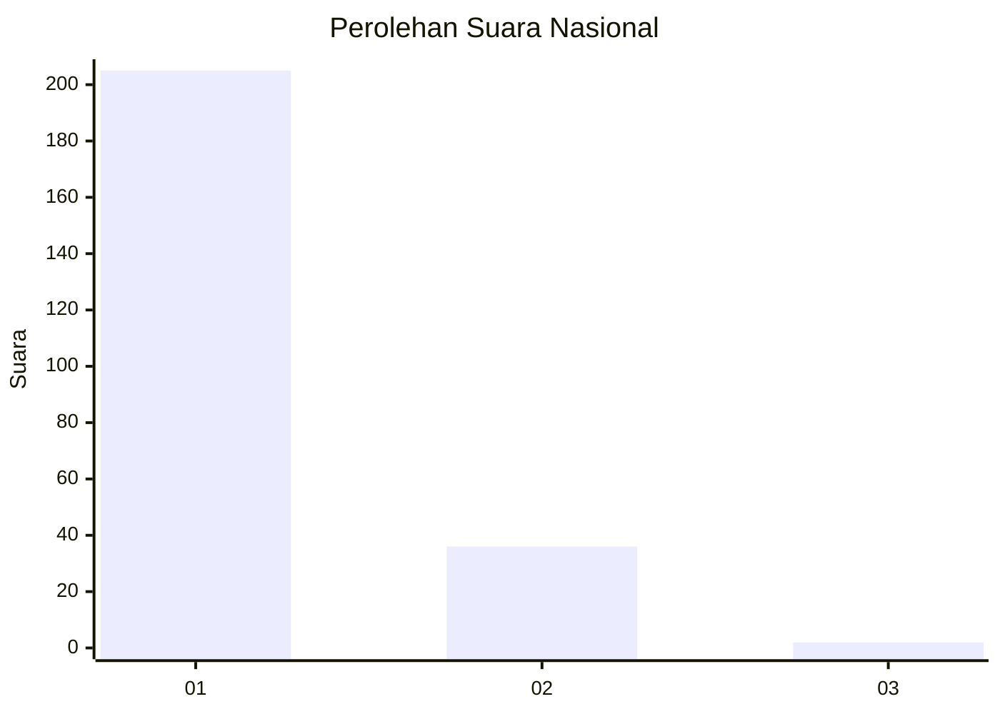
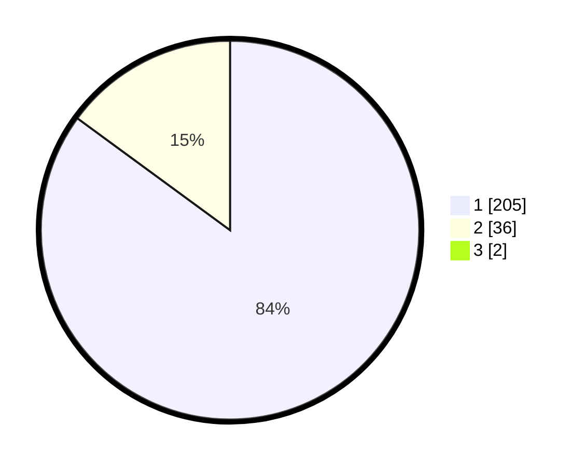

# Hasil

## Grafik

## Tabel

| No. | Nama Paslon    | Suara | Suara (raw) | Persentase |
|:--- |:-------------- | -----:| -----------:| ----------:|
| 1   | ANIES MUHAIMIN | 205   | [205][p-1]  | 84,36      |
| 2   | PRABOWO GIBRAN | 36    | [36][p-2]   | 14,81      |
| 3   | GANJAR MAHFUD  | 2     | [2][p-3]    | 0,82       |

[p-1]: https://github.com/gigit-pemilu/pemilu-2024/blob/main/pilpres/hitung-suara/sub/11-aceh/sub/06-aceh-besar/sub/09-mesjid-raya/sub/2012-neuheun/sub/020-tps/sub/paslon-1.txt
[p-2]: https://github.com/gigit-pemilu/pemilu-2024/blob/main/pilpres/hitung-suara/sub/11-aceh/sub/06-aceh-besar/sub/09-mesjid-raya/sub/2012-neuheun/sub/020-tps/sub/paslon-2.txt
[p-3]: https://github.com/gigit-pemilu/pemilu-2024/blob/main/pilpres/hitung-suara/sub/11-aceh/sub/06-aceh-besar/sub/09-mesjid-raya/sub/2012-neuheun/sub/020-tps/sub/paslon-3.txt

## Foto C Plano

https://sirekap-obj-formc.kpu.go.id/dcdb/pemilu/ppwp/11/06/09/20/12/1106092012020-20240214-215634--6e5dfdd1-9356-40e1-88fb-08b96a809d79.jpg

https://sirekap-obj-formc.kpu.go.id/dcdb/pemilu/ppwp/11/06/09/20/12/1106092012020-20240215-064046--1bca47e7-b6b8-4caa-bed6-c019a33fbd64.jpg

https://sirekap-obj-formc.kpu.go.id/dcdb/pemilu/ppwp/11/06/09/20/12/1106092012020-20240214-215930--ecfef87e-03fe-4205-93bd-c2433a73674d.jpg

## Metadata

| Key        | Value               |
| ---------- | ------------------- |
| Time Stamp | 2024-02-15 23:29:50 |

