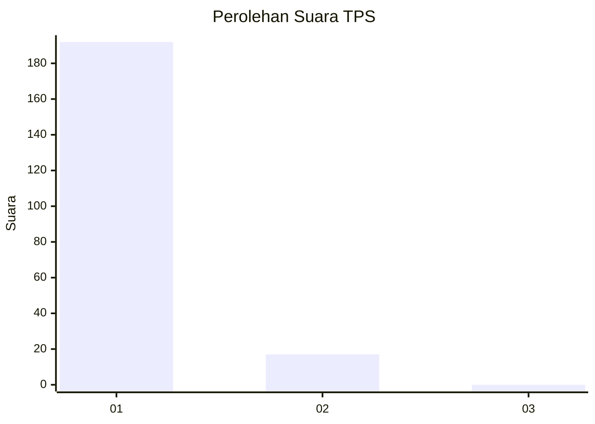
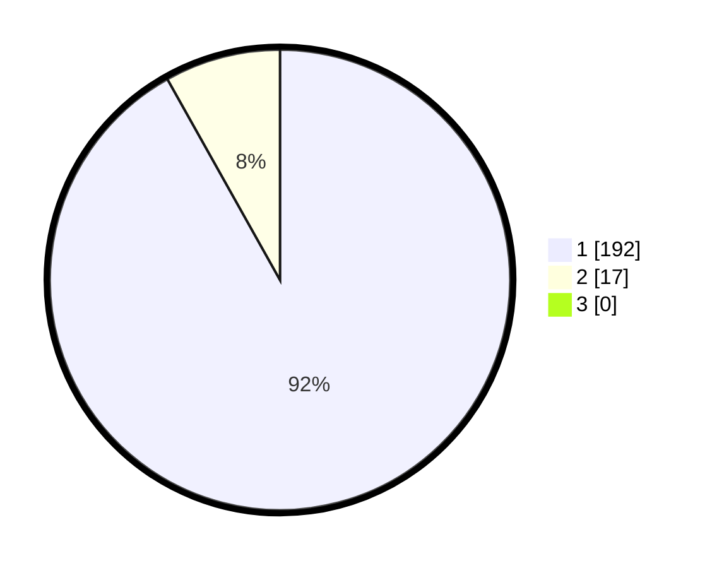

# Hasil

## Grafik

## Tabel

| No. | Nama Paslon    | Suara | Suara (raw) | Persentase |
|:--- |:-------------- | -----:| -----------:| ----------:|
| 1   | ANIES MUHAIMIN | 192   | [192][p-1]  | 91,87      |
| 2   | PRABOWO GIBRAN | 17    | [17][p-2]   | 8,13       |
| 3   | GANJAR MAHFUD  | 0     | [0][p-3]    | 0,00       |

[p-1]: https://github.com/gigit-pemilu/pemilu-2024-11-aceh/blob/main/pilpres/hitung-suara/sub/11-aceh/sub/06-aceh-besar/sub/09-mesjid-raya/sub/2013-lamnga/sub/001-tps/sub/paslon-1.txt
[p-2]: https://github.com/gigit-pemilu/pemilu-2024-11-aceh/blob/main/pilpres/hitung-suara/sub/11-aceh/sub/06-aceh-besar/sub/09-mesjid-raya/sub/2013-lamnga/sub/001-tps/sub/paslon-2.txt
[p-3]: https://github.com/gigit-pemilu/pemilu-2024-11-aceh/blob/main/pilpres/hitung-suara/sub/11-aceh/sub/06-aceh-besar/sub/09-mesjid-raya/sub/2013-lamnga/sub/001-tps/sub/paslon-3.txt

## Foto C Plano

https://sirekap-obj-formc.kpu.go.id/d137/pemilu/ppwp/11/06/09/20/13/1106092013001-20240216-152346--d583f9e6-589e-413f-abe2-ffd8a0fefe90.jpg

https://sirekap-obj-formc.kpu.go.id/d137/pemilu/ppwp/11/06/09/20/13/1106092013001-20240216-152550--07306559-c2f6-44c2-918a-bb7236992287.jpg

https://sirekap-obj-formc.kpu.go.id/d137/pemilu/ppwp/11/06/09/20/13/1106092013001-20240216-152838--fcae1552-a283-4d18-9a58-e1f97a7d6f98.jpg

## Metadata

| Key        | Value               |
| ---------- | ------------------- |
| Time Stamp | 2024-02-24 22:31:28 |

