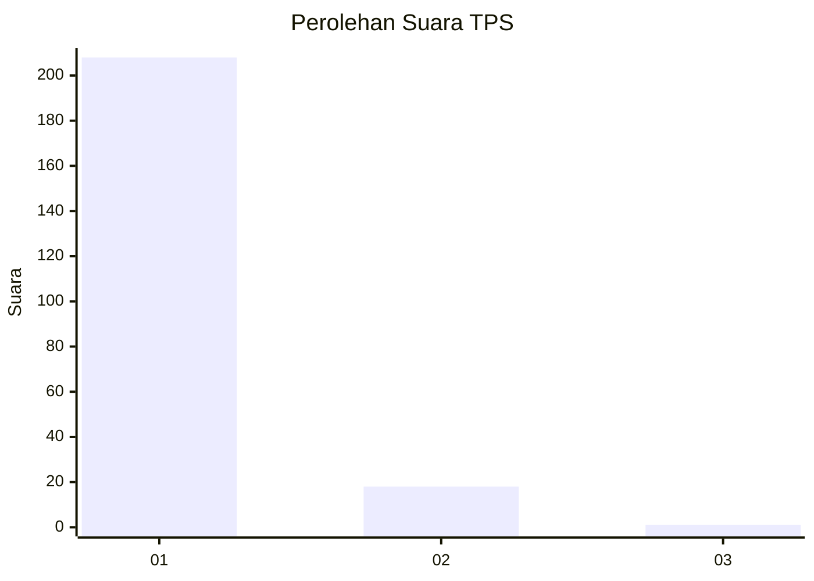
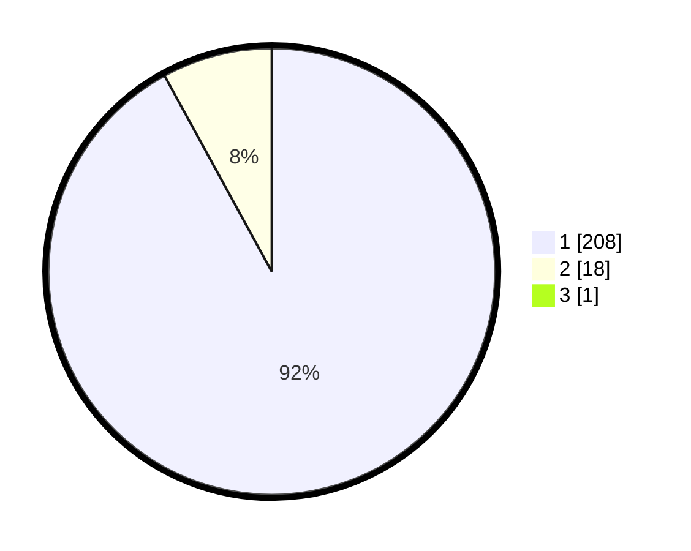

# Hasil

## Grafik

## Tabel

| No. | Nama Paslon    | Suara | Suara (raw) | Persentase |
|:--- |:-------------- | -----:| -----------:| ----------:|
| 1   | ANIES MUHAIMIN | 208   | [208][p-1]  | 91,63      |
| 2   | PRABOWO GIBRAN | 18    | [18][p-2]   | 7,93       |
| 3   | GANJAR MAHFUD  | 1     | [1][p-3]    | 0,44       |

[p-1]: https://github.com/gigit-pemilu/pemilu-2024-11-aceh/blob/main/pilpres/hitung-suara/sub/11-aceh/sub/06-aceh-besar/sub/10-ingin-jaya/sub/2001-lambaro/sub/002-tps/sub/paslon-1.txt
[p-2]: https://github.com/gigit-pemilu/pemilu-2024-11-aceh/blob/main/pilpres/hitung-suara/sub/11-aceh/sub/06-aceh-besar/sub/10-ingin-jaya/sub/2001-lambaro/sub/002-tps/sub/paslon-2.txt
[p-3]: https://github.com/gigit-pemilu/pemilu-2024-11-aceh/blob/main/pilpres/hitung-suara/sub/11-aceh/sub/06-aceh-besar/sub/10-ingin-jaya/sub/2001-lambaro/sub/002-tps/sub/paslon-3.txt

## Foto C Plano

https://sirekap-obj-formc.kpu.go.id/baff/pemilu/ppwp/11/06/10/20/01/1106102001002-20240215-083215--54d5a2c6-5237-4a24-a55e-29cb1288dc7e.jpg

https://sirekap-obj-formc.kpu.go.id/baff/pemilu/ppwp/11/06/10/20/01/1106102001002-20240215-082857--4f2eaec3-ed3d-4703-bc32-ed8d89debd35.jpg

https://sirekap-obj-formc.kpu.go.id/baff/pemilu/ppwp/11/06/10/20/01/1106102001002-20240215-083204--42f381ae-43b1-4db1-8e1c-a9caa3c58c31.jpg

## Metadata

| Key        | Value               |
| ---------- | ------------------- |
| Time Stamp | 2024-02-15 17:00:25 |

