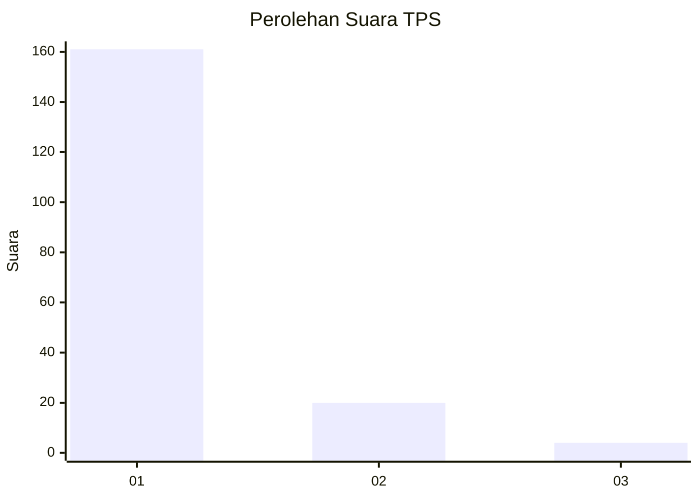
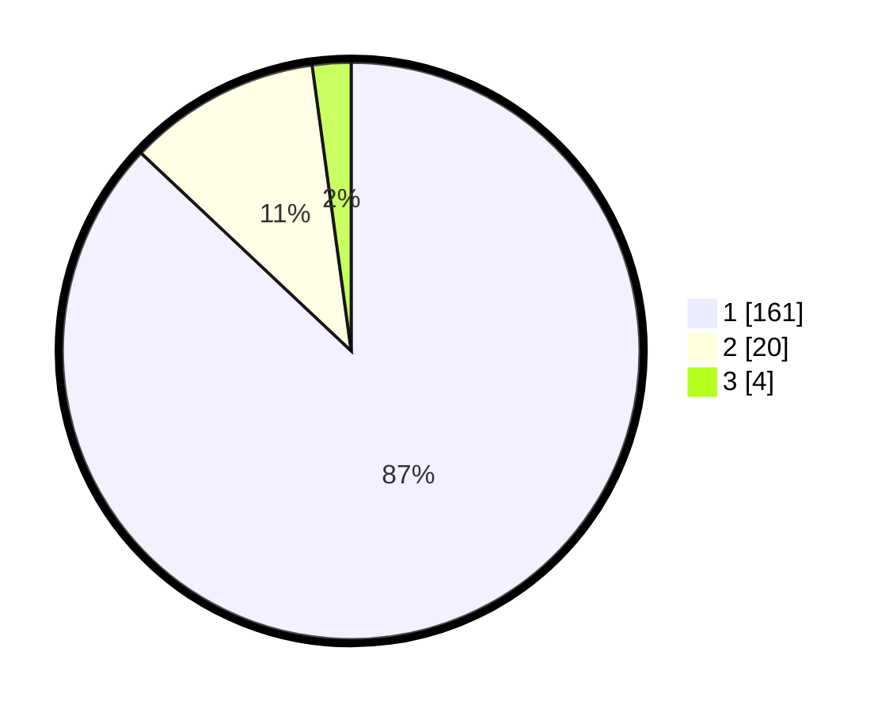

# Hasil

## Grafik

## Tabel

| No. | Nama Paslon    | Suara | Suara (raw) | Persentase |
|:--- |:-------------- | -----:| -----------:| ----------:|
| 1   | ANIES MUHAIMIN | 161   | [161][p-1]  | 87,03      |
| 2   | PRABOWO GIBRAN | 20    | [20][p-2]   | 10,81      |
| 3   | GANJAR MAHFUD  | 4     | [4][p-3]    | 2,16       |

[p-1]: https://github.com/gigit-pemilu/pemilu-2024-11-aceh/blob/main/pilpres/hitung-suara/sub/11-aceh/sub/06-aceh-besar/sub/10-ingin-jaya/sub/2003-bakoy/sub/001-tps/sub/paslon-1.txt
[p-2]: https://github.com/gigit-pemilu/pemilu-2024-11-aceh/blob/main/pilpres/hitung-suara/sub/11-aceh/sub/06-aceh-besar/sub/10-ingin-jaya/sub/2003-bakoy/sub/001-tps/sub/paslon-2.txt
[p-3]: https://github.com/gigit-pemilu/pemilu-2024-11-aceh/blob/main/pilpres/hitung-suara/sub/11-aceh/sub/06-aceh-besar/sub/10-ingin-jaya/sub/2003-bakoy/sub/001-tps/sub/paslon-3.txt

## Foto C Plano

https://sirekap-obj-formc.kpu.go.id/5df3/pemilu/ppwp/11/06/10/20/03/1106102003001-20240214-185216--48e5aabb-413f-4e54-8f0a-c0fb449b3300.jpg

https://sirekap-obj-formc.kpu.go.id/5df3/pemilu/ppwp/11/06/10/20/03/1106102003001-20240214-184927--c5015d46-a282-4ddf-b63a-40c7936cb0a5.jpg

https://sirekap-obj-formc.kpu.go.id/5df3/pemilu/ppwp/11/06/10/20/03/1106102003001-20240214-223047--ddd1c127-506d-47f5-94d2-9e9fb00989a6.jpg

## Metadata

| Key        | Value               |
| ---------- | ------------------- |
| Time Stamp | 2024-02-15 17:00:25 |

## DATA PEMILIH TETAP

Jumlah pemilih dalam DPT: **177**.
 * L: **45**.
 * P: **41**.

## DATA PENGGUNA HAK PILIH

Jumlah pengguna hak pilih dalam DPT: **192**.
 * L: **98**.
 * P: **94**.

Jumlah pengguna hak pilih dalam DPTb: **0**.
 * L: **0**.
 * P: **0**.

Jumlah pengguna hak pilih dalam DPK: **1**.
 * L: **1**.
 * P: **0**.

Jumlah pengguna hak pilih: **193**.
 * L: **99**.
 * P: **94**.

## JUMLAH SUARA SAH DAN TIDAK SAH

JUMLAH SELURUH SUARA SAH: **185**.

JUMLAH SUARA TIDAK SAH: **2**.

JUMLAH SELURUH SUARA SAH DAN SUARA TIDAK SAH: **187**.

