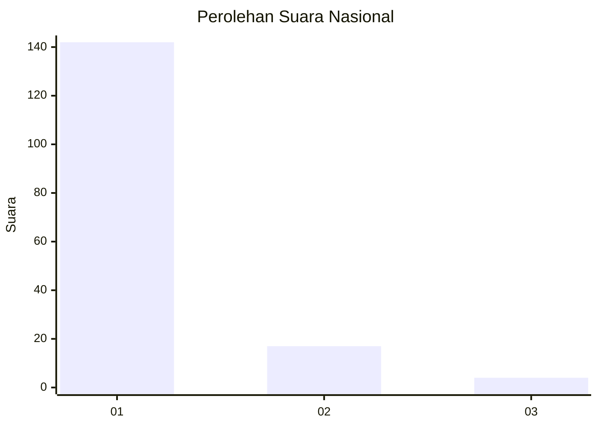
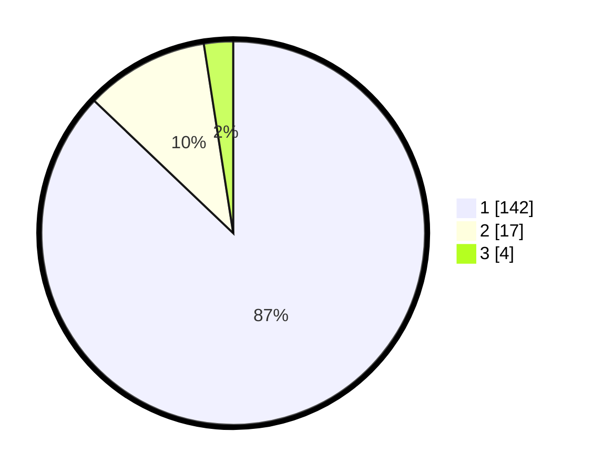

# Hasil

## Grafik

## Tabel

| No. | Nama Paslon    | Suara | Suara (raw) | Persentase |
|:--- |:-------------- | -----:| -----------:| ----------:|
| 1   | ANIES MUHAIMIN | 142   | [142][p-1]  | 87,12      |
| 2   | PRABOWO GIBRAN | 17    | [17][p-2]   | 10,43      |
| 3   | GANJAR MAHFUD  | 4     | [4][p-3]    | 2,45       |

[p-1]: https://github.com/gigit-pemilu/pemilu-2024/blob/main/pilpres/hitung-suara/sub/11-aceh/sub/06-aceh-besar/sub/10-ingin-jaya/sub/2006-meunasah-tutong/sub/001-tps/sub/paslon-1.txt
[p-2]: https://github.com/gigit-pemilu/pemilu-2024/blob/main/pilpres/hitung-suara/sub/11-aceh/sub/06-aceh-besar/sub/10-ingin-jaya/sub/2006-meunasah-tutong/sub/001-tps/sub/paslon-2.txt
[p-3]: https://github.com/gigit-pemilu/pemilu-2024/blob/main/pilpres/hitung-suara/sub/11-aceh/sub/06-aceh-besar/sub/10-ingin-jaya/sub/2006-meunasah-tutong/sub/001-tps/sub/paslon-3.txt

## Foto C Plano

https://sirekap-obj-formc.kpu.go.id/0de0/pemilu/ppwp/11/06/10/20/06/1106102006001-20240214-211114--83f31eef-7da9-4a1a-8c3e-57b233e81246.jpg

https://sirekap-obj-formc.kpu.go.id/0de0/pemilu/ppwp/11/06/10/20/06/1106102006001-20240214-195658--9033b445-5230-4dfe-b748-3e8c15bdc335.jpg

https://sirekap-obj-formc.kpu.go.id/0de0/pemilu/ppwp/11/06/10/20/06/1106102006001-20240214-202857--27d51b20-e4ef-4529-941d-f88933db7642.jpg

## Metadata

| Key        | Value               |
| ---------- | ------------------- |
| Time Stamp | 2024-02-15 16:30:25 |

