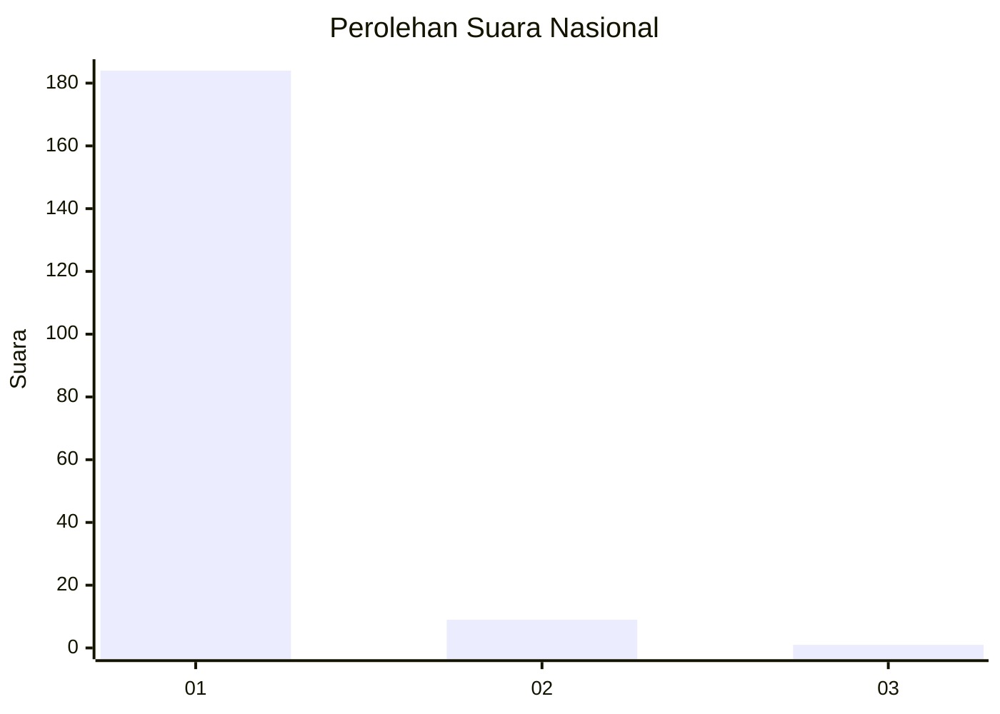
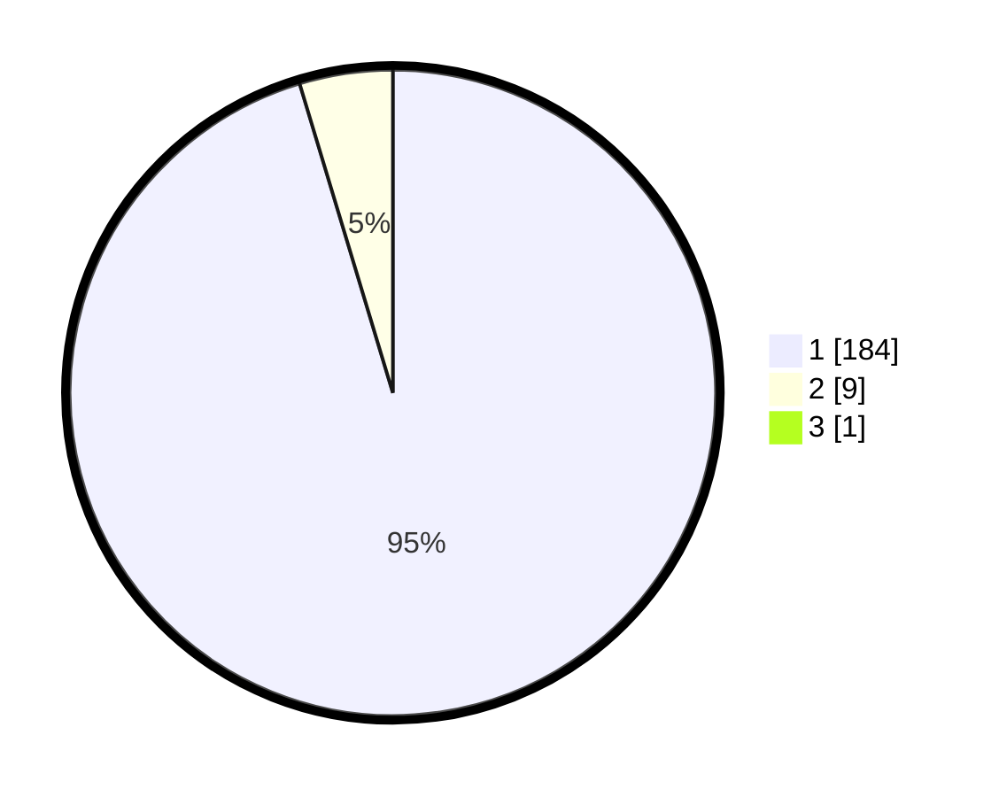

# Hasil

## Grafik

## Tabel

| No. | Nama Paslon    | Suara | Suara (raw) | Persentase |
|:--- |:-------------- | -----:| -----------:| ----------:|
| 1   | ANIES MUHAIMIN | 184   | [184][p-1]  | 94,85      |
| 2   | PRABOWO GIBRAN | 9     | [9][p-2]    | 4,64       |
| 3   | GANJAR MAHFUD  | 1     | [1][p-3]    | 0,52       |

[p-1]: https://github.com/gigit-pemilu/pemilu-2024/blob/main/pilpres/hitung-suara/sub/11-aceh/sub/06-aceh-besar/sub/10-ingin-jaya/sub/2007-siron/sub/003-tps/sub/paslon-1.txt
[p-2]: https://github.com/gigit-pemilu/pemilu-2024/blob/main/pilpres/hitung-suara/sub/11-aceh/sub/06-aceh-besar/sub/10-ingin-jaya/sub/2007-siron/sub/003-tps/sub/paslon-2.txt
[p-3]: https://github.com/gigit-pemilu/pemilu-2024/blob/main/pilpres/hitung-suara/sub/11-aceh/sub/06-aceh-besar/sub/10-ingin-jaya/sub/2007-siron/sub/003-tps/sub/paslon-3.txt

## Foto C Plano

https://sirekap-obj-formc.kpu.go.id/3774/pemilu/ppwp/11/06/10/20/07/1106102007003-20240215-035158--d9fffbe8-9334-4774-b0b6-96ee0b76321a.jpg

https://sirekap-obj-formc.kpu.go.id/3774/pemilu/ppwp/11/06/10/20/07/1106102007003-20240215-035310--cf6e103f-b87a-4030-99e5-d734904efd87.jpg

https://sirekap-obj-formc.kpu.go.id/3774/pemilu/ppwp/11/06/10/20/07/1106102007003-20240215-040231--0fede001-3942-48df-ba5b-19f6a9d83a25.jpg

## Metadata

| Key        | Value               |
| ---------- | ------------------- |
| Time Stamp | 2024-02-15 18:30:25 |

