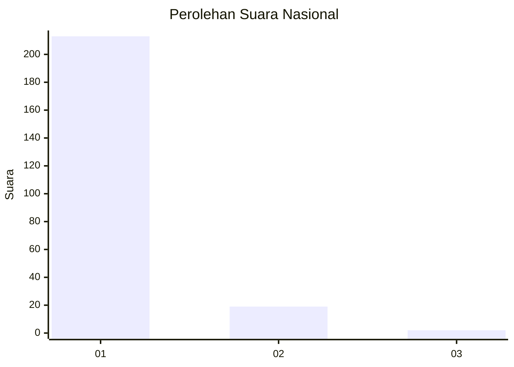
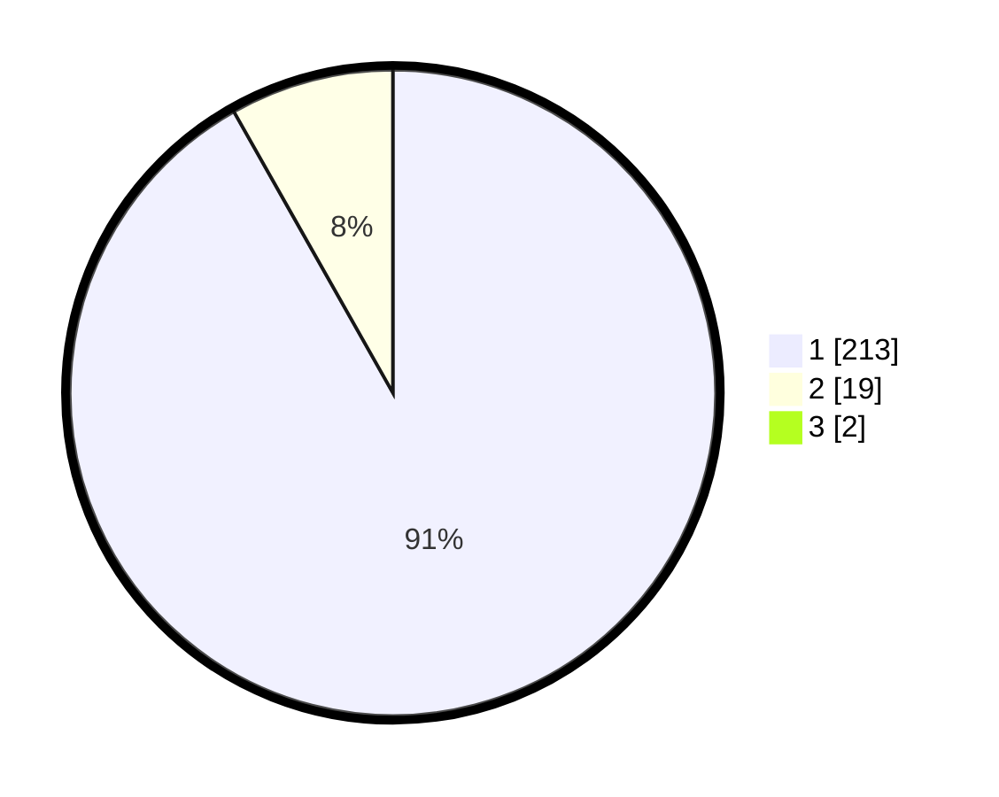

# Hasil

## Grafik

## Tabel

| No. | Nama Paslon    | Suara | Suara (raw) | Persentase |
|:--- |:-------------- | -----:| -----------:| ----------:|
| 1   | ANIES MUHAIMIN | 213   | [213][p-1]  | 91,03      |
| 2   | PRABOWO GIBRAN | 19    | [19][p-2]   | 8,12       |
| 3   | GANJAR MAHFUD  | 2     | [2][p-3]    | 0,85       |

[p-1]: https://github.com/gigit-pemilu/pemilu-2024/blob/main/pilpres/hitung-suara/sub/11-aceh/sub/06-aceh-besar/sub/10-ingin-jaya/sub/2008-pasie-lamgarot/sub/001-tps/sub/paslon-1.txt
[p-2]: https://github.com/gigit-pemilu/pemilu-2024/blob/main/pilpres/hitung-suara/sub/11-aceh/sub/06-aceh-besar/sub/10-ingin-jaya/sub/2008-pasie-lamgarot/sub/001-tps/sub/paslon-2.txt
[p-3]: https://github.com/gigit-pemilu/pemilu-2024/blob/main/pilpres/hitung-suara/sub/11-aceh/sub/06-aceh-besar/sub/10-ingin-jaya/sub/2008-pasie-lamgarot/sub/001-tps/sub/paslon-3.txt

## Foto C Plano

https://sirekap-obj-formc.kpu.go.id/838a/pemilu/ppwp/11/06/10/20/08/1106102008001-20240215-064649--4c1db7f2-8ee2-4fd8-b1d5-887c7b455769.jpg

https://sirekap-obj-formc.kpu.go.id/838a/pemilu/ppwp/11/06/10/20/08/1106102008001-20240215-064721--395df681-e41a-4f6c-ae03-f581ba84a260.jpg

https://sirekap-obj-formc.kpu.go.id/838a/pemilu/ppwp/11/06/10/20/08/1106102008001-20240215-064845--6b4c79ba-368c-402d-bead-1259e235283c.jpg

## Metadata

| Key        | Value               |
| ---------- | ------------------- |
| Time Stamp | 2024-02-15 16:30:25 |

