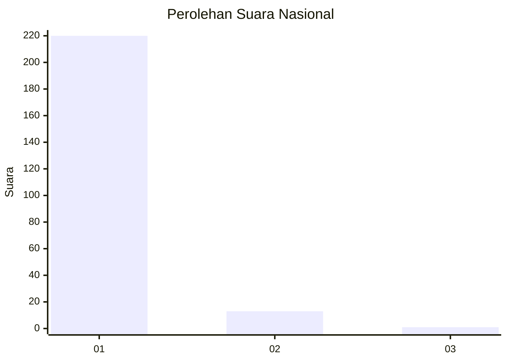
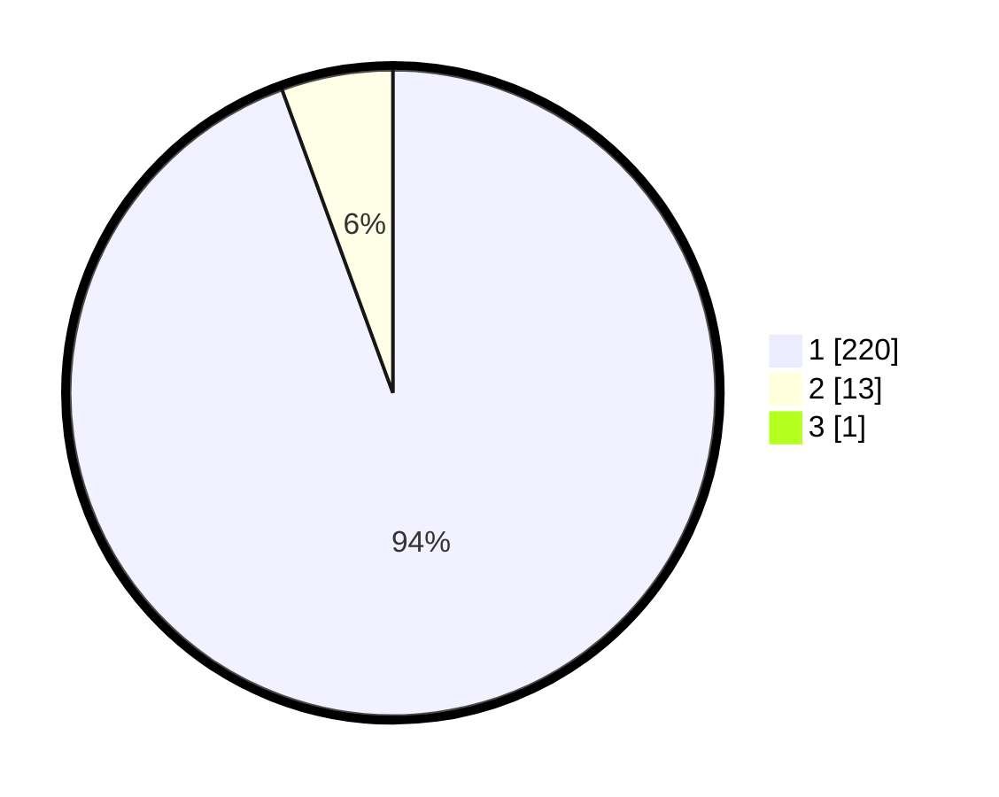

# Hasil

## Grafik

## Tabel

| No. | Nama Paslon    | Suara | Suara (raw) | Persentase |
|:--- |:-------------- | -----:| -----------:| ----------:|
| 1   | ANIES MUHAIMIN | 220   | [220][p-1]  | 94,02      |
| 2   | PRABOWO GIBRAN | 13    | [13][p-2]   | 5,56       |
| 3   | GANJAR MAHFUD  | 1     | [1][p-3]    | 0,43       |

[p-1]: https://github.com/gigit-pemilu/pemilu-2024/blob/main/pilpres/hitung-suara/sub/11-aceh/sub/06-aceh-besar/sub/10-ingin-jaya/sub/2008-pasie-lamgarot/sub/002-tps/sub/paslon-1.txt
[p-2]: https://github.com/gigit-pemilu/pemilu-2024/blob/main/pilpres/hitung-suara/sub/11-aceh/sub/06-aceh-besar/sub/10-ingin-jaya/sub/2008-pasie-lamgarot/sub/002-tps/sub/paslon-2.txt
[p-3]: https://github.com/gigit-pemilu/pemilu-2024/blob/main/pilpres/hitung-suara/sub/11-aceh/sub/06-aceh-besar/sub/10-ingin-jaya/sub/2008-pasie-lamgarot/sub/002-tps/sub/paslon-3.txt

## Foto C Plano

https://sirekap-obj-formc.kpu.go.id/3c1c/pemilu/ppwp/11/06/10/20/08/1106102008002-20240215-063219--a015793d-73f3-48f1-b905-a752fb8dcee5.jpg

https://sirekap-obj-formc.kpu.go.id/3c1c/pemilu/ppwp/11/06/10/20/08/1106102008002-20240214-193612--aa0c7bb1-e3db-4e1e-8a0f-6d2995575670.jpg

https://sirekap-obj-formc.kpu.go.id/3c1c/pemilu/ppwp/11/06/10/20/08/1106102008002-20240214-193628--66408caf-7bd9-40cb-a838-5e8ba1783bcf.jpg

## Metadata

| Key        | Value               |
| ---------- | ------------------- |
| Time Stamp | 2024-02-15 15:30:25 |

