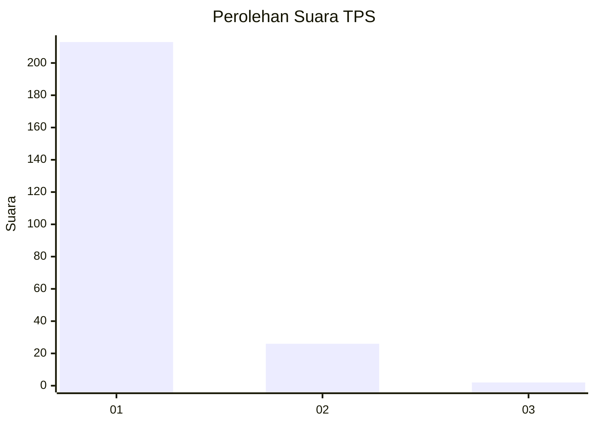
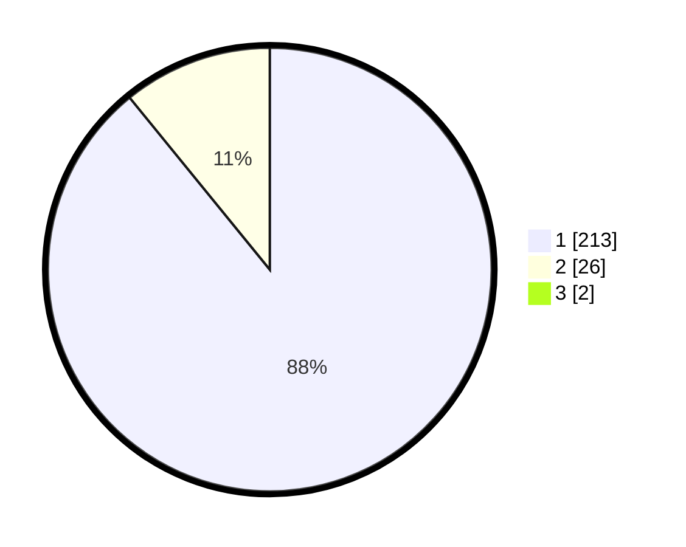

# Hasil

## Grafik

## Tabel

| No. | Nama Paslon    | Suara | Suara (raw) | Persentase |
|:--- |:-------------- | -----:| -----------:| ----------:|
| 1   | ANIES MUHAIMIN | 213   | [213][p-1]  | 88,38      |
| 2   | PRABOWO GIBRAN | 26    | [26][p-2]   | 10,79      |
| 3   | GANJAR MAHFUD  | 2     | [2][p-3]    | 0,83       |

[p-1]: https://github.com/gigit-pemilu/pemilu-2024-11-aceh/blob/main/pilpres/hitung-suara/sub/11-aceh/sub/06-aceh-besar/sub/10-ingin-jaya/sub/2009-dham-ceukok/sub/001-tps/sub/paslon-1.txt
[p-2]: https://github.com/gigit-pemilu/pemilu-2024-11-aceh/blob/main/pilpres/hitung-suara/sub/11-aceh/sub/06-aceh-besar/sub/10-ingin-jaya/sub/2009-dham-ceukok/sub/001-tps/sub/paslon-2.txt
[p-3]: https://github.com/gigit-pemilu/pemilu-2024-11-aceh/blob/main/pilpres/hitung-suara/sub/11-aceh/sub/06-aceh-besar/sub/10-ingin-jaya/sub/2009-dham-ceukok/sub/001-tps/sub/paslon-3.txt

## Foto C Plano

https://sirekap-obj-formc.kpu.go.id/e489/pemilu/ppwp/11/06/10/20/09/1106102009001-20240215-023401--ff17a3e7-a6bd-4684-b2f6-b9ea8ad86e11.jpg

https://sirekap-obj-formc.kpu.go.id/e489/pemilu/ppwp/11/06/10/20/09/1106102009001-20240215-023420--c067ec46-9f78-443d-855c-8635de43a565.jpg

https://sirekap-obj-formc.kpu.go.id/e489/pemilu/ppwp/11/06/10/20/09/1106102009001-20240215-023530--f4eb5e59-2904-404f-afc6-56a5a40c8585.jpg

## Metadata

| Key        | Value               |
| ---------- | ------------------- |
| Time Stamp | 2024-02-15 21:30:27 |

