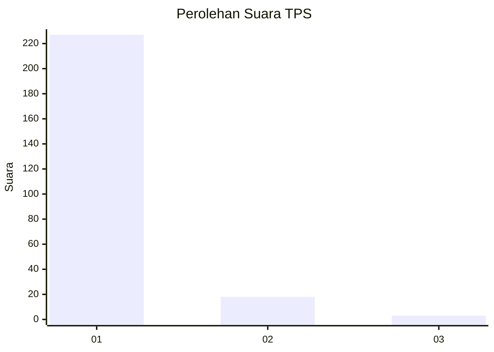
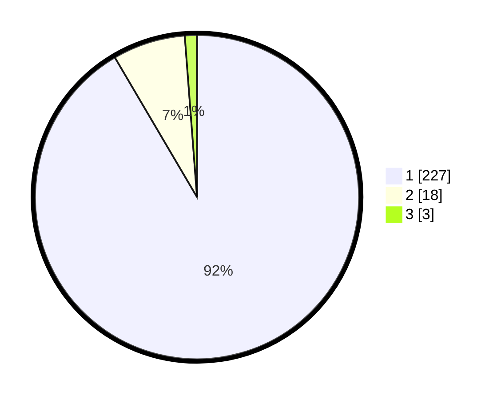

# Hasil

## Grafik

## Tabel

| No. | Nama Paslon    | Suara | Suara (raw) | Persentase |
|:--- |:-------------- | -----:| -----------:| ----------:|
| 1   | ANIES MUHAIMIN | 227   | [227][p-1]  | 91,53      |
| 2   | PRABOWO GIBRAN | 18    | [18][p-2]   | 7,26       |
| 3   | GANJAR MAHFUD  | 3     | [3][p-3]    | 1,21       |

[p-1]: https://github.com/gigit-pemilu/pemilu-2024-11-aceh/blob/main/pilpres/hitung-suara/sub/11-aceh/sub/06-aceh-besar/sub/10-ingin-jaya/sub/2009-dham-ceukok/sub/002-tps/sub/paslon-1.txt
[p-2]: https://github.com/gigit-pemilu/pemilu-2024-11-aceh/blob/main/pilpres/hitung-suara/sub/11-aceh/sub/06-aceh-besar/sub/10-ingin-jaya/sub/2009-dham-ceukok/sub/002-tps/sub/paslon-2.txt
[p-3]: https://github.com/gigit-pemilu/pemilu-2024-11-aceh/blob/main/pilpres/hitung-suara/sub/11-aceh/sub/06-aceh-besar/sub/10-ingin-jaya/sub/2009-dham-ceukok/sub/002-tps/sub/paslon-3.txt

## Foto C Plano

https://sirekap-obj-formc.kpu.go.id/67e2/pemilu/ppwp/11/06/10/20/09/1106102009002-20240215-015901--9d0b7dbc-858d-4f32-833c-2cd70200c732.jpg

https://sirekap-obj-formc.kpu.go.id/67e2/pemilu/ppwp/11/06/10/20/09/1106102009002-20240215-015918--378d4673-d9cb-4be9-8624-7425fb0831cc.jpg

https://sirekap-obj-formc.kpu.go.id/67e2/pemilu/ppwp/11/06/10/20/09/1106102009002-20240215-015934--7740309b-8cc3-4953-85a2-7dbf4418f3d9.jpg

## Metadata

| Key        | Value               |
| ---------- | ------------------- |
| Time Stamp | 2024-02-15 23:29:50 |

