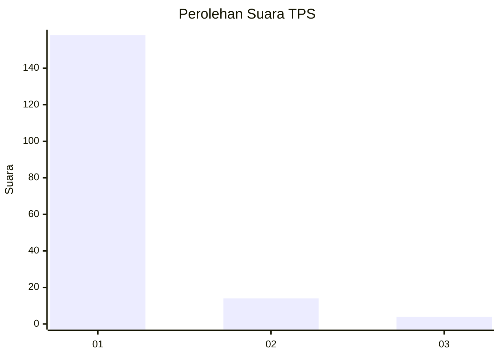
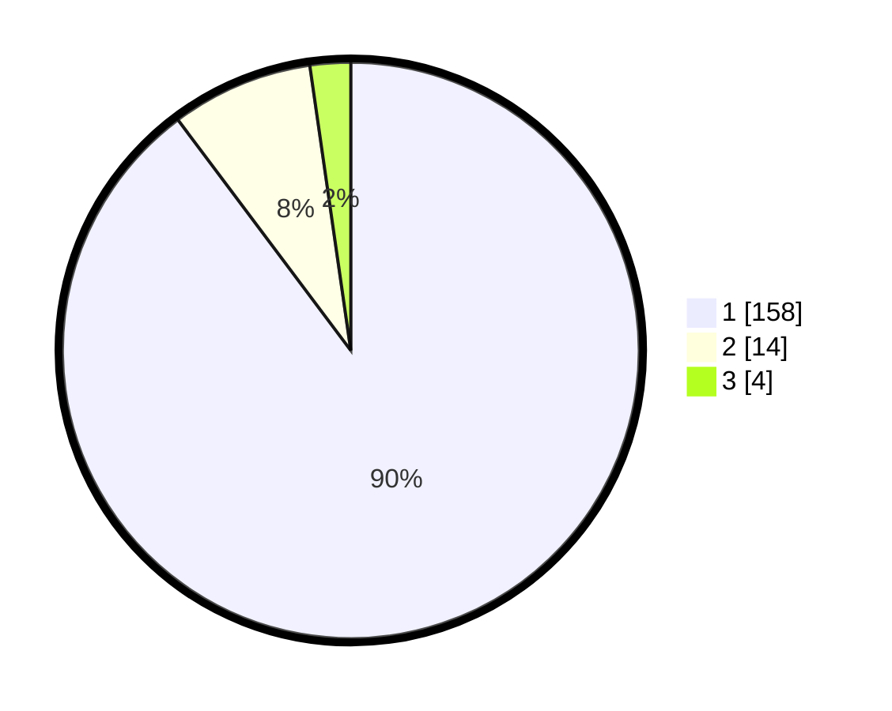

# Hasil

## Grafik

## Tabel

| No. | Nama Paslon    | Suara | Suara (raw) | Persentase |
|:--- |:-------------- | -----:| -----------:| ----------:|
| 1   | ANIES MUHAIMIN | 158   | [158][p-1]  | 89,77      |
| 2   | PRABOWO GIBRAN | 14    | [14][p-2]   | 7,95       |
| 3   | GANJAR MAHFUD  | 4     | [4][p-3]    | 2,27       |

[p-1]: https://github.com/gigit-pemilu/pemilu-2024-11-aceh/blob/main/pilpres/hitung-suara/sub/11-aceh/sub/06-aceh-besar/sub/10-ingin-jaya/sub/2012-lubok-gapuy/sub/001-tps/sub/paslon-1.txt
[p-2]: https://github.com/gigit-pemilu/pemilu-2024-11-aceh/blob/main/pilpres/hitung-suara/sub/11-aceh/sub/06-aceh-besar/sub/10-ingin-jaya/sub/2012-lubok-gapuy/sub/001-tps/sub/paslon-2.txt
[p-3]: https://github.com/gigit-pemilu/pemilu-2024-11-aceh/blob/main/pilpres/hitung-suara/sub/11-aceh/sub/06-aceh-besar/sub/10-ingin-jaya/sub/2012-lubok-gapuy/sub/001-tps/sub/paslon-3.txt

## Foto C Plano

https://sirekap-obj-formc.kpu.go.id/e57e/pemilu/ppwp/11/06/10/20/12/1106102012001-20240215-024702--d378556b-6a72-49de-ac53-78b92419d1b7.jpg

https://sirekap-obj-formc.kpu.go.id/e57e/pemilu/ppwp/11/06/10/20/12/1106102012001-20240215-015445--2558920d-0ec0-48a9-921c-7eabcf54aa5c.jpg

https://sirekap-obj-formc.kpu.go.id/e57e/pemilu/ppwp/11/06/10/20/12/1106102012001-20240215-020000--97979d1d-085c-49ab-a523-aeb39f8675da.jpg

## Metadata

| Key        | Value               |
| ---------- | ------------------- |
| Time Stamp | 2024-02-15 21:30:27 |

