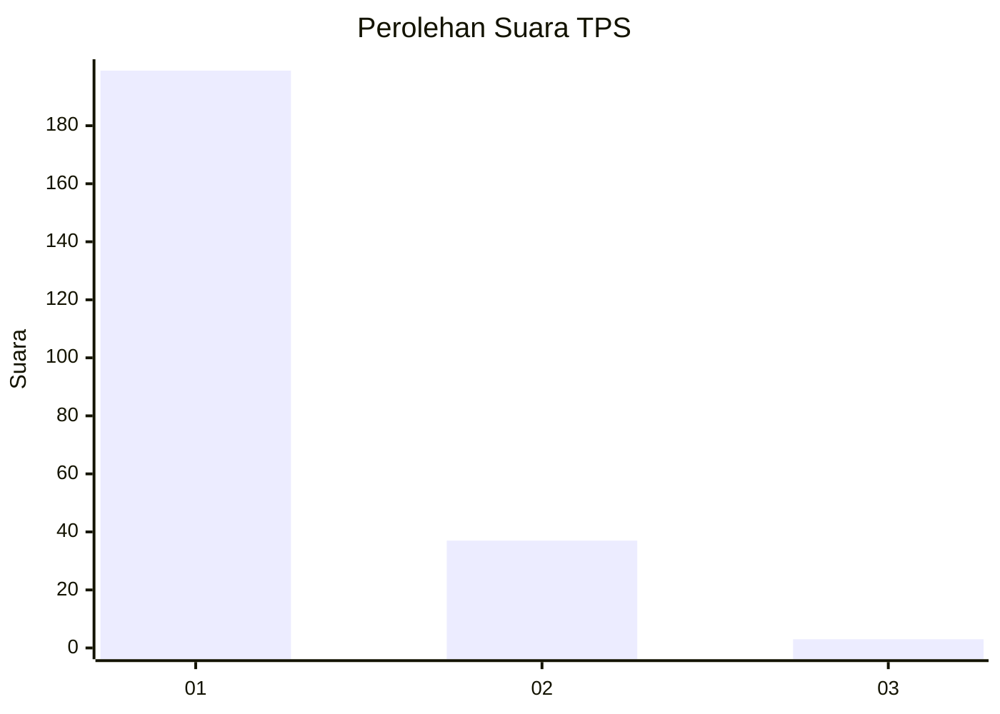
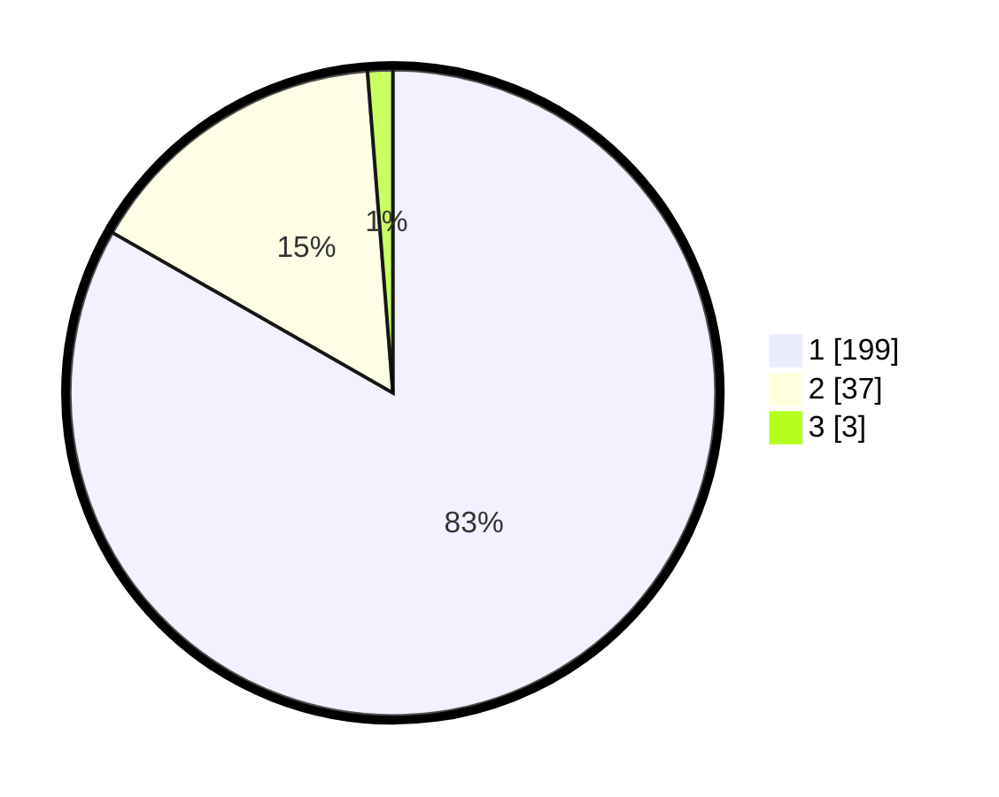

# Hasil

## Grafik

## Tabel

| No. | Nama Paslon    | Suara | Suara (raw) | Persentase |
|:--- |:-------------- | -----:| -----------:| ----------:|
| 1   | ANIES MUHAIMIN | 199   | [199][p-1]  | 83,26      |
| 2   | PRABOWO GIBRAN | 37    | [37][p-2]   | 15,48      |
| 3   | GANJAR MAHFUD  | 3     | [3][p-3]    | 1,26       |

[p-1]: https://github.com/gigit-pemilu/pemilu-2024-11-aceh/blob/main/pilpres/hitung-suara/sub/11-aceh/sub/06-aceh-besar/sub/10-ingin-jaya/sub/2018-ajee-cut/sub/001-tps/sub/paslon-1.txt
[p-2]: https://github.com/gigit-pemilu/pemilu-2024-11-aceh/blob/main/pilpres/hitung-suara/sub/11-aceh/sub/06-aceh-besar/sub/10-ingin-jaya/sub/2018-ajee-cut/sub/001-tps/sub/paslon-2.txt
[p-3]: https://github.com/gigit-pemilu/pemilu-2024-11-aceh/blob/main/pilpres/hitung-suara/sub/11-aceh/sub/06-aceh-besar/sub/10-ingin-jaya/sub/2018-ajee-cut/sub/001-tps/sub/paslon-3.txt

## Foto C Plano

https://sirekap-obj-formc.kpu.go.id/dc15/pemilu/ppwp/11/06/10/20/18/1106102018001-20240215-101220--5c963dde-95c9-4df9-9d95-be87933bfeac.jpg

https://sirekap-obj-formc.kpu.go.id/dc15/pemilu/ppwp/11/06/10/20/18/1106102018001-20240215-101346--6a675bdf-845e-4600-88bb-f3743f79732d.jpg

https://sirekap-obj-formc.kpu.go.id/dc15/pemilu/ppwp/11/06/10/20/18/1106102018001-20240215-101507--d756ee86-2fef-49f6-bd07-840d688e65ff.jpg

## Metadata

| Key        | Value               |
| ---------- | ------------------- |
| Time Stamp | 2024-02-15 17:00:25 |

