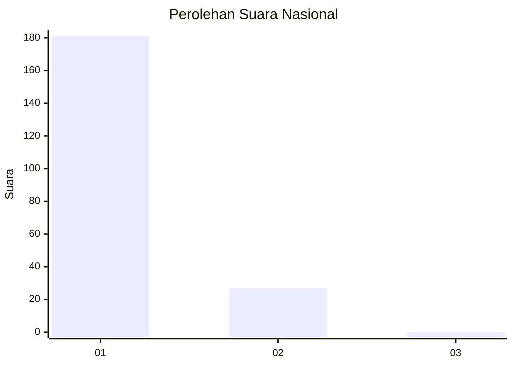
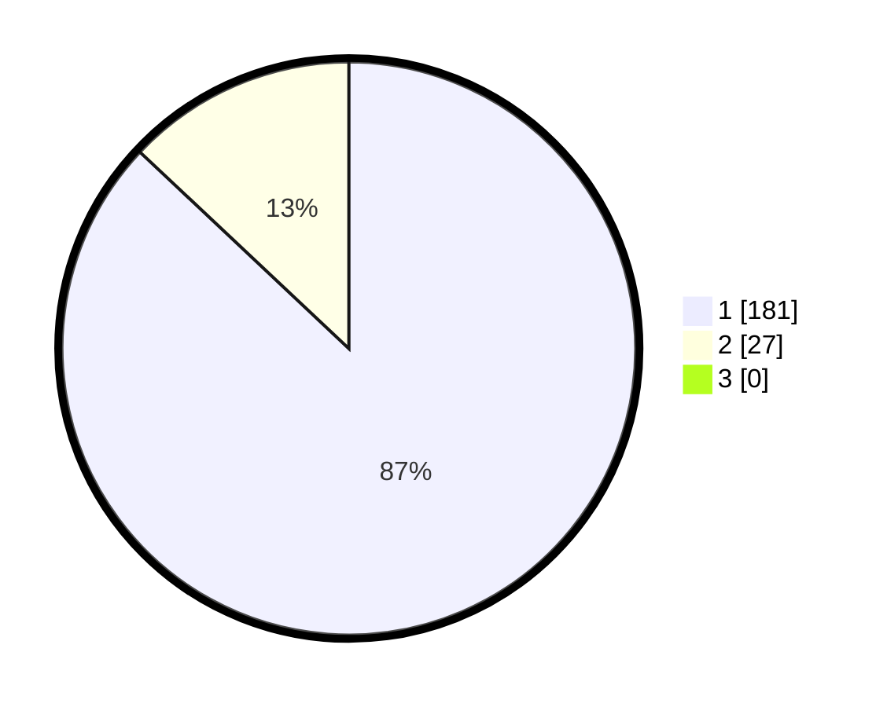

# Hasil

## Grafik

## Tabel

| No. | Nama Paslon    | Suara | Suara (raw) | Persentase |
|:--- |:-------------- | -----:| -----------:| ----------:|
| 1   | ANIES MUHAIMIN | 181   | [181][p-1]  | 87,02      |
| 2   | PRABOWO GIBRAN | 27    | [27][p-2]   | 12,98      |
| 3   | GANJAR MAHFUD  | 0     | [0][p-3]    | 0,00       |

[p-1]: https://github.com/gigit-pemilu/pemilu-2024/blob/main/pilpres/hitung-suara/sub/11-aceh/sub/06-aceh-besar/sub/10-ingin-jaya/sub/2018-ajee-cut/sub/002-tps/sub/paslon-1.txt
[p-2]: https://github.com/gigit-pemilu/pemilu-2024/blob/main/pilpres/hitung-suara/sub/11-aceh/sub/06-aceh-besar/sub/10-ingin-jaya/sub/2018-ajee-cut/sub/002-tps/sub/paslon-2.txt
[p-3]: https://github.com/gigit-pemilu/pemilu-2024/blob/main/pilpres/hitung-suara/sub/11-aceh/sub/06-aceh-besar/sub/10-ingin-jaya/sub/2018-ajee-cut/sub/002-tps/sub/paslon-3.txt

## Foto C Plano

https://sirekap-obj-formc.kpu.go.id/3800/pemilu/ppwp/11/06/10/20/18/1106102018002-20240215-114026--47d11189-07cb-4629-80f2-34802cf27a54.jpg

https://sirekap-obj-formc.kpu.go.id/3800/pemilu/ppwp/11/06/10/20/18/1106102018002-20240215-114151--d85ff6e5-e9cf-4ca9-a895-6c73681f2d8c.jpg

https://sirekap-obj-formc.kpu.go.id/3800/pemilu/ppwp/11/06/10/20/18/1106102018002-20240215-114242--a019acf5-46e1-423f-87c8-7f86c7087202.jpg

## Metadata

| Key        | Value               |
| ---------- | ------------------- |
| Time Stamp | 2024-02-15 21:30:27 |

