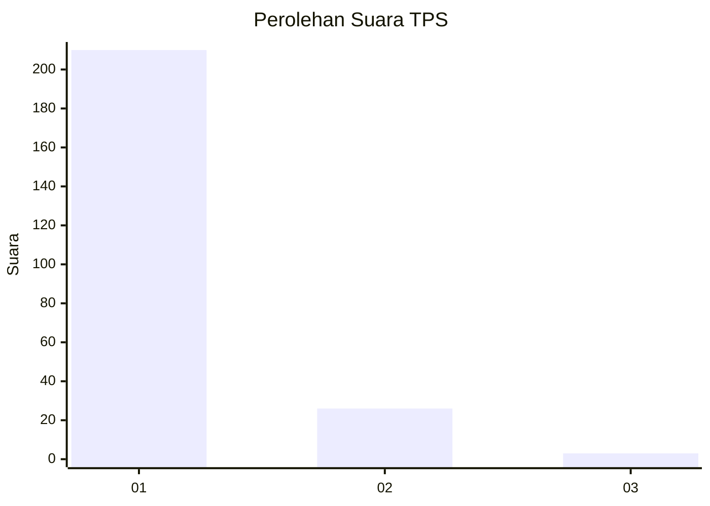
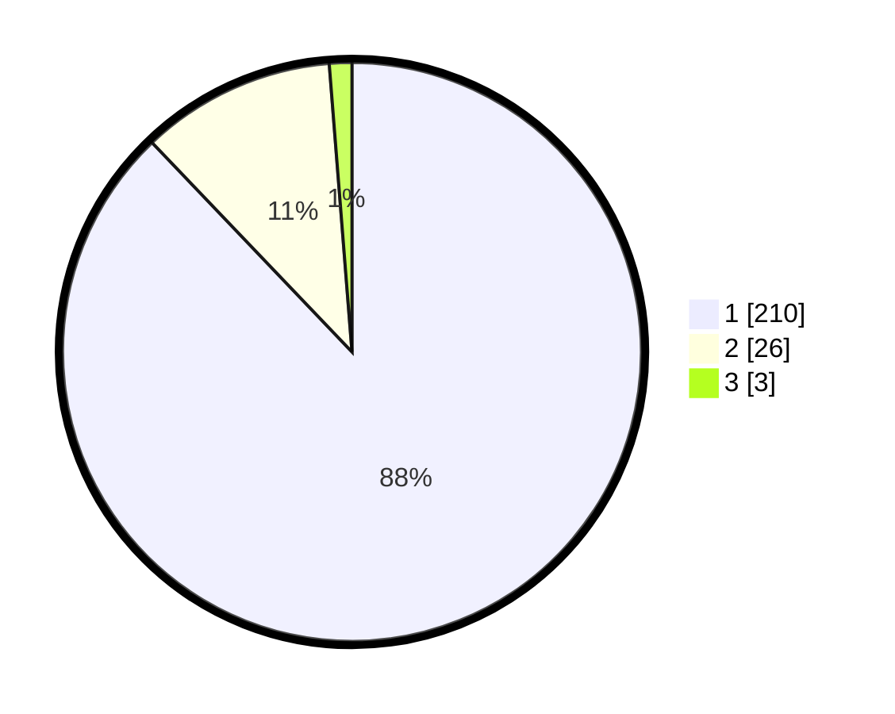

# Hasil

## Grafik

## Tabel

| No. | Nama Paslon    | Suara | Suara (raw) | Persentase |
|:--- |:-------------- | -----:| -----------:| ----------:|
| 1   | ANIES MUHAIMIN | 210   | [210][p-1]  | 87,87      |
| 2   | PRABOWO GIBRAN | 26    | [26][p-2]   | 10,88      |
| 3   | GANJAR MAHFUD  | 3     | [3][p-3]    | 1,26       |

[p-1]: https://github.com/gigit-pemilu/pemilu-2024-11-aceh/blob/main/pilpres/hitung-suara/sub/11-aceh/sub/06-aceh-besar/sub/10-ingin-jaya/sub/2019-gani/sub/001-tps/sub/paslon-1.txt
[p-2]: https://github.com/gigit-pemilu/pemilu-2024-11-aceh/blob/main/pilpres/hitung-suara/sub/11-aceh/sub/06-aceh-besar/sub/10-ingin-jaya/sub/2019-gani/sub/001-tps/sub/paslon-2.txt
[p-3]: https://github.com/gigit-pemilu/pemilu-2024-11-aceh/blob/main/pilpres/hitung-suara/sub/11-aceh/sub/06-aceh-besar/sub/10-ingin-jaya/sub/2019-gani/sub/001-tps/sub/paslon-3.txt

## Foto C Plano

https://sirekap-obj-formc.kpu.go.id/7844/pemilu/ppwp/11/06/10/20/19/1106102019001-20240215-011009--ad9374c5-603c-49bb-9e76-5efe477eacaa.jpg

https://sirekap-obj-formc.kpu.go.id/7844/pemilu/ppwp/11/06/10/20/19/1106102019001-20240215-011324--13031a0e-fb4e-4b25-93c3-115f1d5d533e.jpg

https://sirekap-obj-formc.kpu.go.id/7844/pemilu/ppwp/11/06/10/20/19/1106102019001-20240214-220627--4fe46692-18a0-4de4-85d9-e4e4991e8bea.jpg

## Metadata

| Key        | Value               |
| ---------- | ------------------- |
| Time Stamp | 2024-02-15 23:29:50 |

