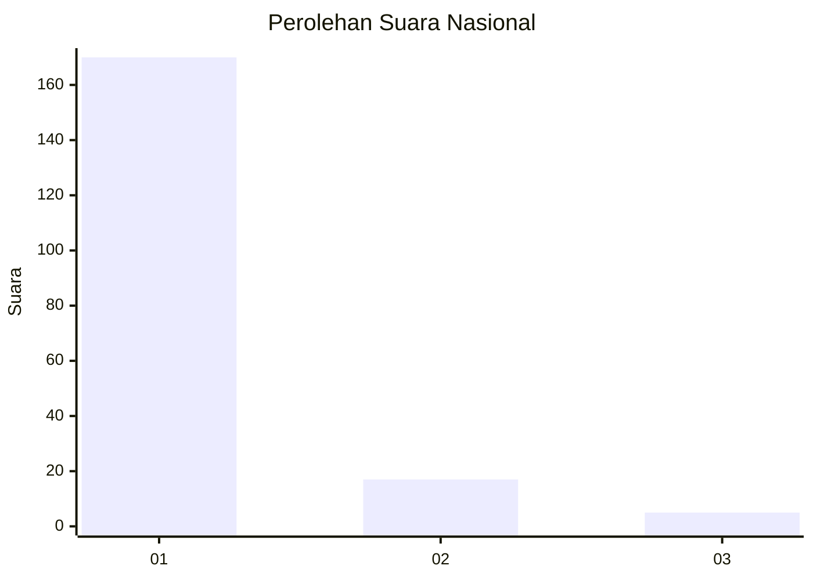
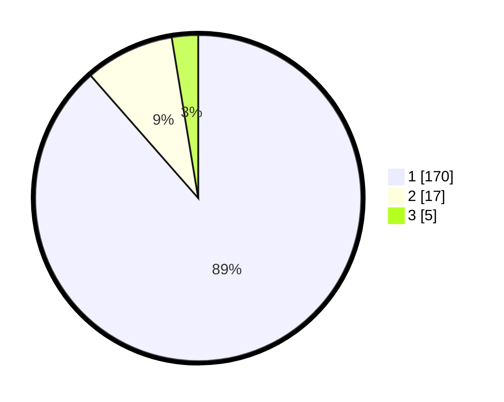

# Hasil

## Grafik

## Tabel

| No. | Nama Paslon    | Suara | Suara (raw) | Persentase |
|:--- |:-------------- | -----:| -----------:| ----------:|
| 1   | ANIES MUHAIMIN | 170   | [170][p-1]  | 88,54      |
| 2   | PRABOWO GIBRAN | 17    | [17][p-2]   | 8,85       |
| 3   | GANJAR MAHFUD  | 5     | [5][p-3]    | 2,60       |

[p-1]: https://github.com/gigit-pemilu/pemilu-2024/blob/main/pilpres/hitung-suara/sub/11-aceh/sub/06-aceh-besar/sub/10-ingin-jaya/sub/2020-ateuk-lueng-ie/sub/002-tps/sub/paslon-1.txt
[p-2]: https://github.com/gigit-pemilu/pemilu-2024/blob/main/pilpres/hitung-suara/sub/11-aceh/sub/06-aceh-besar/sub/10-ingin-jaya/sub/2020-ateuk-lueng-ie/sub/002-tps/sub/paslon-2.txt
[p-3]: https://github.com/gigit-pemilu/pemilu-2024/blob/main/pilpres/hitung-suara/sub/11-aceh/sub/06-aceh-besar/sub/10-ingin-jaya/sub/2020-ateuk-lueng-ie/sub/002-tps/sub/paslon-3.txt

## Foto C Plano

https://sirekap-obj-formc.kpu.go.id/78f0/pemilu/ppwp/11/06/10/20/20/1106102020002-20240215-020350--b6f3ba41-725b-4b0b-9647-b701e4804f39.jpg

https://sirekap-obj-formc.kpu.go.id/78f0/pemilu/ppwp/11/06/10/20/20/1106102020002-20240215-020305--37b5620c-bee7-4e29-82b7-5cf2580c364c.jpg

https://sirekap-obj-formc.kpu.go.id/78f0/pemilu/ppwp/11/06/10/20/20/1106102020002-20240215-020314--bbe170fd-079a-46b5-812c-ad1cced52976.jpg

## Metadata

| Key        | Value               |
| ---------- | ------------------- |
| Time Stamp | 2024-02-15 15:00:29 |

