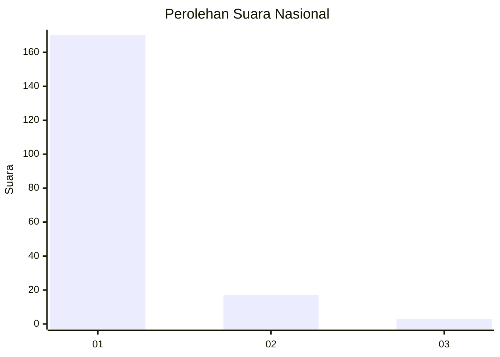
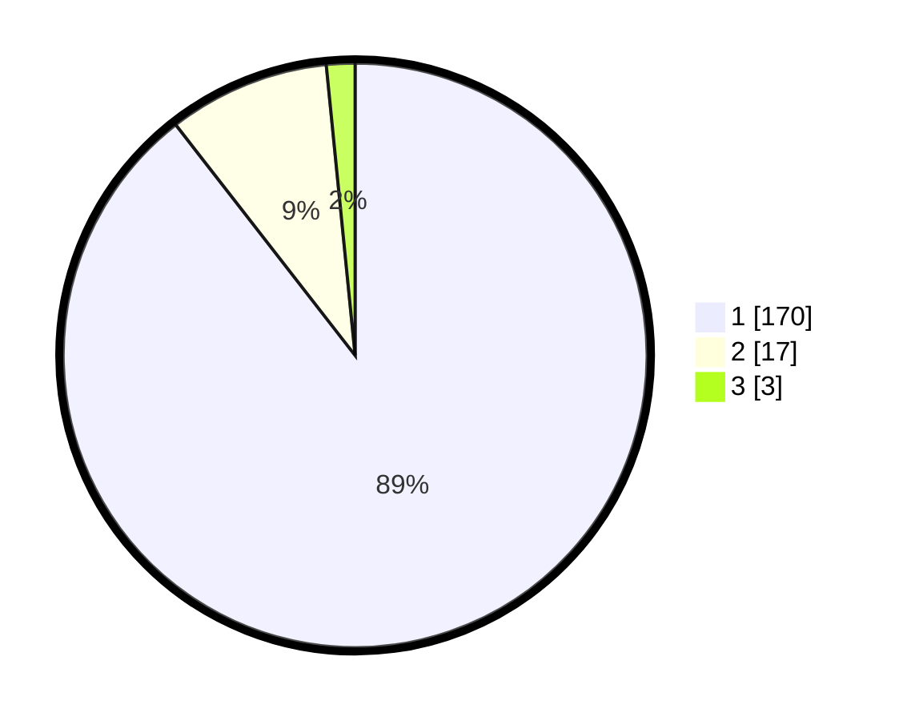

# Hasil

## Grafik

## Tabel

| No. | Nama Paslon    | Suara | Suara (raw) | Persentase |
|:--- |:-------------- | -----:| -----------:| ----------:|
| 1   | ANIES MUHAIMIN | 170   | [170][p-1]  | 89,47      |
| 2   | PRABOWO GIBRAN | 17    | [17][p-2]   | 8,95       |
| 3   | GANJAR MAHFUD  | 3     | [3][p-3]    | 1,58       |

[p-1]: https://github.com/gigit-pemilu/pemilu-2024/blob/main/pilpres/hitung-suara/sub/11-aceh/sub/06-aceh-besar/sub/10-ingin-jaya/sub/2022-cot-suruy/sub/002-tps/sub/paslon-1.txt
[p-2]: https://github.com/gigit-pemilu/pemilu-2024/blob/main/pilpres/hitung-suara/sub/11-aceh/sub/06-aceh-besar/sub/10-ingin-jaya/sub/2022-cot-suruy/sub/002-tps/sub/paslon-2.txt
[p-3]: https://github.com/gigit-pemilu/pemilu-2024/blob/main/pilpres/hitung-suara/sub/11-aceh/sub/06-aceh-besar/sub/10-ingin-jaya/sub/2022-cot-suruy/sub/002-tps/sub/paslon-3.txt

## Foto C Plano

https://sirekap-obj-formc.kpu.go.id/1af0/pemilu/ppwp/11/06/10/20/22/1106102022002-20240214-193739--b52e51d1-8240-47ba-9037-5a3131890c18.jpg

https://sirekap-obj-formc.kpu.go.id/1af0/pemilu/ppwp/11/06/10/20/22/1106102022002-20240214-193751--0a98817e-9e49-4c1b-9b01-fa0e2f0cc4a9.jpg

https://sirekap-obj-formc.kpu.go.id/1af0/pemilu/ppwp/11/06/10/20/22/1106102022002-20240214-193756--b02ddd46-3c44-4085-95b3-fe45e6440997.jpg

## Metadata

| Key        | Value               |
| ---------- | ------------------- |
| Time Stamp | 2024-02-15 17:00:25 |

