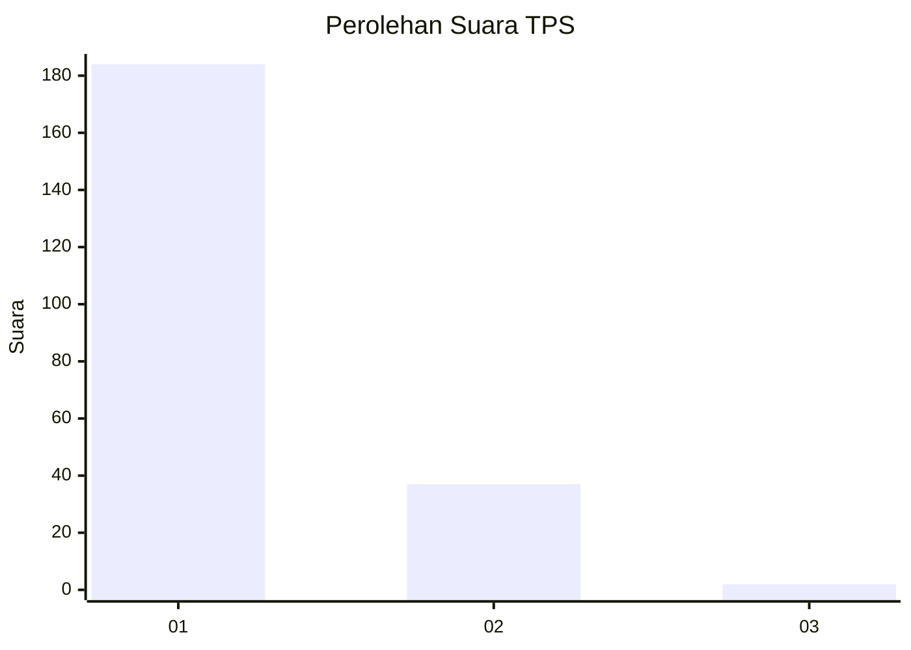
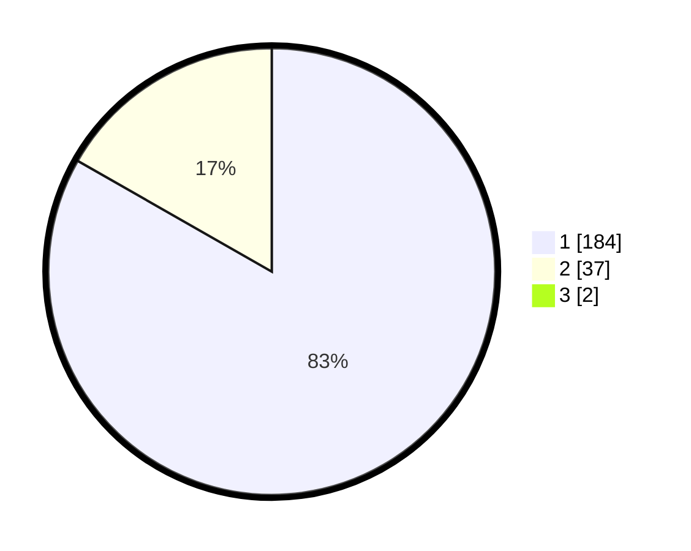

# Hasil

## Grafik

## Tabel

| No. | Nama Paslon    | Suara | Suara (raw) | Persentase |
|:--- |:-------------- | -----:| -----------:| ----------:|
| 1   | ANIES MUHAIMIN | 184   | [184][p-1]  | 82,51      |
| 2   | PRABOWO GIBRAN | 37    | [37][p-2]   | 16,59      |
| 3   | GANJAR MAHFUD  | 2     | [2][p-3]    | 0,90       |

[p-1]: https://github.com/gigit-pemilu/pemilu-2024-11-aceh/blob/main/pilpres/hitung-suara/sub/11-aceh/sub/06-aceh-besar/sub/10-ingin-jaya/sub/2025-meunasah-krueng/sub/001-tps/sub/paslon-1.txt
[p-2]: https://github.com/gigit-pemilu/pemilu-2024-11-aceh/blob/main/pilpres/hitung-suara/sub/11-aceh/sub/06-aceh-besar/sub/10-ingin-jaya/sub/2025-meunasah-krueng/sub/001-tps/sub/paslon-2.txt
[p-3]: https://github.com/gigit-pemilu/pemilu-2024-11-aceh/blob/main/pilpres/hitung-suara/sub/11-aceh/sub/06-aceh-besar/sub/10-ingin-jaya/sub/2025-meunasah-krueng/sub/001-tps/sub/paslon-3.txt

## Foto C Plano

https://sirekap-obj-formc.kpu.go.id/a220/pemilu/ppwp/11/06/10/20/25/1106102025001-20240215-032227--3e466120-6500-46bd-a7fe-19a53fe5b7fb.jpg

https://sirekap-obj-formc.kpu.go.id/a220/pemilu/ppwp/11/06/10/20/25/1106102025001-20240215-024639--a2fa9ada-363d-4e98-b8cf-066f4d0d6f88.jpg

https://sirekap-obj-formc.kpu.go.id/a220/pemilu/ppwp/11/06/10/20/25/1106102025001-20240215-032023--fe48765a-97ed-49dc-a6ef-8c353bd7aa59.jpg

## Metadata

| Key        | Value               |
| ---------- | ------------------- |
| Time Stamp | 2024-02-15 17:00:25 |

