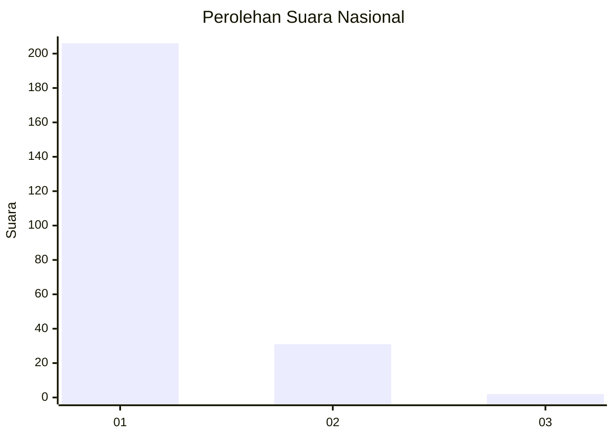
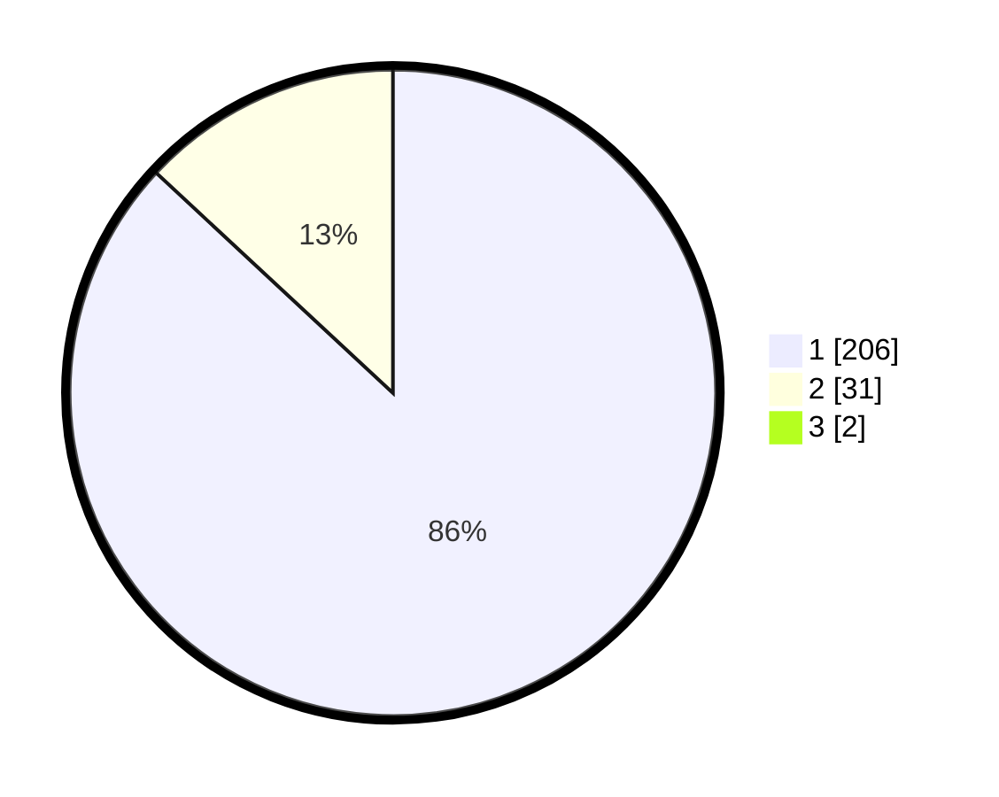

# Hasil

## Grafik

## Tabel

| No. | Nama Paslon    | Suara | Suara (raw) | Persentase |
|:--- |:-------------- | -----:| -----------:| ----------:|
| 1   | ANIES MUHAIMIN | 206   | [206][p-1]  | 86,19      |
| 2   | PRABOWO GIBRAN | 31    | [31][p-2]   | 12,97      |
| 3   | GANJAR MAHFUD  | 2     | [2][p-3]    | 0,84       |

[p-1]: https://github.com/gigit-pemilu/pemilu-2024/blob/main/pilpres/hitung-suara/sub/11-aceh/sub/06-aceh-besar/sub/10-ingin-jaya/sub/2025-meunasah-krueng/sub/003-tps/sub/paslon-1.txt
[p-2]: https://github.com/gigit-pemilu/pemilu-2024/blob/main/pilpres/hitung-suara/sub/11-aceh/sub/06-aceh-besar/sub/10-ingin-jaya/sub/2025-meunasah-krueng/sub/003-tps/sub/paslon-2.txt
[p-3]: https://github.com/gigit-pemilu/pemilu-2024/blob/main/pilpres/hitung-suara/sub/11-aceh/sub/06-aceh-besar/sub/10-ingin-jaya/sub/2025-meunasah-krueng/sub/003-tps/sub/paslon-3.txt

## Foto C Plano

https://sirekap-obj-formc.kpu.go.id/6270/pemilu/ppwp/11/06/10/20/25/1106102025003-20240214-225616--73b041ca-89c8-4ca8-8c67-a73ff621c193.jpg

https://sirekap-obj-formc.kpu.go.id/6270/pemilu/ppwp/11/06/10/20/25/1106102025003-20240215-054813--7e75e653-1a3e-47b8-b8bc-2e6115794999.jpg

https://sirekap-obj-formc.kpu.go.id/6270/pemilu/ppwp/11/06/10/20/25/1106102025003-20240214-225716--e3482677-1e82-435c-9463-a7ba3cdab163.jpg

## Metadata

| Key        | Value               |
| ---------- | ------------------- |
| Time Stamp | 2024-02-15 17:00:25 |

