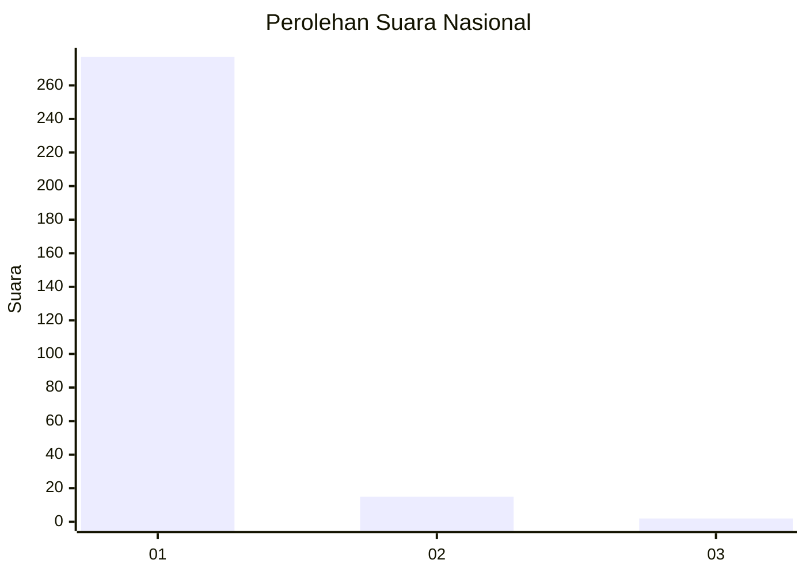
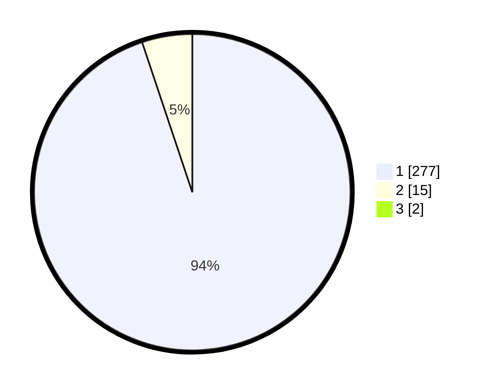

# Hasil

## Grafik

## Tabel

| No. | Nama Paslon    | Suara | Suara (raw) | Persentase |
|:--- |:-------------- | -----:| -----------:| ----------:|
| 1   | ANIES MUHAIMIN | 277   | [277][p-1]  | 94,22      |
| 2   | PRABOWO GIBRAN | 15    | [15][p-2]   | 5,10       |
| 3   | GANJAR MAHFUD  | 2     | [2][p-3]    | 0,68       |

[p-1]: https://github.com/gigit-pemilu/pemilu-2024/blob/main/pilpres/hitung-suara/sub/11-aceh/sub/06-aceh-besar/sub/10-ingin-jaya/sub/2027-lubok-batee/sub/003-tps/sub/paslon-1.txt
[p-2]: https://github.com/gigit-pemilu/pemilu-2024/blob/main/pilpres/hitung-suara/sub/11-aceh/sub/06-aceh-besar/sub/10-ingin-jaya/sub/2027-lubok-batee/sub/003-tps/sub/paslon-2.txt
[p-3]: https://github.com/gigit-pemilu/pemilu-2024/blob/main/pilpres/hitung-suara/sub/11-aceh/sub/06-aceh-besar/sub/10-ingin-jaya/sub/2027-lubok-batee/sub/003-tps/sub/paslon-3.txt

## Foto C Plano

https://sirekap-obj-formc.kpu.go.id/231b/pemilu/ppwp/11/06/10/20/27/1106102027003-20240214-230257--1ac8fcb2-5c70-41e3-919b-1cd47e10d9d4.jpg

https://sirekap-obj-formc.kpu.go.id/231b/pemilu/ppwp/11/06/10/20/27/1106102027003-20240214-230922--c398ee73-69fd-4c9e-9a7b-b515f8a3590a.jpg

https://sirekap-obj-formc.kpu.go.id/231b/pemilu/ppwp/11/06/10/20/27/1106102027003-20240214-231229--8d4b38ae-bfa3-4bb6-87ee-e49bc1361a36.jpg

## Metadata

| Key        | Value               |
| ---------- | ------------------- |
| Time Stamp | 2024-02-15 17:00:25 |

