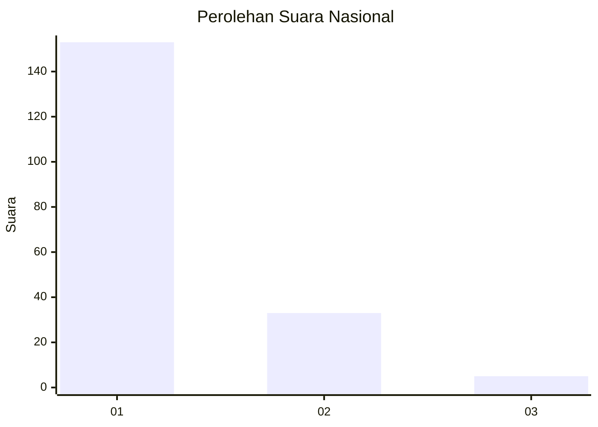
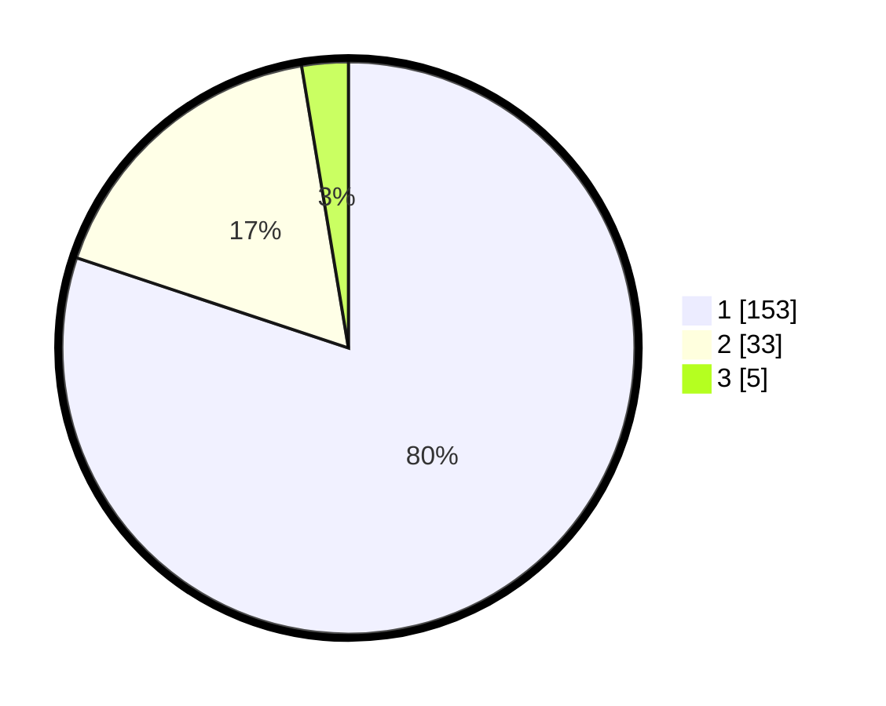

# Hasil

## Grafik

## Tabel

| No. | Nama Paslon    | Suara | Suara (raw) | Persentase |
|:--- |:-------------- | -----:| -----------:| ----------:|
| 1   | ANIES MUHAIMIN | 153   | [153][p-1]  | 80,10      |
| 2   | PRABOWO GIBRAN | 33    | [33][p-2]   | 17,28      |
| 3   | GANJAR MAHFUD  | 5     | [5][p-3]    | 2,62       |

[p-1]: https://github.com/gigit-pemilu/pemilu-2024/blob/main/pilpres/hitung-suara/sub/11-aceh/sub/06-aceh-besar/sub/10-ingin-jaya/sub/2031-meunasah-manyang-pagar-air/sub/001-tps/sub/paslon-1.txt
[p-2]: https://github.com/gigit-pemilu/pemilu-2024/blob/main/pilpres/hitung-suara/sub/11-aceh/sub/06-aceh-besar/sub/10-ingin-jaya/sub/2031-meunasah-manyang-pagar-air/sub/001-tps/sub/paslon-2.txt
[p-3]: https://github.com/gigit-pemilu/pemilu-2024/blob/main/pilpres/hitung-suara/sub/11-aceh/sub/06-aceh-besar/sub/10-ingin-jaya/sub/2031-meunasah-manyang-pagar-air/sub/001-tps/sub/paslon-3.txt

## Foto C Plano

https://sirekap-obj-formc.kpu.go.id/0457/pemilu/ppwp/11/06/10/20/31/1106102031001-20240215-054231--e63fb934-768f-417c-bb08-f5cf3471b5b5.jpg

https://sirekap-obj-formc.kpu.go.id/0457/pemilu/ppwp/11/06/10/20/31/1106102031001-20240215-054423--816760c0-f155-4831-b328-b2ba2f2fbce6.jpg

https://sirekap-obj-formc.kpu.go.id/0457/pemilu/ppwp/11/06/10/20/31/1106102031001-20240215-054536--b5146aa3-4915-4b2d-a874-c5633e0377d5.jpg

## Metadata

| Key        | Value               |
| ---------- | ------------------- |
| Time Stamp | 2024-02-15 17:00:25 |

